# LifeVerse 产品需求文档 PRD-v2

> 文档版本：v2.0 | 创建日期：2026-06-22 | 状态：评审中

| 字段 | 内容 |
|------|------|
| 文档名称 | LifeVerse 核心功能产品需求文档（v2.0） |
| 产品名称 | LifeVerse（人生董事会） |
| 文档负责人 | Alex Chen（产品总监） |
| 撰写人 | Emma Wang（产品经理） |
| 评审人 | 工程负责人、设计负责人、AI 算法负责人 |
| 文档状态 | 评审中 |
| 适用版本 | LifeVerse v2.0 |

## 修订记录

| 版本 | 日期 | 修订人 | 修订内容 |
|------|------|--------|----------|
| v1.0 | 2026-04-10 | Emma Wang | 初版，包含智慧议会 MVP（6 名成员）与基础对话 |
| v2.0 | 2026-06-22 | Emma Wang | 新增注册登录、个人资料、内心对话、重逢对话、自定义 Agent、议会扩展、推荐组合共 7 大功能模块 |

---

## 一、产品背景与目标

### 1.1 业务背景

LifeVerse 是一款以"与不同时空的自己对话"和"组建个人智慧议会"为核心体验的 AI 内省成长产品。v1.0 版本已上线智慧议会基础功能，用户可以从 6 名预设成员（如王阳明、苏格拉底、乔布斯等）中选择 3 名组成议会，就人生议题展开多角色对话。

v1.0 上线后收集到的核心反馈集中在三个方向：

- **身份与连续性问题**：用户在议会对话中频繁提到"想和自己聊聊"，但现有产品没有"自己"这个角色，用户无法把对话沉淀为对自我的理解。`[Research-backed]` 用户访谈中 68% 的受访者表达过这一诉求。
- **议会深度不足**：6 名成员覆盖面有限，用户希望加入更多元的视角（历史人物、文学角色、职业导师、心理顾问），也希望自己定义角色。`[Data-backed]` v1.0 议会使用 7 日留存为 31%，用户反馈"聊几次就没什么新意了"。
- **缺少基础账户体系**：v1.0 采用游客模式，对话记录无法跨设备同步，用户更换设备后数据丢失，严重影响信任感。`[Data-backed]` 设备更换导致的流失占整体流失的 19%。

### 1.2 用户现状与痛点

| 痛点 | 表现 | 影响 |
|------|------|------|
| 无法与自我对话 | 用户在人生困惑时，缺少一个能基于自身记忆和情感状态给出回应的"内心声音" | 内省停留在表层，难以形成持续的自我认知 |
| 时间维度断裂 | 用户想回顾"五年前的自己会怎么看现在的我"，或想和"未来的自己"确认方向，但没有工具支持 | 人生决策缺少纵向参照，容易陷入当下情绪 |
| 议会视角单一 | 6 名固定成员无法覆盖用户多元的人生议题（职场、情感、创业、心理） | 对话重复度高，用户黏性低 |
| 角色不可定制 | 用户有特定的人生导师或虚构偶像，但无法将其纳入议会 | 个性化体验缺失 |
| 账户与数据无保障 | 游客模式下数据仅存本地，换设备即丢失 | 用户不敢深度投入，留存受损 |

### 1.3 不解决的后果

若不在 v2.0 解决上述问题，LifeVerse 将停留在"轻量对话玩具"的认知层面，无法建立"个人人生操作系统"的产品定位。具体后果：7 日留存难以突破 35%，付费转化缺乏支撑（用户不愿为无法积累、无法个性化的体验付费），产品在同类 AI 对话产品中失去差异化。

### 1.4 产品目标

**北极星指标**：周活跃用户的平均深度对话次数（单次对话轮数 ≥ 5 轮计为深度对话）。

v2.0 的三个目标，按优先级排列：

| 优先级 | 目标 | 衡量指标 | 目标值 |
|--------|------|----------|--------|
| P0 | 建立账户与个人资料体系，让用户数据可积累、可跨设备 | 注册转化率、登录态 7 日留存 | 注册转化 ≥ 60%；登录态 7 日留存 ≥ 45% |
| P0 | 上线"与自己对话"（内心对话 + 重逢对话），补齐自我认知闭环 | 内心对话功能渗透率、重逢对话功能渗透率 | 内心对话渗透率（用过/活跃用户）≥ 50%；重逢对话渗透率 ≥ 30% |
| P1 | 扩展议会生态（成员扩展 + 自定义 Agent + 推荐组合），提升议会深度与个性化 | 议会 7 日留存、自定义 Agent 创建率、推荐组合使用率 | 议会 7 日留存 ≥ 45%；自定义 Agent 创建率 ≥ 25%；推荐组合使用率 ≥ 40% |

### 1.5 范围说明

本 PRD 覆盖 v2.0 的 7 大功能模块。以下内容不在本 PRD 范围内：

- 付费会员体系与商业化方案（另行立项）
- 议会多角色同屏群聊的交互升级（v2.1 规划）
- 语音对话与多模态输入（v2.1 规划，本版仅支持文字）
- 数据导出与账号注销的完整流程（账号注销基础流程在本版覆盖，数据导出延后）

---

## 二、用户画像

LifeVerse 的用户有一个共同特征：在某个具体的人生节点上，产生了向内探索的动机。他们不是来"杀时间"的，而是带着真实困惑来的。以下三个画像覆盖了核心用户群。

### 2.1 画像 A：转折期探索者——林晓

| 维度 | 描述 |
|------|------|
| 基本信息 | 27 岁，女，互联网公司产品运营，一线城市 |
| 生活状态 | 工作 4 年，正考虑是否转行或读研，处于职业迷茫期 |
| 技术熟练度 | 高，日常使用各类 AI 工具辅助工作 |
| 使用频率 | 每周 3-4 次，多在晚上独处时使用 |
| 决策权 | 个人产品，自主决策 |
| 痛点严重度 | 高——她需要一个能基于她过去经历给出回应的对象，而不是通用 AI 的套话 |
| 核心诉求 | "我想和五年前刚毕业那个充满干劲的自己聊聊，也想问问十年后的我，现在的纠结到底值不值得" |
| 典型场景 | 深夜写完周报后，打开 LifeVerse，选择"5 年前的自己"展开重逢对话，把当下的纠结说给她听 |

### 2.2 画像 B：自我成长实践者——陈默

| 维度 | 描述 |
|------|------|
| 基本信息 | 34 岁，男，创业者，已婚有一个孩子 |
| 生活状态 | 公司进入瓶颈期，家庭与事业双重压力，开始系统阅读哲学与心理学 |
| 技术熟练度 | 中，习惯用笔记类工具，对 AI 持开放但审慎态度 |
| 使用频率 | 每天一次，晨间或通勤时 |
| 决策权 | 个人产品，自主决策 |
| 痛点严重度 | 高——他需要多元且深度的视角来辅助决策，单一角色无法满足 |
| 核心诉求 | "我想要一个属于我自己的智囊团，有王阳明教我修心，有巴菲特帮我看商业，再有一个懂我行业的导师" |
| 典型场景 | 面对一个融资决策时，组建"创业智囊团"组合，分别听取马斯克、巴菲特、乔布斯的视角，再做综合判断 |

### 2.3 画像 C：情感疗愈寻求者——苏然

| 维度 | 描述 |
|------|------|
| 基本信息 | 22 岁，女，大四学生，正在经历一段重要关系的结束 |
| 生活状态 | 情绪低落，对心理咨询有顾虑（费用与病耻感），希望先有一个安全的出口 |
| 技术熟练度 | 中高，Z 世代，习惯用各类社交与内容产品 |
| 使用频率 | 不固定，情绪波动时密集使用，平复后可能间隔较长 |
| 决策权 | 个人产品，自主决策 |
| 痛点严重度 | 极高——她需要一个不带评判、能共情、且能引导她自我觉察的对象 |
| 核心诉求 | "我不想被说教，我想有一个温柔的声音，帮我听见自己心里到底在想什么" |
| 典型场景 | 情绪崩溃的夜晚，打开内心对话，把混乱的情绪倾倒出来，AI 以她"内心的自己"的口吻温柔回应，帮她慢慢理清 |

### 2.4 角色划分

LifeVerse 是 C 端个人产品，但涉及以下系统角色：

| 角色 | 说明 | 本 PRD 涉及功能 |
|------|------|----------------|
| 普通用户 | 注册并使用产品的个人 | 全部 7 大功能 |
| 未登录访客 | 仅浏览首页，未注册 | 功能 1（登录引导） |
| 系统管理员 | 后台运营人员，管理议会成员库、推荐组合配置 | 功能 6、功能 7 的后台配置（本 PRD 仅描述前台，后台另出运营文档） |

### 2.5 核心使用场景与优先级

| 优先级 | 场景 | 涉及功能 |
|--------|------|----------|
| P0 | 新用户首次进入，完成注册登录并填写基础资料，获得个性化体验 | 功能 1、功能 2 |
| P0 | 用户在情绪波动或人生困惑时，与"内心的自己"展开文字对话，获得温柔且自省的回应 | 功能 3 |
| P0 | 用户选择一个时间点，与"过去/未来的自己"重逢对话，获得纵向的人生参照 | 功能 4 |
| P1 | 用户创建专属 AI 角色（如自己的行业导师），并在议会中使用 | 功能 5 |
| P1 | 用户从扩展后的 20+ 成员库中自由组合 3-6 人议会 | 功能 6 |
| P1 | 用户一键使用系统推荐的成员组合，快速进入高质量对话 | 功能 7 |

---

## 三、功能需求总览

下表枚举 v2.0 全部功能点，作为工程与评审的快速索引。各功能模块的详细描述见第四章。

| 编号 | 模块 | 功能描述 |
|------|------|----------|
| F1 | 用户注册登录系统 | 支持微信扫码登录（对接微信开放平台 OAuth2.0）与手机验证码登录两种方式。首次登录自动完成注册，无需单独走注册流程。登录态通过 Token 持久化，7 天内免重复登录。未登录用户仅可访问首页（产品介绍与登录入口），其余所有页面（个人资料、对话、议会等）均需登录后访问，未登录访问时拦截并引导至登录页。 |
| F2 | 个人资料系统 | 用户可设置头像（系统随机分配默认头像，支持自定义上传）、昵称（2-20 字符）、出生年月日（日期选择器）、性别（男/女/其他）、个人简介（可选，最多 200 字）。系统根据出生日期自动计算并显示年龄，并在填写出生日期时提示用户使用真实日期（因系统会根据年龄提供差异化体验）。 |
| F3 | 内心对话功能 | 用户可与"内心的自己"展开文字对话。AI 综合用户的记忆、年龄、情感状态生成内心独白式回应，对话风格为温柔、自省、引导式。对话历史持久化保存，用户可随时回看。 |
| F4 | 重逢对话功能 | 用户可选择一个时间点（如 5 年前的自己、10 年后的自己），与该时间点的"自己"展开对话。AI 根据用户记忆与所选时间点生成符合该时间心境与认知水平的对话，风格为怀旧或展望、强调情感共鸣。对话历史持久化保存。 |
| F5 | 自定义 Agent 功能 | 用户可创建自定义 AI 角色，配置项包括名称、头像、性格描述、专业领域、对话风格。创建后的 Agent 可在智慧议会中作为成员使用。支持编辑与删除，每名用户最多创建 10 个自定义 Agent。 |
| F6 | 智慧议会成员扩展 | 在 v1.0 现有 6 名成员基础上，新增历史人物、文学角色、职业导师、心理顾问等类型成员，议会成员库扩展至 20+ 个。用户可自由组合 3-6 名成员组成议会。 |
| F7 | 系统推荐成员组合 | 系统预设多种成员组合方案（如"创业智囊团""心灵成长组""职场突围组"等），用户可一键使用推荐组合，也可在推荐基础上自定义调整成员。 |

---

## 四、详细功能需求

> 以下各功能模块统一采用结构：用户故事、功能描述（含业务逻辑、交互逻辑、规则约束、权限逻辑、边界与异常）、验收标准、优先级。涉及页面布局处配原型示意图（Mermaid 线框图）。

### 4.1 功能 1：用户注册登录系统

#### 4.1.1 用户故事

- 作为一名新用户，我希望通过微信扫码或手机验证码快速登录，这样我不用记额外的账号密码。
- 作为一名新用户，我希望首次登录就自动完成注册，这样我不用填写冗长的注册表单。
- 作为一名老用户，我希望登录状态能保持一段时间，这样我不用每次打开都重新登录。
- 作为一名未登录访客，我希望先看看首页了解产品，再决定是否登录，这样我不会有注册压力。

#### 4.1.2 功能描述

**业务逻辑**

系统提供两种登录方式：微信扫码登录与手机验证码登录。两种方式均采用"登录即注册"逻辑——后端根据微信 openid 或手机号查询用户记录，若不存在则自动创建用户记录并完成登录，若存在则直接登录。不设独立的注册入口。

登录成功后，后端签发访问令牌（access_token，有效期 2 小时）与刷新令牌（refresh_token，有效期 7 天）。客户端将 refresh_token 持久化存储，在 access_token 过期时用其换取新的 access_token，实现 7 天免登录。7 天后 refresh_token 失效，用户需重新登录。

未登录用户的访问权限控制：首页（产品介绍、功能展示、登录入口）对所有用户开放；其余页面（个人资料、内心对话、重逢对话、智慧议会、自定义 Agent）均需登录态。未登录用户尝试访问受保护页面时，前端路由拦截并跳转至登录页，登录成功后回跳至原目标页面。

**交互逻辑**

微信扫码登录流程：

1. 用户在登录页点击"微信登录" → 页面展示微信二维码（由微信开放平台生成）。
2. 用户使用微信扫码并在手机端确认授权 → 前端轮询登录状态（每 2 秒一次，超时 5 分钟）。
3. 后端收到微信回调，用 code 换取 access_token 与 openid，查询/创建用户，签发本系统令牌。
4. 前端检测到登录成功 → 存储 token，跳转至用户原本要访问的页面（或首页）。

手机验证码登录流程：

1. 用户在登录页输入手机号 → 点击"获取验证码" → 按钮变为 60 秒倒计时，后端校验手机号格式并发送短信。
2. 用户输入 6 位验证码 → 点击"登录" → 后端校验验证码，查询/创建用户，签发令牌。
3. 前端存储 token，跳转至目标页面。

登录态过期处理：

1. access_token 过期时，前端自动用 refresh_token 静默刷新；刷新成功则无感继续操作。
2. refresh_token 过期或失效时，前端清除本地登录态，跳转至登录页，并提示"登录已过期，请重新登录"。

**规则约束**

- 手机号：11 位数字，符合中国大陆手机号格式（1 开头，第二位 3-9），必填。
- 验证码：6 位数字，有效期 5 分钟，同一手机号 5 分钟内最多发送 3 次，验证码输入错误 5 次后失效需重新获取。
- 微信扫码二维码：有效期 5 分钟，过期后需用户点击刷新重新生成。
- refresh_token：有效期 7 天，每次静默刷新时不重置有效期（即从首次登录起算 7 天，而非滑动续期）。
- 同一手机号与同一微信 openid 视为同一用户（若用户先用手机号登录、后用微信登录且微信绑定了同一手机号，需引导合并账号，合并流程见边界与异常）。

**权限逻辑**

- 未登录访客：仅可访问首页。
- 已登录用户：可访问全部功能页面。
- 系统不设管理员前台入口，管理员通过独立后台系统操作。

**边界与异常**

| 场景 | 处理方式 |
|------|----------|
| 微信授权失败（用户拒绝/网络错误） | 前端提示"授权失败，请重试"，停留在登录页，可重新扫码 |
| 验证码发送频率超限 | 后端返回限流错误，前端提示"发送过于频繁，请稍后再试" |
| 验证码错误 | 提示"验证码错误，请重新输入"，剩余尝试次数提示 |
| 手机号格式错误 | 实时校验，输入框下方提示"请输入正确的手机号"，获取验证码按钮禁用 |
| 网络超时（扫码轮询/登录请求） | 提示"网络异常，请检查网络后重试"，提供重试按钮 |
| 账号合并场景：微信登录获取的手机号已存在独立手机号账号 | 弹窗提示"该微信绑定的手机号已注册 LifeVerse，是否合并账号？合并后两端的对话记录与资料将统一到此账号下"，用户确认后后端执行合并，取消则中断微信登录 |
| refresh_token 被多设备挤占 | 本版不实现单设备登录限制，多设备可同时保持登录态 |

#### 4.1.3 原型示意

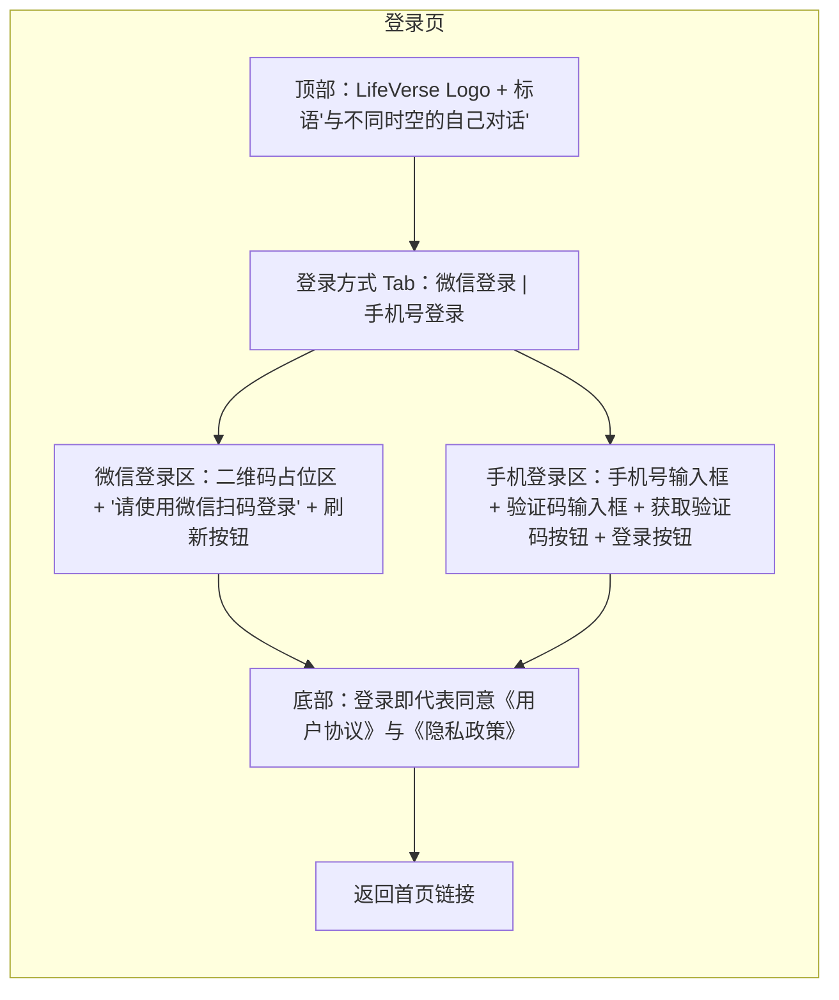

#### 4.1.4 验收标准

1. 新用户使用微信扫码登录，授权成功后自动创建账号并进入产品，无需额外注册步骤。
2. 新用户使用手机验证码登录，验证码校验通过后自动创建账号并进入产品。
3. 老用户重复登录，能正确识别已有账号并恢复登录态，历史对话记录正常展示。
4. 登录后关闭 App 并在 7 天内重新打开，无需重新登录即处于登录态。
5. 超过 7 天后重新打开，登录态失效，跳转至登录页并提示"登录已过期"。
6. 未登录用户点击任何非首页入口，均被拦截至登录页；登录成功后回跳至原目标页面。
7. 验证码 5 分钟内同一手机号发送超过 3 次时，第 4 次发送被拒绝并提示。
8. 验证码连续输错 5 次后失效，需重新获取。
9. 微信二维码 5 分钟后过期，过期后扫码提示失效，需刷新二维码。

#### 4.1.5 优先级

P0。账户体系是 v2.0 全部功能的地基，必须最先交付。

---

### 4.2 功能 2：个人资料系统

#### 4.2.1 用户故事

- 作为一名新用户，我希望登录后能快速完善个人资料，这样系统能提供更贴合我的体验。
- 作为一名用户，我希望系统根据我的出生日期自动算出年龄，这样我不用自己填年龄。
- 作为一名用户，我希望能上传自己喜欢的头像，这样我的个人空间更有归属感。
- 作为一名用户，我希望系统告诉我为什么要填真实出生日期，这样我理解其价值后愿意如实填写。

#### 4.2.2 功能描述

**业务逻辑**

个人资料是 AI 对话个性化的基础数据源。用户的出生日期、性别、个人简介等信息会作为上下文注入内心对话与重逢对话的 AI 生成中，使"内心的自己"和"过去/未来的自己"的回应贴合用户真实情况。

新用户首次登录后，若个人资料未完善（昵称、出生日期为空），系统引导其进入资料完善流程（非强制阻断，但强提示）。用户也可随时在"我的-个人资料"页面编辑资料。

头像机制：新用户注册后系统从默认头像池（预设 24 张风格统一的插画头像）中随机分配一张作为默认头像。用户可在资料页选择"上传头像"替换，上传后经图片合规校验与裁剪后生效。

年龄计算：系统根据出生日期与当前日期实时计算年龄（周岁），显示在资料页。该年龄值同步用于内心对话与重逢对话的 AI 上下文（如重逢对话中"10 年后的自己"的认知水平基于当前年龄 +10 推算）。

**交互逻辑**

资料完善流程（首次登录引导）：

1. 登录成功后检测资料完整度 → 若昵称或出生日期为空，弹出引导卡片"完善资料，让内心的自己更懂你"，提供"去完善"与"稍后"两个选项。
2. 用户点击"去完善" → 进入资料编辑页，系统已预填默认头像与随机昵称（可修改）。
3. 用户依次填写昵称、出生日期、性别、个人简介 → 点击"保存" → 校验通过后保存并返回。

资料编辑（日常入口）：

1. 用户在"我的"页面点击头像或"编辑资料" → 进入资料编辑页。
2. 修改任意字段 → 点击"保存" → 校验通过后保存，提示"资料已更新"。

出生日期填写：

1. 用户点击出生日期字段 → 弹出日期选择器（年/月/日三列滚动选择）。
2. 选择完成后，字段下方显示提示文案："系统会根据你的真实年龄，让内心的自己和过去/未来的自己更懂你。请填写真实出生日期。"
3. 年龄字段自动计算并灰显（不可手动编辑）。

头像上传：

1. 用户点击头像 → 弹出操作菜单："从相册选择""拍照""恢复默认头像"。
2. 选择图片后进入裁剪界面（圆形裁剪框） → 确认裁剪 → 上传 → 显示新头像。

**规则约束**

- 头像：默认头像池 24 张；自定义上传支持 JPG/PNG，单张 ≤ 5MB，上传后裁剪为正方形，显示尺寸 200x200px；图片需通过内容安全审核（涉黄涉政涉暴拒绝）。
- 昵称：2-20 字符（中英文/数字/常见符号均计 1 字符），必填，不可为纯空格，不可包含敏感词。
- 出生日期：日期选择器选择，年份范围 1920-当前年份，必填；若选择日期使计算年龄 < 12 岁，提示"LifeVerse 暂不建议 12 岁以下用户使用"但不阻断保存（由监护人决定）。
- 性别：单选"男""女""其他"，必填。
- 个人简介：可选，最多 200 字，超出时输入框提示字数超限并禁止继续输入。
- 年龄：系统自动计算，不可手动编辑。

**权限逻辑**

- 用户仅可编辑自己的资料。
- 个人资料中的昵称与头像在议会对话中会展示给"自己"（不涉及其他真实用户，LifeVerse 无社交关系链）。

**边界与异常**

| 场景 | 处理方式 |
|------|----------|
| 头像上传内容安全审核不通过 | 提示"图片内容不合规，请更换后重试"，头像保持原样 |
| 头像上传文件超 5MB | 提示"图片大小不能超过 5MB" |
| 昵称包含敏感词 | 保存时后端校验，提示"昵称包含违规内容，请修改" |
| 昵称为纯空格 | 前端 trim 后校验长度，不满足 2 字符则提示 |
| 出生日期选择未来日期 | 日期选择器最大值限制为当天，不可选未来 |
| 网络异常导致保存失败 | 提示"保存失败，请检查网络后重试"，保留用户已填内容 |
| 用户跳过资料完善直接使用 | 允许使用，但内心对话与重逢对话的 AI 上下文中缺少年龄等信息，回应会偏通用；系统在用户首次发起对话时再次轻提示完善资料 |

#### 4.2.3 原型示意

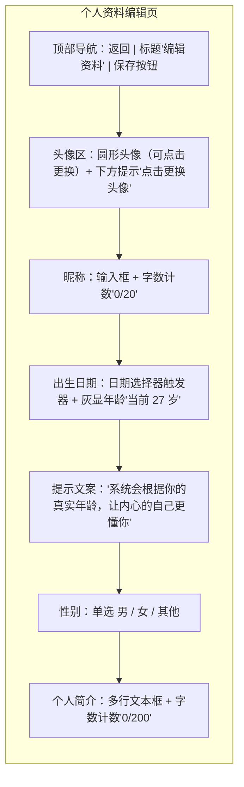

#### 4.2.4 验收标准

1. 新用户注册后获得系统随机分配的默认头像，且默认头像从 24 张池中随机选取。
2. 用户可成功上传自定义头像，上传后经裁剪与审核生效，资料页与对话中显示新头像。
3. 昵称输入少于 2 字符或超过 20 字符时，保存按钮禁用并提示。
4. 昵称为纯空格时被识别为不合规。
5. 出生日期通过日期选择器选择，不可手动输入，不可选择未来日期。
6. 选择出生日期后，年龄自动计算并显示，且不可手动修改。
7. 出生日期字段下方显示真实日期填写提示文案。
8. 个人简介超过 200 字时无法继续输入。
9. 资料保存成功后，内心对话与重逢对话的 AI 回应能体现用户的年龄与性别信息。
10. 头像上传不合规图片时被拒绝并提示。

#### 4.2.5 优先级

P0。个人资料（尤其出生日期）是内心对话与重逢对话的必要上下文，需在功能 3、4 之前或同步交付。

---

### 4.3 功能 3：内心对话功能

#### 4.3.1 用户故事

- 作为一名用户，我希望和"内心的自己"聊天，这样我能听到一个真正了解我的人怎么看我现在的处境。
- 作为一名用户，我希望这个声音是温柔的、不评判的，这样我敢于把真实的想法说出来。
- 作为一名用户，我希望它能引导我自己思考，而不是直接给我答案，这样我能真正成长。
- 作为一名用户，我希望对话记录能保存下来，这样我以后可以回看自己当时的心路历程。

#### 4.3.2 功能描述

**业务逻辑**

内心对话是 LifeVerse 的核心差异化体验。用户进入内心对话后，AI 扮演用户"内心的自己"——一个完全基于用户自身记忆、年龄、情感状态生成的内在声音。与通用 AI 助手不同，内心对话的 AI 不是"外部顾问"，而是"用户自己的内在投射"，因此它的回应必须让用户感到"这就是我心里那个声音"。

AI 生成上下文包含以下要素：

- 用户个人资料（昵称、年龄、性别、个人简介）。
- 用户在 LifeVerse 中沉淀的"记忆卡片"（用户主动记录的人生经历、重要事件、情感片段；v2.0 中记忆卡片为基础版，用户可在对话中提及，系统也可在用户授权后从对话中提取记忆）。
- 当前对话的情感状态（系统对用户最近几轮发言做情感分析，识别情绪倾向：焦虑、迷茫、释然、喜悦等，作为回应基调参考）。
- 对话历史（同一会话内的上下文，保证连贯）。

对话风格定义为三个关键词：温柔、自省、引导式。

- 温柔：语气温和、接纳，不使用命令式或说教式表达，先共情再回应。
- 自省：回应中带有用户自己的视角和经历，让用户感到"这是我在和自己说话"，而非外部建议。
- 引导式：不直接给结论，而是用提问和类比引导用户自己思考，回应中至少包含一个开放式提问（当用户情绪强烈时除外，此时以共情为主）。

对话以会话（session）为单位组织。用户每次进入内心对话可新建会话或继续历史会话。每个会话独立保存，用户可在"内心对话-历史"中查看所有会话列表，点击进入回看完整对话。

**交互逻辑**

发起对话：

1. 用户在首页或功能入口点击"内心对话" → 进入内心对话页面。
2. 若有进行中的会话，默认展示最近一个会话并定位到底部；若无，展示空白态（引导文案 + 输入框）。
3. 空白态引导文案示例："和内心的自己聊聊吧。无论你今天经历了什么，这里都有一个温柔的声音在等你。"
4. 用户在输入框输入文字 → 点击发送 → 消息出现在对话区（用户消息，右侧） → AI 开始生成（显示"内心的自己正在感受…"的加载态） → AI 回复出现（左侧，带"内心的自己"头像与昵称）。

对话过程：

1. 用户发送消息后，AI 回应采用流式输出（逐字显示），首字响应时间 ≤ 2 秒。
2. AI 回应中若包含提问，以温和的方式呈现，不显得咄咄逼人。
3. 用户可连续发送多条消息，AI 基于完整上下文回应。

会话管理：

1. 顶部提供"新建对话"按钮 → 点击后若当前会话有内容则提示"是否结束当前对话并新建？"，确认后归档当前会话并进入新空白会话。
2. 顶部提供"历史"入口 → 进入会话列表页，按时间倒序排列，每条显示会话首条用户消息摘要 + 时间 + 消息条数。
3. 点击历史会话 → 进入只读回看模式（不可继续发送，需点击"继续这段对话"切换为可编辑态）。

**规则约束**

- 单条用户消息：最多 2000 字，超出提示"单条消息不超过 2000 字"。
- 单个会话：无轮数硬限制，但当会话超过 50 轮时，系统提示"这段对话已经很丰富了，要不要新建一段？"（不强制）。
- AI 回应：单次回应控制在 50-300 字，避免过长导致阅读疲劳；情感强烈时回应可更短，以共情为主。
- 上下文窗口：保留当前会话全部历史 + 用户资料 + 记忆卡片摘要；当历史过长超出模型上下文窗口时，采用摘要压缩策略（保留最近 10 轮原文 + 更早历史的摘要）。
- 内容安全：用户输入与 AI 输出均经过内容安全过滤；检测到自伤/自杀等高风险信号时，AI 回应中嵌入关怀语句并提供心理援助热线信息（详见边界与异常）。

**权限逻辑**

- 仅登录用户可使用。
- 用户仅可查看自己的内心对话历史。
- 内心对话内容属于用户私密数据，不对外展示，不进入任何社交或推荐流。

**边界与异常**

| 场景 | 处理方式 |
|------|----------|
| AI 生成超时（>15 秒未返回首字） | 提示"内心的自己需要多一点时间感受，请稍候"，提供"重试"按钮 |
| AI 生成失败 | 提示"暂时无法连接，请稍后重试"，不丢失用户已发送的消息 |
| 用户输入涉及自伤/自杀信号 | AI 回应以关怀为主，不展开引导提问，回应末尾附"如果你正在经历困难，可以拨打心理援助热线 400-161-9995。你不是一个人。"同时系统后台记录该事件用于安全运营 |
| 用户输入涉及违法内容 | 拒绝生成相关回应，提示"这个话题我暂时无法回应"，引导回正常对话 |
| 网络中断 | 已发送消息保留，AI 回复未完成的部分标记为"生成中断"，恢复网络后可点击"重新生成" |
| 用户资料未完善（无出生日期） | AI 上下文缺少年龄信息，回应偏通用；系统在对话页顶部轻提示"完善出生日期，内心的自己会更懂你" |

#### 4.3.3 原型示意

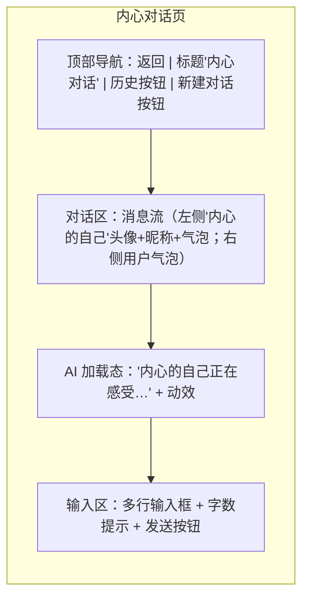

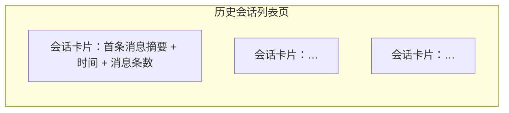

#### 4.3.4 验收标准

1. 用户进入内心对话后，AI 以"内心的自己"身份回应，回应内容体现用户的年龄、性别或个人简介信息（非通用套话）。
2. AI 回应风格符合温柔、自省、引导式三个特征：语气接纳、带有用户自身视角、包含开放式提问（情绪强烈时以共情为主可不含提问）。
3. AI 回应首字响应时间 ≤ 2 秒，采用流式输出。
4. 单条用户消息超过 2000 字时被拦截并提示。
5. AI 单次回应字数在 50-300 字区间。
6. 对话历史按会话保存，用户可在历史列表查看所有会话并回看完整内容。
7. 用户继续历史会话时，AI 能基于该会话的上下文连贯回应。
8. 用户输入涉及自伤信号时，AI 回应包含关怀语句与心理援助热线。
9. AI 生成超时或失败时，用户已发送消息不丢失，可重试。
10. 内心对话内容仅用户自己可见，不出现任何对外暴露。

#### 4.3.5 优先级

P0。内心对话是 LifeVerse"与自己对话"核心定位的支柱功能，是 v2.0 差异化的关键。

---

### 4.4 功能 4：重逢对话功能

#### 4.4.1 用户故事

- 作为一名用户，我希望和"5 年前的自己"对话，这样我能从过去的视角重新看待现在的选择。
- 作为一名用户，我希望和"10 年后的自己"对话，这样我能从未来回望现在，获得方向感。
- 作为一名用户，我希望对话感觉真实——过去的自己有那时的天真，未来的自己有那时的从容，而不是一个通用 AI 换了张皮。
- 作为一名用户，我希望每次重逢对话都能保存，这样这些跨越时间的对话成为我人生的珍贵记录。

#### 4.4.2 功能描述

**业务逻辑**

重逢对话让用户与"过去某个时间点的自己"或"未来某个时间点的自己"展开对话。这是 LifeVerse 独有的"时间维度内省"体验——用户不是在和外部角色对话，而是在和自己人生时间轴上的另一个版本对话。

时间点选择机制：

- 过去的自己：用户可选择"1 年前""3 年前""5 年前""10 年前""18 岁的自己""刚出生的自己"等预设时间点，也可自定义具体年份。系统根据用户当前年龄与所选时间点，推算"那时的自己"的年龄。
- 未来的自己：用户可选择"1 年后""3 年后""5 年后""10 年后""20 年后""60 岁的自己""80 岁的自己"等预设时间点，也可自定义。

AI 生成上下文包含：

- 用户个人资料（昵称、年龄、性别、个人简介）。
- 目标时间点对应的"那时的年龄"。
- 用户记忆卡片中与该时间点相关的事件（如选择"5 年前"，系统检索 5 年前后的记忆卡片；若无记忆卡片，则基于年龄特征生成）。
- 对话风格基调：过去的自己 → 怀旧、带着那时的认知局限与纯真；未来的自己 → 展望、带着阅历后的从容与智慧。
- 对话历史。

对话风格分为两类：

- 与过去的自己对话（怀旧型）：语气带有回忆的温度，会提起"那时候的我们"做过的事、有过的梦想，偶尔带着"现在的你比那时候成熟了"的感慨。回应中体现那个年龄段的认知水平——比如 18 岁的自己会更理想主义、更冲动，不会像现在的自己一样权衡利弊。
- 与未来的自己对话（展望型）：语气从容、温暖，像一个已经走过这段路的人在回头鼓励你。回应中体现未来的阅历——比如 10 年后的自己会更豁达，会说"现在的焦虑，十年后你会发现其实没那么重要"，但不是轻视，而是带着理解的宽慰。

情感共鸣是重逢对话的核心：AI 回应要让用户感到"这真的是那个阶段的我会说的话"，产生穿越时间的情感连接。回应中可适度引用用户记忆卡片中的具体事件增强真实感。

会话管理逻辑与内心对话一致：以会话为单位，支持新建、历史回看、继续。每个会话标注其时间点（如"与 5 年前的自己"），便于用户在历史列表中区分。

**交互逻辑**

发起重逢对话：

1. 用户在首页或功能入口点击"重逢对话" → 进入时间点选择页。
2. 时间点选择页展示两个分区："回到过去"（预设：1/3/5/10 年前、18 岁、刚出生）与"前往未来"（预设：1/3/5/10/20 年后、60 岁、80 岁），底部提供"自定义时间"输入。
3. 用户选择一个时间点 → 页面展示"那时的你"卡片：显示那时的年龄 + 一句情境描述（如"5 年前的你，22 岁，刚毕业，对未来既期待又不安"） → 点击"开始对话"。
4. 进入对话页，AI 主动发起第一句（如过去的自己："嘿，好久不见。现在的你，过得怎么样？"），用户随后展开对话。

对话过程：

1. 与内心对话一致的流式输出、消息展示方式。
2. AI 回应中会自然带入时间参照（过去的自己："那时候我们总想着……""你还记得吗……"；未来的自己："等你到了我这个年纪就明白了……""我现在回头看……"）。
3. 对话页顶部显示当前时间点标签（如"与 5 年前的自己对话"）。

会话管理：

1. 历史列表中每个会话显示时间点标签 + 首条消息摘要 + 时间。
2. 其余会话操作（新建、回看、继续）与内心对话一致。

**规则约束**

- 时间点选择：过去时间不可早于用户出生年；未来时间无上限，但超过 100 年后系统提示"那么远的未来，连未来的自己也想象不到了，试试近一点的时间？"（不阻断）。
- 单条用户消息：最多 2000 字。
- AI 回应：单次 50-300 字，首句由 AI 主动发起（破冰）。
- 上下文窗口：与内心对话一致的摘要压缩策略。
- 内容安全：与内心对话一致，含高风险信号关怀机制。
- 同一时间点可创建多个会话（用户可能多次与"5 年前的自己"对话，每次议题不同）。

**权限逻辑**

- 仅登录用户可使用。
- 用户仅可查看自己的重逢对话历史。
- 重逢对话内容属于用户私密数据。

**边界与异常**

| 场景 | 处理方式 |
|------|----------|
| 用户无任何记忆卡片，选择"5 年前" | AI 基于用户当前年龄推算 5 年前的年龄，结合该年龄段的普遍特征生成回应，回应中不引用具体事件，而是用"那时候的我们大概在……"等推测性表达 |
| 用户选择"18 岁的自己"但当前年龄 < 18 | 提示"你还没到 18 岁呢，要不要和未来的自己聊聊？"，引导至未来时间点 |
| AI 生成超时/失败 | 与内心对话一致的处理 |
| 用户输入涉及自伤/自杀信号 | 与内心对话一致的关怀机制 |
| 自定义时间输入非法值（非数字、负数） | 输入校验，提示"请输入有效的年数" |

#### 4.4.3 原型示意

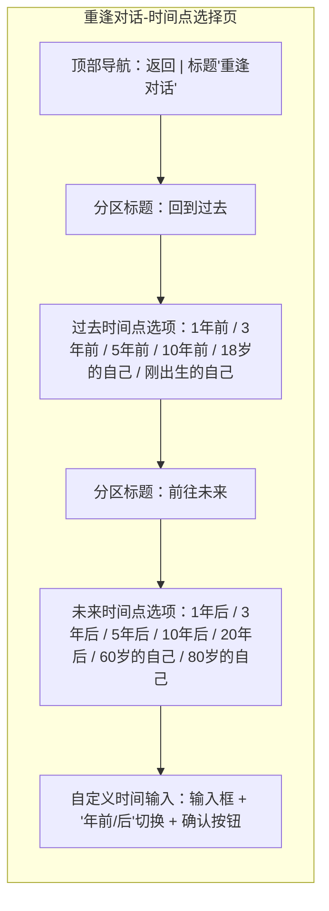

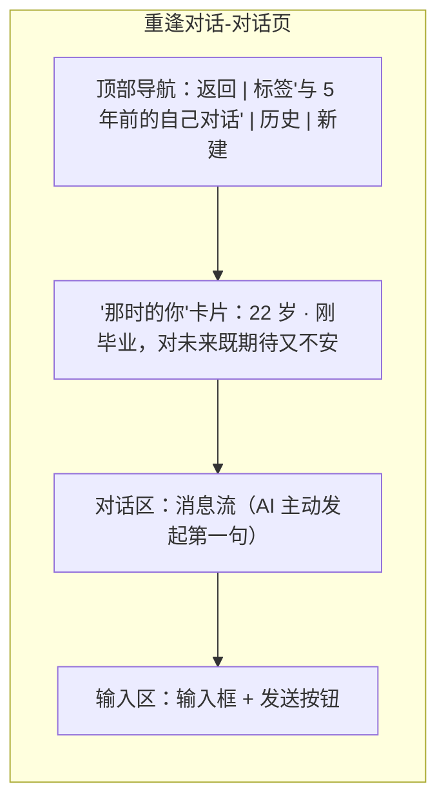

#### 4.4.4 验收标准

1. 用户可选择过去或未来的预设时间点，也可自定义时间。
2. 选择时间点后，系统展示"那时的你"卡片，正确显示那时的年龄。
3. 进入对话后，AI 主动发起第一句，语气符合所选时间点的特征（过去怀旧/未来展望）。
4. 与过去的自己对话时，AI 回应体现那个年龄段的认知水平（如 18 岁更理想主义），而非用现在的成熟口吻。
5. 与未来的自己对话时，AI 回应体现未来阅历的从容与宽慰。
6. 当用户有相关记忆卡片时，AI 回应中能自然引用具体事件增强真实感。
7. 对话历史按会话保存并标注时间点标签，用户可在历史列表区分不同时间点的对话。
8. 用户选择"18 岁的自己"但当前年龄不足 18 岁时，被引导至未来时间点。
9. AI 回应首字响应 ≤ 2 秒，流式输出，单次回应 50-300 字。
10. 高风险信号触发关怀机制与心理援助热线。

#### 4.4.5 优先级

P0。重逢对话与内心对话共同构成"与自己对话"的核心体验闭环，是产品差异化的另一支柱。

---

### 4.5 功能 5：自定义 Agent 功能

#### 4.5.1 用户故事

- 作为一名用户，我希望能创建一个专属的 AI 角色（比如我崇拜的行业前辈），这样我能和真正对我有意义的人"对话"。
- 作为一名用户，我希望能定义这个角色的性格和专业领域，这样它的回应符合我的预期。
- 作为一名用户，我希望创建的角色能加入我的智慧议会，这样议会真正变成"我的"议会。
- 作为一名用户，我希望能随时编辑或删除我创建的角色，这样我可以不断调整。
- 作为一名用户，我希望有数量上限提示，这样我不会无节制地创建导致管理混乱。

#### 4.5.2 功能描述

**业务逻辑**

自定义 Agent 让用户在系统预设成员之外，拥有自己定义的 AI 角色。每个自定义 Agent 由用户配置五项核心属性：名称、头像、性格描述、专业领域、对话风格。系统将这些配置转化为 AI 的角色设定（system prompt），使该 Agent 在议会对话中以用户定义的身份、性格、专业视角回应。

自定义 Agent 创建后进入用户的"我的 Agent 库"，在智慧议会组队时与系统预设成员并列展示，用户可将其选入议会。自定义 Agent 仅创建者本人可见可用，不共享给其他用户（v2.0 不含 Agent 分享/市场功能）。

数量限制：每名用户最多创建 10 个自定义 Agent。达到上限时，需删除已有 Agent 才能创建新的。

编辑与删除：用户可随时编辑自定义 Agent 的任意配置项，编辑后立即生效（不影响已使用该 Agent 的历史对话记录，历史记录保留编辑前的角色设定快照）。删除 Agent 时，若该 Agent 正在某议会组合中使用，系统提示"该 Agent 正在议会中使用，删除后将从议会移除，确认删除？"。

**交互逻辑**

创建 Agent：

1. 用户在"我的-Agent 管理"页面点击"创建 Agent" → 检查是否已达 10 个上限 → 若已达上限提示"已达上限，请先删除不需要的 Agent"；未达上限则进入创建页。
2. 创建页依次填写：名称、头像、性格描述、专业领域、对话风格。
3. 填写过程中，"对话风格"提供预设标签快捷选择（如"理性分析""温暖鼓励""犀利直白""幽默风趣""沉稳内敛"），用户可单选一个标签，也可自定义描述。
4. 点击"创建" → 校验通过后保存 → 提示"Agent 创建成功"，返回 Agent 管理页。

编辑 Agent：

1. 在 Agent 管理页点击某个 Agent 卡片 → 进入编辑页（结构与创建页一致，预填已有配置）。
2. 修改配置 → 点击"保存" → 校验通过后生效。

删除 Agent：

1. 在 Agent 管理页的 Agent 卡片上点击"删除" → 二次确认弹窗（含议会使用提示） → 确认后删除。

在议会中使用：

1. 智慧议会组队页的成员选择列表中，系统预设成员与"我的 Agent"分区展示。
2. 用户选择自定义 Agent 加入议会，与系统成员使用方式一致。

**规则约束**

- 名称：2-12 字符，必填，不可与用户已有自定义 Agent 重名，不可包含敏感词，不可与系统预设成员名称完全相同（避免混淆）。
- 头像：与个人资料头像机制一致，默认从 Agent 专用头像池（16 张风格化头像）随机分配，支持自定义上传（JPG/PNG，≤ 5MB，内容安全审核）。
- 性格描述：10-200 字，必填，描述该角色的性格特征（如"沉稳、睿智、善于从失败中提炼经验"）。
- 专业领域：必填，提供预设分类（商业/科技/艺术/文学/哲学/心理/医学/法律/教育/其他）单选，并支持补充具体领域说明（最多 50 字，如"商业-早期创业融资"）。
- 对话风格：必填，可选预设标签或自定义描述（自定义最多 100 字）。
- 数量上限：10 个/用户。
- 内容安全：所有文本配置项经敏感词与内容安全审核；头像经图片审核。

**权限逻辑**

- 仅登录用户可创建、编辑、删除自定义 Agent。
- 自定义 Agent 仅创建者可见可用，不跨用户共享。
- 用户不可编辑或删除系统预设成员。

**边界与异常**

| 场景 | 处理方式 |
|------|----------|
| 创建时已达 10 个上限 | 提示"已达上限，请先删除不需要的 Agent"，不进入创建页 |
| 名称与已有自定义 Agent 重名 | 提示"已存在同名 Agent，请修改名称" |
| 名称与系统预设成员相同 | 提示"该名称与系统成员冲突，请修改" |
| 性格描述/对话风格包含敏感词 | 保存时校验失败，提示"内容包含违规信息，请修改" |
| 头像审核不通过 | 提示"图片内容不合规，请更换" |
| 删除正在议会中使用的 Agent | 二次确认弹窗，明确提示将从议会移除 |
| 编辑 Agent 后，历史对话中的该 Agent 回应 | 历史记录保留编辑前的角色设定快照，不受编辑影响；新对话使用新配置 |

#### 4.5.3 原型示意

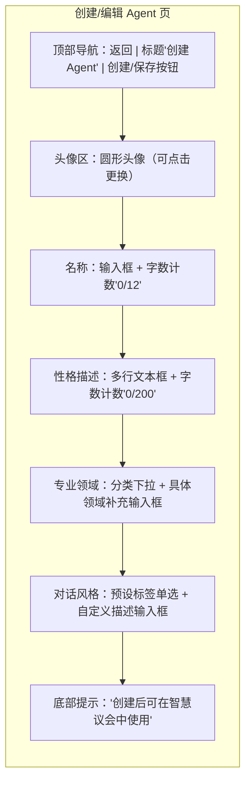

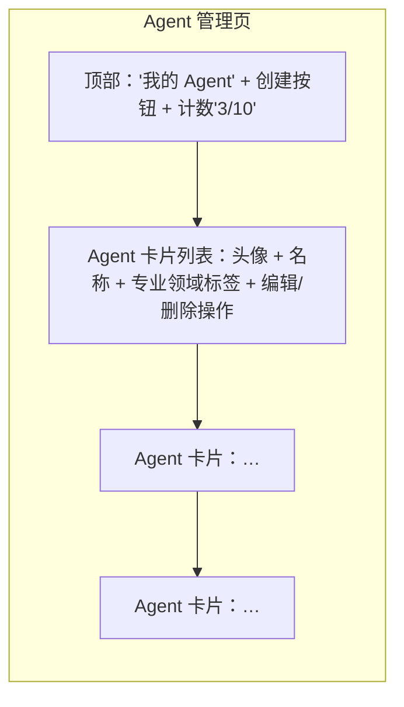

#### 4.5.4 验收标准

1. 用户可创建自定义 Agent，填写名称、头像、性格描述、专业领域、对话风格五项配置。
2. 创建成功后，该 Agent 出现在"我的 Agent 库"中，并在议会组队页可选。
3. 自定义 Agent 在议会对话中，以用户定义的身份、性格、专业视角回应（可通过对话内容验证角色设定生效）。
4. 用户可编辑已有 Agent 的任意配置项，编辑后新对话立即生效。
5. 编辑 Agent 不影响已使用该 Agent 的历史对话记录（历史保留原设定快照）。
6. 用户可删除 Agent，删除时若该 Agent 在议会中使用，有二次确认提示。
7. 用户创建第 11 个 Agent 时被拦截并提示已达上限。
8. 名称重名、与系统成员同名、敏感词等校验均生效。
9. 自定义 Agent 仅创建者本人可见，其他用户不可见。
10. 头像上传经内容安全审核，不合规图片被拒绝。

#### 4.5.5 优先级

P1。自定义 Agent 是议会个性化的关键，但依赖议会扩展（功能 6）先行，故排在 P0 功能之后。

---

### 4.6 功能 6：智慧议会成员扩展

#### 4.6.1 用户故事

- 作为一名用户，我希望有更多成员可选，这样我的议会能覆盖更多人生议题。
- 作为一名用户，我希望能按类型筛选成员（历史人物、心理顾问等），这样我能快速找到适合当前议题的人。
- 作为一名用户，我希望能自由组合 3-6 个成员，这样议会规模适合我的需求。
- 作为一名用户，我希望新增成员和原有成员体验一致，这样不会有"二等成员"的感觉。

#### 4.6.2 功能描述

**业务逻辑**

v1.0 议会有 6 名预设成员。v2.0 将成员库扩展至 20+ 个，新增四类成员：历史人物、文学角色、职业导师、心理顾问。扩展后成员库按类型分组，用户在组队时可按类型筛选。

成员库构成（v2.0 目标 22 名）：

| 类型 | 成员示例 | 数量 |
|------|----------|------|
| 哲人智者（v1.0 保留） | 王阳明、苏格拉底、孔子、老子 | 4 |
| 商业领袖（v1.0 保留 + 新增） | 乔布斯、马斯克、巴菲特、稻盛和夫 | 4 |
| 历史人物（新增） | 诸葛亮、曾国藩、丘吉尔、林肯 | 4 |
| 文学角色（新增） | 苏轼（文人形象）、堂吉诃德、哈利·波特、保尔·柯察金 | 4 |
| 职业导师（新增） | 互联网产品导师、创业者导师、职场转型顾问、自由职业者导师 | 4 |
| 心理顾问（新增） | 认知行为顾问、存在主义心理顾问、积极心理学顾问、关系疗愈顾问 | 4 |

> 注：以上成员为示例配置，最终名单由内容运营团队确定并录入后台。文学角色类成员明确标注"文学形象"，避免与真实人物混淆。职业导师与心理顾问类成员为"角色型"成员（非指代真实在世人），由系统设定其专业视角与回应框架。

每名成员的配置项（后台维护）：名称、头像、类型标签、一句话简介、详细角色设定（性格、价值观、专业视角、说话风格、经典观点）、适用议题标签。这些配置作为该成员在议会对话中的 system prompt。

议会组队规则：用户从全部成员库（系统预设 + 自定义 Agent）中选择 3-6 名组成议会。议会对话时，用户提出议题，被选中的成员依次或按用户指定顺序发言，各成员以自身角色设定回应。

**交互逻辑**

议会组队页：

1. 用户进入"智慧议会" → 默认展示当前议会（若有）或组队引导。
2. 组队页顶部显示"已选 X/6"，成员选择区按类型分组展示（哲人智者、商业领袖、历史人物、文学角色、职业导师、心理顾问、我的 Agent），每组可折叠/展开。
3. 顶部提供类型筛选 Tab（全部 + 各类型），点击筛选仅展示该类型成员。
4. 每个成员卡片显示头像、名称、一句话简介、类型标签；已选成员卡片高亮并显示"已选"标记与移除按钮。
5. 用户点击未选成员 → 加入议会（已选数 +1）；点击已选成员 → 移出议会（已选数 -1）。
6. 已选数 < 3 时，"开始议会"按钮禁用并提示"至少选择 3 名成员"；已选数 = 6 时，再点击成员提示"议会已满（最多 6 名）"。
7. 点击"开始议会" → 进入议会对话页。

成员详情查看：

1. 在成员卡片上点击成员头像/名称（非选择区） → 弹出成员详情卡片：展示简介、详细角色设定摘要、适用议题标签、经典观点示例。
2. 详情卡片提供"加入议会/移出议会"按钮。

议会对话：

1. 议会对话页与 v1.0 一致，用户输入议题，成员依次发言。
2. v2.0 新增"指定发言"：用户可点击某成员头像，指定其就当前议题优先发言。
3. 对话历史保存逻辑与 v1.0 一致。

**规则约束**

- 议会成员数：3-6 名，含自定义 Agent。
- 同一议会中不可重复选择同一成员。
- 自定义 Agent 与系统成员可混选。
- 成员库数量：v2.0 上线时 ≥ 20 名系统预设成员。
- 成员配置由后台维护，前台只读。

**权限逻辑**

- 仅登录用户可使用议会。
- 系统预设成员对所有用户可见可选。
- 自定义 Agent 仅创建者可见可选。

**边界与异常**

| 场景 | 处理方式 |
|------|----------|
| 用户已选 6 名仍尝试添加 | 提示"议会已满，最多 6 名成员"，阻止添加 |
| 用户已选不足 3 名尝试开始 | "开始议会"按钮禁用，提示"至少选择 3 名成员" |
| 成员库加载失败 | 展示已缓存成员，提示"部分成员加载失败，可下拉刷新" |
| 议会对话中某成员生成失败 | 该成员发言位显示"暂时无法发言"，其他成员正常发言，用户可点击"重试该成员" |

#### 4.6.3 原型示意

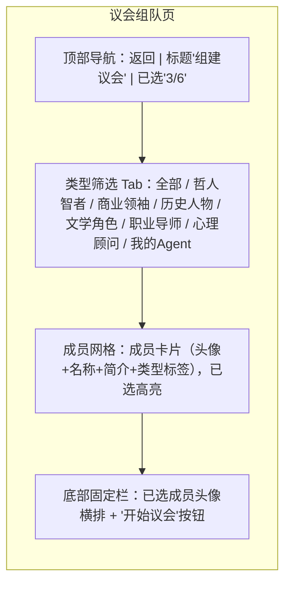

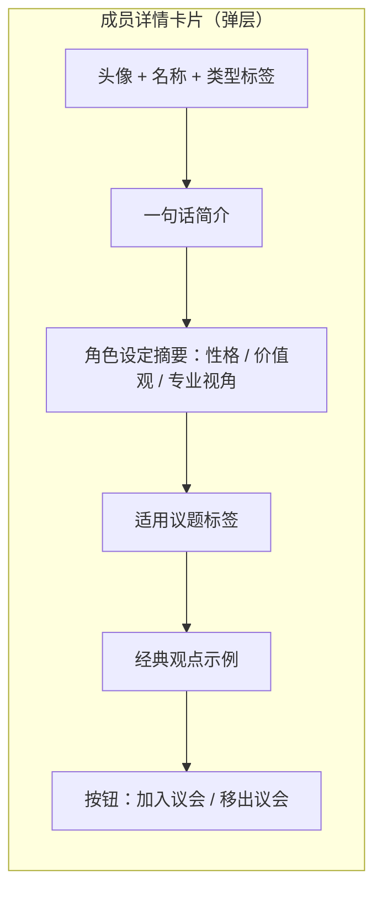

#### 4.6.4 验收标准

1. v2.0 上线后，系统预设议会成员 ≥ 20 名，覆盖哲人智者、商业领袖、历史人物、文学角色、职业导师、心理顾问六类。
2. 用户可按类型筛选成员，筛选结果正确。
3. 用户可查看任一成员的详情卡片，包含简介、角色设定、适用议题、经典观点。
4. 用户可选择 3-6 名成员组成议会，含自定义 Agent 时可混选。
5. 已选不足 3 名时无法开始议会，已选满 6 名时无法继续添加。
6. 议会对话中各成员以自身角色设定回应，体现差异化视角。
7. 用户可指定某成员优先发言。
8. 新增成员与 v1.0 原有成员在对话体验上一致，无功能差异。
9. 成员库加载失败时展示缓存并支持刷新。
10. 单成员生成失败时不影响其他成员发言，支持单成员重试。

#### 4.6.5 优先级

P1。议会扩展是提升议会深度的核心，但属于体验增强而非地基功能，排在 P0 之后。

---

### 4.7 功能 7：系统推荐成员组合

#### 4.7.1 用户故事

- 作为一名新用户，我不知道该选哪些成员，我希望系统给我推荐现成的组合，这样我能快速开始。
- 作为一名用户，我希望推荐组合有明确的主题（如"创业智囊团"），这样我能按当前议题选组合。
- 作为一名用户，我希望一键使用推荐组合后还能调整，这样既有便利又有灵活性。
- 作为一名用户，我希望看到每个组合的推荐理由，这样我理解这个组合适合什么场景。

#### 4.7.2 功能描述

**业务逻辑**

系统预设多种成员组合方案，每个组合包含：组合名称、主题描述、推荐理由、成员列表（3-6 名）、适用场景标签。推荐组合由运营团队在后台配置维护，前台展示给用户。

用户在议会组队页可查看推荐组合列表，一键应用某个组合（即将其成员填入当前议会选择），也可在应用后自定义调整（增删成员，受 3-6 名约束）。用户也可将当前自定义的议会组合"收藏"为个人组合（v2.0 基础版，仅本地保存，不分享）。

预设推荐组合示例（最终方案由运营确定）：

| 组合名称 | 成员 | 主题 | 适用场景 |
|----------|------|------|----------|
| 创业智囊团 | 马斯克、巴菲特、乔布斯 | 商业决策与创业方向 | 创业者面临战略选择 |
| 心灵成长组 | 王阳明、苏格拉底、10 年后的自己 | 内省与心智成长 | 人生迷茫、寻求内在方向 |
| 职场突围组 | 职业转型顾问、认知行为顾问、互联网产品导师 | 职业发展与心理调适 | 职业瓶颈、转型焦虑 |
| 逆境重生组 | 曾国藩、保尔·柯察金、存在主义心理顾问 | 面对挫折与重建 | 遭遇重大挫折、需要韧性 |
| 人生旷达组 | 苏轼、老子、80 岁的自己 | 豁达与人生智慧 | 中年困惑、寻求超脱 |
| 创意灵感组 | 堂吉诃德、乔布斯、哈利·波特 | 创造力与想象力 | 创意工作、突破思维定式 |

> 注：含"X 岁的自己"的组合依赖重逢对话中的"自己"角色能力，议会中调用时复用重逢对话的 AI 上下文逻辑。

**交互逻辑**

查看与使用推荐组合：

1. 议会组队页顶部新增"推荐组合"入口（横向滑动卡片或独立分区）。
2. 每个推荐组合卡片显示：组合名称、成员头像组（叠加展示）、主题描述、适用场景标签。
3. 用户点击组合卡片 → 展开组合详情：推荐理由 + 完整成员列表（含各成员简介）+ "使用此组合"按钮。
4. 点击"使用此组合" → 系统将该组合成员填入当前议会选择 → 跳转至组队页（已选成员区显示该组合成员），用户可继续调整或直接"开始议会"。

应用后调整：

1. 应用推荐组合后，用户可像正常组队一样增删成员（受 3-6 名约束）。
2. 调整后组合不再标注为"推荐组合"，变为"自定义组合"。

收藏个人组合：

1. 用户在组队页调整好成员后，可点击"收藏此组合" → 输入组合名称 → 保存至"我的组合"。
2. "我的组合"在推荐组合区单独分区展示，可一键应用或删除。

**规则约束**

- 推荐组合成员数：3-6 名，成员来自系统预设成员库与"自己"角色。
- 推荐组合由后台配置，前台只读；运营可增删改组合，前台实时生效（或下次进入生效）。
- 个人收藏组合：每用户最多 10 个，可删除。
- 应用推荐组合时，若组合中某成员用户已选，不重复添加；若应用后超出 6 名上限，提示"组合成员数超出上限，请先移除部分成员"。

**权限逻辑**

- 仅登录用户可使用推荐组合与收藏个人组合。
- 推荐组合对所有用户一致（后台统一配置）。
- 个人收藏组合仅用户自己可见。

**边界与异常**

| 场景 | 处理方式 |
|------|----------|
| 推荐组合加载失败 | 展示缓存组合，提示"推荐组合加载失败，可下拉刷新" |
| 应用推荐组合后超出 6 名（用户已选了部分成员） | 提示"当前已选 X 名，该组合有 Y 名，超出上限，请先移除部分成员再应用" |
| 推荐组合含"自己"角色但用户资料未完善 | 正常应用，"自己"角色在议会中基于已有资料生成（资料越完整体验越好） |
| 收藏个人组合达 10 个上限 | 提示"收藏已满，请先删除不需要的组合" |
| 后台删除了某推荐组合，用户正在使用其快照 | 已开始的议会对话不受影响；下次进入组队页该组合不再展示 |

#### 4.7.3 原型示意

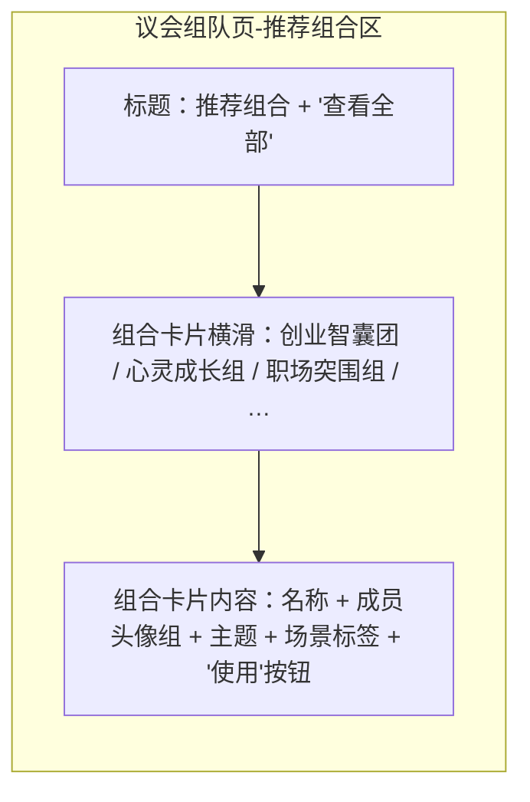

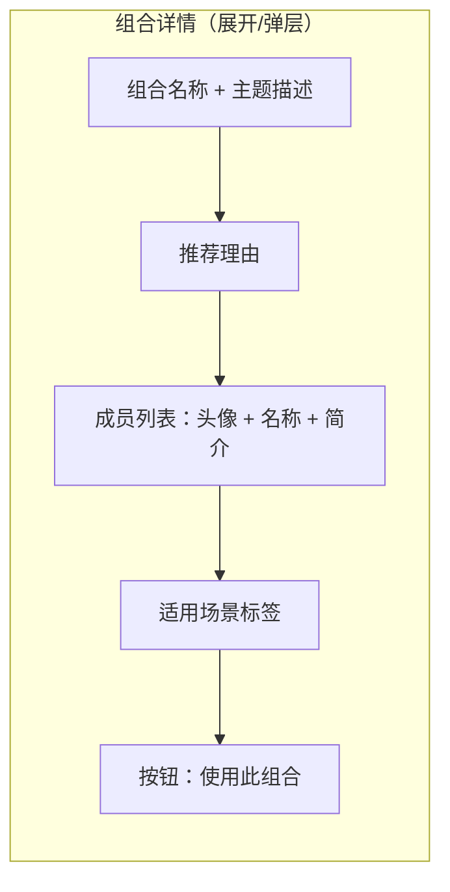

#### 4.7.4 验收标准

1. 议会组队页展示系统推荐组合列表，每个组合含名称、成员、主题、适用场景。
2. 用户可查看推荐组合详情，包含推荐理由与完整成员列表。
3. 用户点击"使用此组合"后，组合成员被填入当前议会选择，可直接开始或继续调整。
4. 应用推荐组合后，用户可增删成员，调整后变为自定义组合。
5. 应用推荐组合时若与已选成员冲突或超限，有明确提示。
6. 用户可收藏当前自定义组合，输入名称后保存至"我的组合"。
7. 个人收藏组合最多 10 个，达上限时提示。
8. 推荐组合加载失败时展示缓存并支持刷新。
9. 含"自己"角色的推荐组合可正常应用，"自己"在议会中基于用户资料生成回应。
10. 推荐组合由后台统一配置，对所有用户一致。

#### 4.7.5 优先级

P1。推荐组合降低新用户使用门槛，依赖议会扩展（功能 6）先行。

---

## 五、非功能需求

### 5.1 性能需求

| 指标 | 要求 | 适用场景 |
|------|------|----------|
| 首屏加载 | ≤ 2 秒（4G 网络） | 全部页面 |
| AI 首字响应 | ≤ 2 秒 | 内心对话、重逢对话、议会对话 |
| AI 完整回应 | ≤ 10 秒（300 字以内） | 全部对话场景 |
| 接口响应 | ≤ 500ms（非 AI 接口） | 登录、资料保存、Agent 增删改、议会组队 |
| 短信验证码送达 | ≤ 30 秒（95% 的请求） | 手机验证码登录 |
| 微信扫码轮询 | 每 2 秒一次，5 分钟超时 | 微信登录 |
| 并发支持 | 支撑 v2.0 预期 DAU 的 3 倍峰值并发 | 全局 |
| 议会多成员生成 | 6 名成员全部发言完成 ≤ 30 秒 | 议会对话 |

AI 对话的流式输出（SSE 或 WebSocket）需保证在网络波动下不中断用户体验，断线后可断点续传或重新生成。

### 5.2 安全需求

**账户与认证安全**

- 密码相关：本产品不设密码登录，采用验证码与 OAuth 令牌，降低密码泄露风险。
- Token 存储：access_token 与 refresh_token 存储在客户端安全区域（Web 端使用 HttpOnly Cookie 或安全存储，App 端使用系统安全存储），不暴露在 localStorage 明文中。
- Token 传输：全程 HTTPS 加密传输。
- 验证码防刷：同一手机号 5 分钟内最多 3 次，同一 IP 1 小时内最多 20 次，超出触发风控验证（图形验证码或限制）。
- 微信 OAuth：严格按微信开放平台规范实现，code 一次性使用，后端校验 state 防 CSRF。

**数据安全与隐私**

- 用户对话内容（内心对话、重逢对话、议会对话）属于高敏感个人数据，存储需加密（至少传输层 HTTPS + 存储层字段级加密）。
- 用户个人资料（出生日期、性别等）加密存储。
- 内心对话与重逢对话内容仅用户本人可访问，后台运营人员不可查看明文（如需用于安全审核，需脱敏且经授权流程）。
- 自伤/自杀等高风险信号事件记录仅限安全运营团队访问，用于触发关怀流程，不用于其他用途。
- 用户数据不向第三方共享，不用于广告推荐。
- 账号注销：提供账号注销入口，注销后用户全部数据（资料、对话、Agent、组合）在 30 天内彻底删除且不可恢复。

**内容安全**

- 用户输入与 AI 输出双向内容安全过滤，覆盖涉政、涉黄、涉暴、涉毒、违法等类别。
- AI 输出需经过敏感词二次校验，防止模型生成违规内容。
- 头像与图片上传经图像内容安全审核。
- 自伤/自杀信号检测与关怀响应机制（详见功能 3、4 边界与异常）。

**AI 安全**

- AI 回应需设置安全护栏：不生成医疗诊断、法律判决、金融投资建议等需要专业资质的结论性内容，相关议题引导用户咨询专业人士。
- AI 不生成鼓励自伤、伤害他人或违法行为的回应。
- 防提示词注入：对用户输入做净化处理，防止用户通过特殊指令篡改 AI 角色设定或绕过安全限制。

### 5.3 兼容性需求

**端覆盖**

| 端 | 要求 |
|----|------|
| 移动端 H5 | 主力端，适配 iOS 14+ / Android 9+ 主流浏览器（Safari、Chrome、微信内置浏览器） |
| 微信小程序 | v2.0 同步上线小程序版本，复用 H5 核心逻辑，适配微信登录原生能力 |
| PC 端 Web | 兼容适配，支持 Chrome 90+、Edge 90+、Safari 14+，响应式布局 |
| 原生 App | v2.0 不单独开发原生 App，通过 H5/小程序覆盖；原生 App 列入 v2.1 规划 |

**屏幕适配**

- 移动端：适配 360px-430px 宽度区间的主流机型，对话页输入框适配软键盘弹起。
- PC 端：居中布局，最大宽度 480px 模拟移动端体验，或独立 PC 布局（由设计确定）。

**兼容性约束**

- 微信内置浏览器需兼容微信 JSSDK 扫码能力。
- 日期选择器在 iOS 与 Android 表现一致（不依赖原生 date input，使用自定义组件）。
- 流式输出在弱网环境下需有降级处理（超时提示 + 重试）。

### 5.4 可用性与可靠性

- 服务可用性目标：99.5%（月度），核心对话服务单次故障恢复 ≤ 30 分钟。
- AI 服务降级策略：当主模型服务不可用时，降级至备用模型或返回预设兜底回应，保证对话不中断。
- 数据持久化：对话历史、个人资料、自定义 Agent 等用户数据需持久化存储，具备定期备份与灾备能力，数据丢失恢复点目标（RPO）≤ 1 小时。

### 5.5 可维护性与可扩展性

- 议会成员库与推荐组合通过后台配置管理，新增/调整成员无需发版。
- AI 角色设定（system prompt）通过配置化管理，支持运营调整无需改代码。
- 对话风格、内容安全规则等以规则引擎形式管理，便于迭代。

---

## 六、里程碑规划

v2.0 采用分阶段交付策略，按功能优先级与依赖关系拆分为三个里程碑。每个里程碑结束时有可验证的交付物。

### 6.1 里程碑总览

| 里程碑 | 名称 | 周期 | 交付功能 | 交付目标 |
|--------|------|------|----------|----------|
| M1 | 地基阶段 | 第 1-4 周 | 功能 1（注册登录）+ 功能 2（个人资料） | 账户体系可用，用户可注册登录并完善资料，为后续 AI 对话提供上下文基础 |
| M2 | 核心对话阶段 | 第 5-10 周 | 功能 3（内心对话）+ 功能 4（重逢对话） | "与自己对话"核心体验闭环上线，产品差异化能力建立 |
| M3 | 议会生态阶段 | 第 11-16 周 | 功能 5（自定义 Agent）+ 功能 6（议会扩展）+ 功能 7（推荐组合） | 议会深度与个性化能力上线，v2.0 全部功能交付 |

### 6.2 M1：地基阶段（第 1-4 周）

**交付功能**：功能 1 用户注册登录系统、功能 2 个人资料系统。

| 周次 | 关键事项 |
|------|----------|
| 第 1 周 | 需求评审完成；技术方案设计（账户体系、Token 机制、微信 OAuth 对接方案）；UI 设计启动 |
| 第 2 周 | 后端开发：用户表设计、登录注册接口、验证码服务对接、微信 OAuth 对接；前端开发：登录页、路由鉴权拦截 |
| 第 3 周 | 后端开发：个人资料接口、头像上传与审核、年龄计算；前端开发：资料编辑页、首次登录引导 |
| 第 4 周 | 联调测试；安全测试（Token 安全、验证码防刷）；M1 验收；灰度发布 |

**M1 验收标准**：功能 1 与功能 2 的全部验收标准通过；登录态 7 天持久化验证通过；未登录拦截验证通过。

**依赖与风险**：

- 依赖：微信开放平台账号申请与审核（需提前 2 周启动）。
- 依赖：短信服务供应商接入（需提前确定供应商并完成资质审核）。
- 风险：微信审核周期不确定 → 缓解：M1 可先上线手机验证码登录，微信登录作为增量在 M1 末或 M2 初补齐。

### 6.3 M2：核心对话阶段（第 5-10 周）

**交付功能**：功能 3 内心对话、功能 4 重逢对话。

| 周次 | 关键事项 |
|------|----------|
| 第 5 周 | AI 对话方案设计（模型选型、Prompt 工程、上下文管理、情感分析方案）；UI 设计（对话页、时间点选择页、历史列表） |
| 第 6 周 | 后端开发：对话会话管理、AI 调用服务、流式输出接口、内容安全过滤；前端开发：内心对话页、历史列表 |
| 第 7 周 | 后端开发：重逢对话时间点逻辑、记忆卡片检索、AI 上下文组装；前端开发：时间点选择页、重逢对话页 |
| 第 8 周 | Prompt 调优：内心对话风格（温柔/自省/引导式）、重逢对话风格（怀旧/展望）的 Prompt 迭代与评测 |
| 第 9 周 | 联调测试；AI 质量评测（风格一致性、上下文连贯性、安全护栏）；高风险信号关怀机制验证 |
| 第 10 周 | M2 验收；灰度发布（先开放 10% 用户） |

**M2 验收标准**：功能 3 与功能 4 的全部验收标准通过；AI 回应风格评测达标（内心对话温柔/自省/引导式特征命中率 ≥ 85%；重逢对话时间特征命中率 ≥ 85%）；首字响应 ≤ 2 秒；安全护栏全部生效。

**依赖与风险**：

- 依赖：M1 账户与资料体系已完成（AI 上下文需要用户资料）。
- 依赖：AI 模型服务可用性与配额（需提前与模型供应商确认并发配额）。
- 风险：AI 风格一致性难达标 → 缓解：第 8 周专项 Prompt 调优，建立离线评测样本集（含边界样本与负样本），设定 go/no-go 标准。
- 风险：自伤/自杀信号误判或漏判 → 缓解：建立高风险信号检测的双重机制（关键词 + 模型分类），漏判率目标 ≤ 2%，误判率目标 ≤ 10%，并配备人工抽检。

### 6.4 M3：议会生态阶段（第 11-16 周）

**交付功能**：功能 5 自定义 Agent、功能 6 议会成员扩展、功能 7 推荐成员组合。

| 周次 | 关键事项 |
|------|----------|
| 第 11 周 | 议会扩展方案设计（成员库结构、后台配置方案、推荐组合配置方案）；新增成员的角色设定撰写（内容运营 + AI 算法协作） |
| 第 12 周 | 后端开发：成员库管理、议会组队接口、自定义 Agent 增删改查；前端开发：议会组队页（类型筛选、成员详情）、Agent 管理页 |
| 第 13 周 | 后端开发：推荐组合配置与查询、个人收藏组合；前端开发：推荐组合区、组合详情、收藏功能 |
| 第 14 周 | 后端开发：议会对话中自定义 Agent 与"自己"角色的 AI 上下文组装；新增成员 Prompt 调优 |
| 第 15 周 | 联调测试；新增成员对话质量评测；推荐组合合理性验证；自定义 Agent 角色设定生效验证 |
| 第 16 周 | M3 验收；全量发布 v2.0 |

**M3 验收标准**：功能 5、6、7 的全部验收标准通过；系统预设成员 ≥ 20 名；新增成员对话质量与 v1.0 原有成员一致；推荐组合可一键应用并支持调整；自定义 Agent 在议会中角色设定生效。

**依赖与风险**：

- 依赖：M2 已完成（议会中"自己"角色复用重逢对话能力）。
- 依赖：内容运营完成 20+ 成员的角色设定撰写与审核。
- 风险：新增成员角色设定质量参差 → 缓解：建立成员角色设定的质量标准与评审流程，每个成员需通过离线对话评测方可上线。
- 风险：后台配置系统开发延期 → 缓解：M3 初期可先用配置文件方式管理成员与组合，后台系统并行开发，后续切换。

### 6.5 里程碑依赖关系

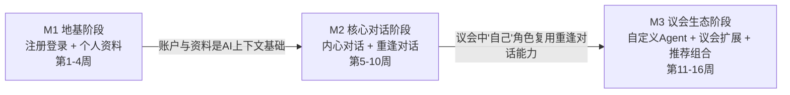

### 6.6 关键决策点

| 决策点 | 时间 | 决策内容 | 决策依据 |
|--------|------|----------|----------|
| DP1 | 第 4 周末 | 微信登录是否随 M1 上线 | 微信开放平台审核是否完成 |
| DP2 | 第 8 周末 | 内心对话与重逢对话的 AI 风格是否达标 | 离线评测 go/no-go 标准 |
| DP3 | 第 10 周末 | M2 是否全量发布 | 灰度 10% 用户的数据表现（首字响应、风格命中率、安全事件） |
| DP4 | 第 15 周末 | 新增成员是否全部上线 | 各成员离线评测通过率 |

---

## 七、附录

### 7.1 术语表

| 术语 | 含义 |
|------|------|
| 内心对话 | 用户与"内心的自己"的 AI 对话，AI 基于用户记忆与情感状态生成内在声音 |
| 重逢对话 | 用户与"过去/未来的自己"的 AI 对话，跨越时间维度的自我对话 |
| 智慧议会 | 用户从成员库中选择 3-6 名角色组成的虚拟议事团体，就人生议题展开多角色对话 |
| 自定义 Agent | 用户自行创建配置的 AI 角色，可加入议会 |
| 记忆卡片 | 用户在 LifeVerse 中记录的人生经历、事件、情感片段，作为 AI 上下文 |
| 会话（session） | 一次连续的对话单元，独立保存与回看 |

### 7.2 待确认事项

| 编号 | 事项 | 说明 |
|------|------|------|
| TBC-1 | 议会成员最终名单 | 本 PRD 列出 22 名示例成员，最终名单由内容运营团队确定 |
| TBC-2 | 推荐组合最终方案 | 本 PRD 列出 6 组示例，最终方案由运营确定 |
| TBC-3 | AI 模型供应商与配额 | 需与算法团队确认模型选型与并发配额 |
| TBC-4 | 短信服务供应商 | 需确定供应商并完成资质审核 |
| TBC-5 | 心理援助热线合作 | 本 PRD 暂用公开热线 400-161-9995，是否接入专业心理援助合作待定 |

---

> 文档结束。本 PRD 经评审通过后进入开发阶段，任何范围变更需经产品总监 Alex Chen 评审并更新版本号。

