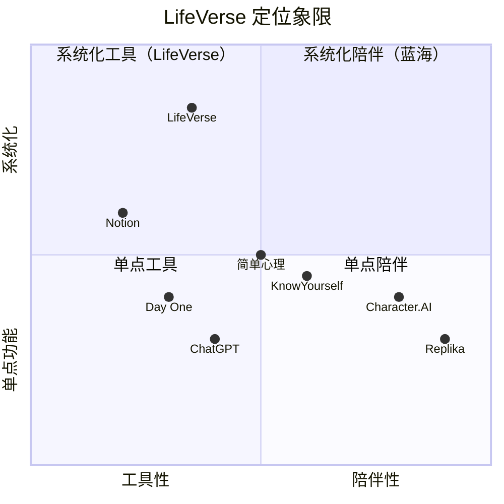
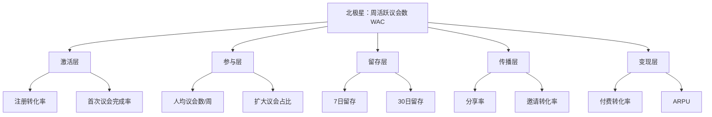

# LifeVerse 市场策略文档

> 文档版本：v1.0
> 维护者：市场总监 Rachel Bai、内容策略师 Noah Zheng
> 上游文档：`prd-v5.md`、`competition.md`、`roadmap.md`、`docs/world/lifeverse.md`
> 适用阶段：MVP 上线（2026 Q4）至 Phase 2 发布（2027 Q2）

---

## 1. 产品定位

### 1.1 一句话定位

LifeVerse 是一个 **AI 生命操作系统**，帮你在重大决策时与智者、记忆和未来的自己对话。

### 1.2 品牌口号

- 英文：**Every life deserves its own universe.**
- 中文：**每一个生命，都值得拥有自己的宇宙。**

### 1.3 传播定位语

> "ChatGPT 帮你做事，LifeVerse 帮你成为自己。"

LifeVerse 不是聊天机器人、不是日记本、不是冥想 App，而是**第一个把'自我'作为操作对象的操作系统**。它把一个人的记忆、情感、梦想、关系与决策，组织成一个可被觉察、可被推演、可被重逢的私人宇宙。

### 1.4 核心价值主张

| 价值层 | 主张 | 对应模块 |
| --- | --- | --- |
| 理解自己 | "我到底是一个怎样的人？" | Inner World、Memory Planet、Wisdom Council |
| 理解过去 | "我是怎么走到今天的？" | Memory Planet、Dream Archive、Reunion |
| 理解未来 | "我可以走向哪里？" | Future Council、Wisdom Council |

### 1.5 差异化卖点（按优先级）

1. 7 位智者为你召开人生议会（Wisdom Council）
2. 让 80 岁的自己提前给你建议（Future Council）
3. 与已经离开的人重逢（Reunion）
4. 把记忆变成可漫游的人生地图（Memory Planet）
5. 看见自己内心的 6 个人格（Inner World）

---

## 2. 目标用户画像

### 2.1 核心人群定义

**25~40 岁面临人生重大决策的都市白领**。他们正处于职业、关系、自我认同的关键转折点，对"如何过好这一生"有真实的焦虑与求解欲。

### 2.2 三个核心画像

#### 画像 1 · 林然，28 岁，互联网产品经理

| 维度 | 描述 |
| --- | --- |
| 人口属性 | 28 岁，男，一线城市，本科以上，未婚 |
| 职业 | 互联网大厂产品经理，工作 5 年，年薪 40 万 |
| 当前困境 | 面临"跳槽去另一家大厂"vs"辞职创业"的决策。创业方向是 AI 教育产品，有合伙人但无现金流 |
| 心理状态 | 焦虑、兴奋、恐惧交织。害怕错过风口，也害怕失去稳定 |
| 信息渠道 | 即刻、小红书、播客（小宇宙）、Twitter/X、知乎 |
| 决策风格 | 数据驱动，但面对人生决策时数据失效，渴望多元视角 |
| 核心诉求 | "我想听听不同人生哲学的人怎么看这件事，而不是只听我妈和同事的" |
| 触达场景 | 深夜刷到"7 位智者帮你做人生决策"的小红书笔记，点进官网 |
| 付费意愿 | 中高。愿意为"高质量的自我觉察"付费，月预算 50~100 元 |

**典型议会议题**："我是否应该辞职创业做 AI 教育产品？"
**最打动他的话**："让马斯克和巴菲特为你辩论这件事，再让 80 岁的你回望这个决定。"

#### 画像 2 · 陈薇，35 岁，中层管理者

| 维度 | 描述 |
| --- | --- |
| 人口属性 | 35 岁，女，新一线城市，硕士，已婚有一孩 |
| 职业 | 外企市场总监，工作 10 年，年薪 60 万 |
| 当前困境 | 面临职业转型（是否转去创业公司）与家庭平衡（孩子刚上小学）的双重压力 |
| 心理状态 | 疲惫、愧疚、不甘。想拼事业又怕亏欠家庭，想顾家又怕被职场淘汰 |
| 信息渠道 | 微信公众号、小红书、得到、LinkedIn |
| 决策风格 | 谨慎、权衡型，容易陷入"既要又要"的内耗 |
| 核心诉求 | "我想看见这个决定 5 年后、10 年后的样子，而不是只在当下纠结" |
| 触达场景 | 在公众号读到《35 岁的她，让 80 岁的自己做了个决定》的用户故事 |
| 付费意愿 | 高。已为得到、心理咨询付费，对自我成长类产品付费习惯成熟 |

**典型议会议题**："我是否应该接受创业公司的 offer，还是留在现在的外企？"
**最打动她的话**："让 50 岁的你和 80 岁的你同时审议这个决定，看看谁会后悔。"

#### 画像 3 · 周航，25 岁，应届毕业生

| 维度 | 描述 |
| --- | --- |
| 人口属性 | 25 岁，男，二线城市，本科，单身 |
| 职业 | 应届硕士毕业生，拿到北京、杭州、成都三个 offer，方向不同 |
| 当前困境 | 城市选择（一线高压高薪 vs 新一线平衡）+ 职业方向（技术 vs 产品）的双重不确定 |
| 心理状态 | 迷茫、从众焦虑。同学都在"卷"，他不确定自己想要什么 |
| 信息渠道 | B 站、小红书、知乎、抖音 |
| 决策风格 | 容易被他人意见左右，缺乏自我价值坐标 |
| 核心诉求 | "我不知道自己到底想要什么，想先搞清楚自己是谁" |
| 触达场景 | 在 B 站看到"用 AI 召开人生议会，7 个智者帮我选城市"的视频 |
| 付费意愿 | 中低。学生预算有限，但愿意为"第一次免费体验"买单（时间） |

**典型议会议题**："我应该去北京做技术，还是去杭州做产品，还是留在成都？"
**最打动他的话**："先别选城市，先让 7 位智者帮你搞清楚——你到底是一个怎样的人。"

### 2.3 人群扩散路径


---

## 3. 竞品分析

### 3.1 竞品格局

LifeVerse 处于"AI 自我探索"赛道，目前**无直接竞品**（首创 AI 生命决策产品），但存在多个间接竞品在相邻赛道分流用户注意力与预算。

### 3.2 直接竞品

**无直接竞品。** LifeVerse 是第一个把"自我"作为操作对象、以"多 Agent 议会 + 时间维度推演 + 记忆管理"为核心的 AI 生命操作系统。详见 `competition.md` 的七维对比矩阵（LifeVerse 总分 35，最高）。

### 3.3 间接竞品

| 竞品类型 | 代表产品 | 用户重叠点 | LifeVerse 差异化 |
| --- | --- | --- | --- |
| 心理咨询 App | 简单心理、KnowYourself | 自我探索、情绪管理需求 | LifeVerse 不是治疗，是决策与觉察；多 Agent 视角 vs 单一咨询师；可推演未来 vs 仅处理当下 |
| AI 对话产品 | Character.AI、Pi、Replika | 与 AI 深度对话需求 | LifeVerse 角色是"镜子"非"玩伴"；议会协同辩论 vs 单角色对话；伦理边界严格；不制造依赖 |
| 通用 AI 助手 | ChatGPT、Claude | 用户会用其问人生问题 | LifeVerse 是"生命仪器"非"瑞士军刀"；系统化 7 模块 vs 单轮对话；跨会话记忆 vs 无记忆 |
| 决策工具 | 决策矩阵、SWOT 工具 | 辅助决策需求 | LifeVerse 多元视角辩论 vs 静态打分；时间推演 + 后悔分析；情感与价值维度 |
| 日记/笔记 | Day One、Notion | 记录与整理需求 | LifeVerse 让记忆"活起来"可对话；AI 自动分类；时间纵深含未来 |

### 3.4 差异化护城河

LifeVerse 的不可替代性建立在 4 个维度上，目前无竞品覆盖：

1. **多 Agent 辩论**：7 智者 + 4 时间自己的议会机制，强制多元视角，避免单一 AI 的盲区。
2. **时间维度推演**：过去/现在/未来三轴联动 + 后悔分析，竞品仅覆盖当下。
3. **记忆管理**：5 星球人生地图，让记忆可"漫游"而非可"检索"。
4. **关系疗愈**：AI 亲人 + 私人议会，Character.AI 接近但无伦理边界与协同。

### 3.5 定位象限



LifeVerse 处于"系统化工具"象限的顶端，并向"系统化陪伴"延伸，这是当前的蓝海位置。

---

## 4. GTM（Go-To-Market）策略

LifeVerse 采用三阶段 GTM 策略，从种子用户验证到品牌建设，每个阶段有明确的目标与退出条件。

### 4.1 Phase 1 · 种子用户获取（0~3 个月）

**目标**：获取 1,000 名种子用户，验证"多元视角 + 时间推演"的核心价值假设。

**核心渠道**：

| 渠道 | 动作 | 目标 | 预算占比 |
| --- | --- | --- | --- |
| Product Hunt | 上线日发起 Product Hunt 发布，争取 Product of the Day | 海外开发者与早期采用者 500 注册 | 10% |
| 小红书 | "命运议会实录"系列笔记，每周 2 篇，主打决策困境共鸣 | 3,000 曝光/篇，200 注册/周 | 30% |
| 知乎 | 深度回答"如何做人生决策"类问题，每周 1 篇长回答 | 5,000 阅读/篇，100 注册/周 | 20% |
| 即刻 | 创始人动态 + 产品思考，建立早期信任 | 1,000 关注，50 注册/周 | 10% |
| 播客（小宇宙） | 创始人上 3 档垂类播客（自我成长/AI/创业） | 5,000 听众触达 | 15% |
| 内推 | 100 人内测圈层口碑扩散，邀请制 | 300 邀请注册 | 15% |

**关键动作**：
- 上线前 2 周：建立 Waitlist，发布概念视频，制造期待。
- 上线日：Product Hunt + 小红书 + 知乎三渠道同步爆发。
- 上线后 1 周：逐一致电/私信前 100 名用户，深度访谈。
- 上线后 2~4 周：根据反馈快速迭代引导流程，提升首次议会完成率。

**退出条件**：
- 注册用户 ≥ 1,000
- 首次议会完成率 ≥ 60%
- 7 日留存 ≥ 35%
- NPS ≥ 30

### 4.2 Phase 2 · 增长黑客（3~6 个月）

**目标**：从 1,000 增长至 10,000 用户，跑通增长飞轮。

**核心机制**：

#### 4.2.1 邀请机制
- 每位用户有 3 个邀请名额，邀请成功双方各获 1 个月 Pro 体验。
- 议会报告可生成"脱敏分享卡片"，分享到社交平台带产品入口。
- "命运报告"分享率作为核心增长指标。

#### 4.2.2 内容营销飞轮
- 小红书：从每周 2 篇提升至每周 3 篇，增加"用户议会实录"UGC。
- 知乎：从回答转向专栏，建立"LifeVerse 议会"专栏。
- 微信公众号：每周 1 篇深度文章 + 用户故事。
- B 站：每周 1 条"议会精华"视频，3~5 分钟。
- Twitter/X：每日 Product updates + AI philosophy。

#### 4.2.3 SEO 与长尾
- 针对"辞职创业要不要""35 岁职业转型""如何做人生决策"等长尾词布局内容。
- 议会报告生成静态分享页，带 SEO 元数据。

**退出条件**：
- 累计用户 ≥ 10,000
- 月活 ≥ 4,000
- 30 日留存 ≥ 30%
- 自然增长占比 ≥ 60%

### 4.3 Phase 3 · 品牌建设（6~12 个月）

**目标**：建立"AI 生命操作系统"品类认知，从 10,000 增长至 50,000 用户。

**核心动作**：

| 动作 | 说明 | 目标 |
| --- | --- | --- |
| KOL 合作 | 签约 5 位垂类 KOL（自我成长/职场/AI/心理），每人 2 条深度内容 | 50 万曝光 |
| 线下活动 | "人生议会"线下沙龙，每月 1 场，每场 30 人 | 品牌深度 + 媒体报道 |
| 品牌大片 | 制作 3 分钟品牌概念片"Every life deserves its own universe" | 100 万播放 |
| 媒体合作 | 与 36氪、虎嗅、极客公园合作深度报道 | 品类定义权 |
| 行业奖项 | 申报 Product Hunt 年度产品、AI 产品奖 | 信任背书 |

**退出条件**：
- 累计用户 ≥ 50,000
- 月活 ≥ 20,000
- 品牌搜索量月均 ≥ 5,000
- 媒体报道 ≥ 20 篇

---

## 5. 定价策略

### 5.1 定价哲学

LifeVerse 的定价遵循三条原则：
1. **价值可感知**：免费版必须让用户完整体验一次议会，感受核心价值。
2. **付费即升级**：付费解锁的是"深度"与"频次"，而非"功能墙"。
3. **隐私不分级**：所有用户的数据隐私标准一致，付费不买隐私。

### 5.2 三档定价

| 层级 | 价格 | 议会频次 | Agent 范围 | 记忆存储 | 核心权益 |
| --- | --- | --- | --- | --- | --- |
| **免费版** | ¥0 | 每月 3 次议会 | 基础 Agent（3 智者焦点议会） | 100 条记忆 | 自我画像、History 基础、命运报告 |
| **Pro 版** | ¥39/月（¥348/年，省 25%） | 无限议会 | 全部 Agent（7 智者 + 4 时间自己） | 无限记忆 | 价值雷达漂移、未来推演、后悔分析、扩大议会 |
| **Team 版** | ¥99/月/人（¥888/年/人） | 无限议会 | 全部 Agent + 团队自定义智者 | 共享记忆空间 | 团队议会、共享记忆、团队时间线、管理后台 |

### 5.3 免费版设计逻辑

- 每月 3 次议会足够让用户体验"标准议会 + 未来议会 + 扩大议会"三种类型。
- 基础 Agent 为 3 智者焦点议会，体验"多元视角"但留有"7 智者完整议会"的升级诱惑。
- 记忆存储 100 条，足够建立初步人生地图，但不足以深度漫游。
- 命运报告完整生成，可分享，是免费版的增长引擎。

### 5.4 Pro 版升级触发点

| 触发场景 | 触发文案 |
| --- | --- |
| 免费议会次数用尽 | "本月议会次数已用完。升级 Pro，让 7 位智者随时为你召开议会。" |
| 想看价值雷达漂移 | "你的价值雷达已发生变化。升级 Pro 解锁漂移轨迹，看见自己的成长。" |
| 想召开扩大议会 | "这个议题冲突值较高，建议召开扩大议会。升级 Pro 解锁智慧议会 + 未来议会联合审议。" |
| 记忆存储将满 | "你的记忆星球即将满载。升级 Pro 获得无限记忆存储。" |

### 5.5 Team 版适用场景

- 创业团队：用议会机制审议战略决策。
- 家庭场景：家庭成员共同召开议会，审议家庭重大决策。
- 心理咨询机构：咨询师用 LifeVerse 辅助来访者自我觉察。

### 5.6 付费转化目标

| 阶段 | 付费转化率目标 |
| --- | --- |
| MVP（Phase 1） | 验证付费意愿，目标 3% |
| Phase 2 | 5% |
| Phase 3 | 8% |
| Phase 4 | 10% |

---

## 6. 增长指标体系

### 6.1 北极星指标

**周活跃议会数（Weekly Active Councils, WAC）**：每周召开的议会总数。

> 选择理由：议会是 LifeVerse 的核心价值交付动作。一个用户召开了议会，意味着他真正使用了产品的核心功能，体验了"多元视角 + 时间推演"的价值。议会数同时反映"活跃用户数 × 使用深度"，比单纯的 DAU/MAU 更能衡量价值交付。

### 6.2 指标分层



### 6.3 辅助指标定义与目标

| 指标 | 定义 | MVP 目标 | Phase 2 目标 | Phase 4 目标 |
| --- | --- | --- | --- | --- |
| 注册转化率 | 访问官网 → 完成注册的比率 | 15% | 20% | 25% |
| 首次议会完成率 | 注册 → 完成第一次议会的比率 | 60% | 65% | 70% |
| 人均议会数/周 | 周活跃用户平均召开议会数 | 2.5 | 3.0 | 4.0 |
| 扩大议会占比 | 扩大议会数 / 总议会数 | 10% | 15% | 20% |
| 7 日留存 | 注册 7 天后仍活跃的比率 | 35% | 40% | 45% |
| 30 日留存 | 注册 30 天后仍活跃的比率 | 20% | 25% | 30% |
| 分享率 | 生成分享卡片的议会占比 | 8% | 12% | 15% |
| 邀请转化率 | 邀请 → 注册的比率 | 20% | 25% | 30% |
| 付费转化率 | 注册 → 付费的比率 | 3% | 5% | 8% |
| ARPU | 每付费用户平均收入 | ¥39 | ¥39 | ¥45 |

### 6.4 指标监控机制

- **日报**：每日早上 9 点发送昨日核心指标简报（注册、议会、留存、付费）。
- **周报**：每周一回顾北极星指标与辅助指标，识别异常。
- **月报**：每月初输出月度增长复盘，含漏斗分析与归因。
- **看板**：实时数据看板（详见 `operations-requirements.md` 数据看板需求）。

### 6.5 关键漏斗

```
官网访问 → 注册 → 完成自我画像 → 完成首次议会 → 7日回访 → 30日留存 → 付费
  100%     15%       12%           10%          4%        2%       0.6%
```

> MVP 阶段重点优化：注册→首次议会完成率（60%目标）与首次议会→7日留存（35%目标）。

---

## 7. 渠道策略

### 7.1 渠道优先级矩阵

| 渠道 | 受众匹配度 | 获客成本 | 增长潜力 | 优先级 |
| --- | --- | --- | --- | --- |
| 小红书 | 高 | 中 | 高 | P0 |
| 知乎 | 高 | 低 | 中 | P0 |
| Product Hunt | 中 | 低 | 中 | P0 |
| B 站 | 中 | 中 | 高 | P1 |
| 微信公众号 | 高 | 中 | 中 | P1 |
| 即刻 | 高 | 低 | 低 | P1 |
| Twitter/X | 中 | 低 | 中 | P1 |
| 抖音/视频号 | 中 | 高 | 高 | P2 |
| 播客（小宇宙） | 高 | 低 | 低 | P2 |
| LinkedIn | 中 | 高 | 低 | P3 |

### 7.2 各渠道策略要点

**小红书**（核心增长渠道）：
- 账号矩阵：官方号 + 创始人号 + 3 个垂类号（职场/心理/AI）。
- 内容形式：图文笔记为主，视频为辅。
- 爆款逻辑：标题用"决策困境共鸣"，正文用"议会实录"，结尾用"产品入口"。
- 投放：薯条推广测试爆款，信息流投放放大。

**知乎**（信任建立渠道）：
- 策略：回答高关注人生决策类问题，建立专业形象。
- 形式：3,000~5,000 字深度长回答，自然植入产品。
- 专栏：建立"LifeVerse 议会"专栏，沉淀长内容。

**Product Hunt**（冷启动渠道）：
- 策略：上线日争取 Product of the Day。
- 准备：提前 2 周联系 PH 猎人，准备英文产品介绍与 Demo 视频。
- 后续：在 PH 社区持续互动，回复评论。

---

## 8. 品牌传播策略

### 8.1 品牌叙事框架

LifeVerse 的品牌叙事围绕一个核心隐喻展开：**"每一个生命，都是一个宇宙。"**

| 叙事层 | 内容 |
| --- | --- |
| 使命 | 让每个人都能拥有一个理解自己的私人宇宙 |
| 愿景 | 成为人类自我觉察的基础设施 |
| 价值观 | 镜子而非裁判 / 显性而非隐性 / 温柔而非冷酷 |
| 故事弧 | 从"决策困境"到"看见全貌"到"与未来重逢" |

### 8.2 传播节奏

| 阶段 | 传播主题 | 核心信息 |
| --- | --- | --- |
| 预热期（上线前 2 周） | "如果 7 位智者为你开会" | 概念植入，制造好奇 |
| 上线期（上线 1 周） | "LifeVerse 上线：AI 生命操作系统" | 产品发布，功能展示 |
| 成长期（上线 1~3 月） | "他们的议会实录" | 用户故事，价值验证 |
| 品牌期（上线 3~6 月） | "每一个生命，都值得拥有自己的宇宙" | 品牌升华，品类定义 |

### 8.3 关键传播物料

| 物料 | 用途 | 交付时间 |
| --- | --- | --- |
| 30 秒概念预告片 | 预热期全渠道投放 | 上线前 2 周 |
| 3 分钟产品演示视频 | 上线期官网与 PH | 上线日 |
| 创始人故事长文 | 上线期公众号与知乎 | 上线日 |
| 用户故事系列（5 篇） | 成长期全渠道 | 上线后 2~6 周 |
| 品牌概念片 | 品牌期全渠道 | 上线后 4 个月 |

---

## 9. 风险与应对

| 风险 | 等级 | 应对策略 |
| --- | --- | --- |
| AI 生成内容引发心理伤害 | 高 | 伦理边界设计 + 心理危机干预 + 专业转介 + 内容审核 |
| 隐私泄露引发信任危机 | 高 | 端到端加密 + RLS + 第三方审计 + 透明隐私政策 |
| "AI 复活逝者"引发伦理争议 | 高 | 预设法务预案 + 媒体沟通策略 + 严格伦理边界 |
| 冷启动失败（注册转化低） | 中 | A/B 测试落地页 + 优化引导流程 + 增加概念视频 |
| LLM 成本失控 | 中 | 缓存策略 + 降级策略 + 本地小模型 + 用量监控 |
| 竞品快速跟进 | 中 | 加速 Phase 2/3 发布 + 建立数据护城河 + 品牌先行 |

---

## 10. 预算分配

### 10.1 MVP 阶段（6 个月）预算分配

| 类目 | 占比 | 说明 |
| --- | --- | --- |
| 内容生产 | 30% | 小红书/知乎/B站内容制作、视频制作 |
| 渠道投放 | 25% | 小红书薯条/信息流、知乎知+ |
| KOL 合作 | 15% | 垂类 KOL 内容合作 |
| 线下活动 | 10% | 沙龙、 meetup |
| 品牌物料 | 10% | 视频、设计、品牌物料 |
| 工具与数据 | 5% | 数据分析工具、CRM、设计工具 |
| 应急储备 | 5% | 突发公关、机会型投放 |

### 10.2 ROI 监控

- 每个渠道单独追踪 CAC（获客成本）与 LTV（生命周期价值）。
- 目标 LTV/CAC ≥ 3。
- 月度复盘各渠道 ROI，淘汰 ROI < 1 的渠道。

---

## 11. 团队分工

| 角色 | 负责人 | 职责 |
| --- | --- | --- |
| 市场总监 | Rachel Bai | 市场策略、预算管理、渠道统筹、KOL 关系 |
| 内容策略师 | Noah Zheng | 内容矩阵、内容日历、议题库、用户故事 |
| 增长运营 | 待招 | 数据分析、A/B 测试、增长实验 |
| 社群运营 | 待招 | Discord/微信群、用户共创、活动策划 |
| 品牌设计 | 待招/外包 | 品牌物料、视觉规范、视频制作 |

---

## 12. 关联文档

- PRD 总纲：`docs/prd/prd-v5.md`
- 竞品分析：`docs/prd/competition.md`
- 路线图：`docs/prd/roadmap.md`
- 产品世界观：`docs/world/lifeverse.md`
- 内容运营计划：`docs/marketing/content-calendar.md`
- 运营需求文档：`docs/marketing/operations-requirements.md`
- 品牌素材清单：`docs/marketing/brand-assets.md`
