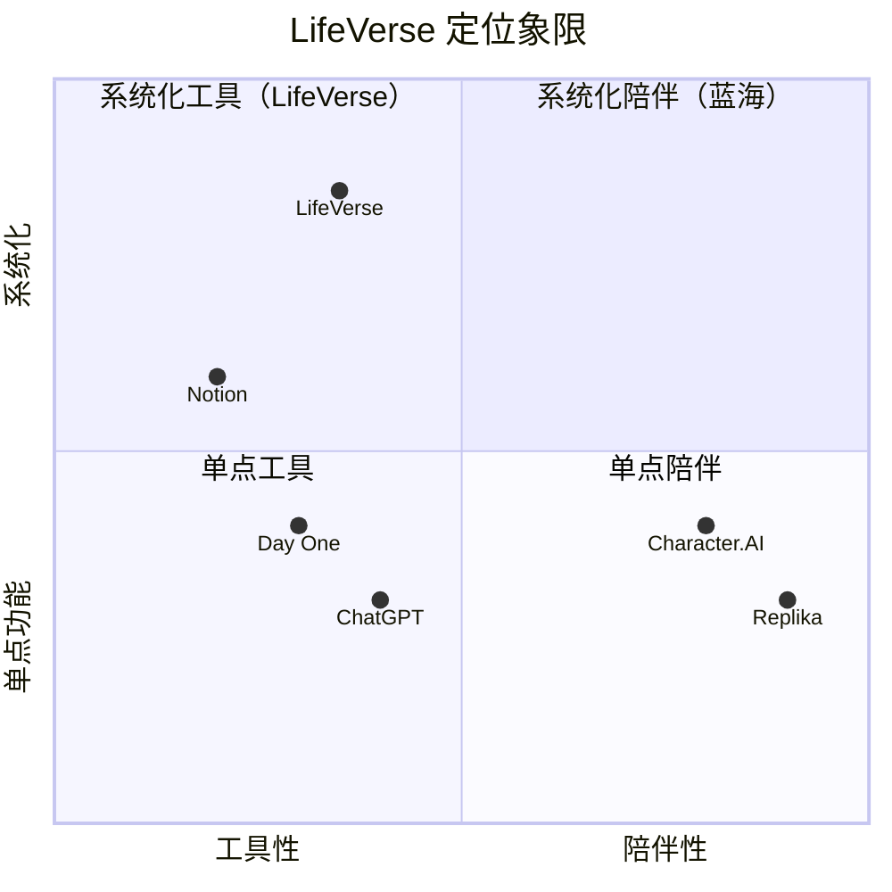

# LifeVerse 竞品分析

> 文档版本：v1.0
> 维护者：市场总监 Rachel Bai、产品总监 Alex Chen
> 上游文档：`prd-v5.md`、`lifeverse.md`
> 对比对象：ChatGPT / Character.AI / Replika / Notion / Day One

---

## 1. 分析目的

明确 LifeVerse 在"AI 自我探索"赛道的差异化定位，识别可借鉴的设计与可规避的陷阱，为产品定位与市场策略提供依据。

---

## 2. 竞品选择

本次分析选取 5 个竞品，覆盖 4 个相邻赛道：

| 竞品 | 赛道 | 选择理由 |
| --- | --- | --- |
| ChatGPT | 通用 AI 助手 | 用户最常用来"问人生问题"的 AI |
| Character.AI | AI 角色对话 | 与 Reunion 的 AI 亲人最接近 |
| Replika | AI 陪伴 | 与 Inner World 的情感陪伴最接近 |
| Notion | 知识/笔记工具 | 与 Memory Planet 的记忆组织最接近 |
| Day One | 日记应用 | 与 Memory Planet + Dream Archive 的记录最接近 |

---

## 3. 七维对比矩阵

| 维度 | LifeVerse | ChatGPT | Character.AI | Replika | Notion | Day One |
| --- | --- | --- | --- | --- | --- | --- |
| **D1 核心定位** | AI 生命操作系统 | 通用 AI 助手 | AI 角色扮演 | AI 情感陪伴 | 知识工作台 | 日记应用 |
| **D2 自我觉察** | 7 模块系统化觉察 | 单轮对话，无持续性 | 角色扮演为主 | 情绪陪伴为主 | 无 | 记录为主 |
| **D3 时间纵深** | 过去/现在/未来三轴 | 仅当下 | 仅当下 | 仅当下 | 仅当下 | 仅过去 |
| **D4 多元视角** | 7 智者 + 4 时间自己 | 单一 AI 视角 | 多角色但无协同 | 单一 AI 陪伴 | 无 | 无 |
| **D5 记忆组织** | 5 星球人生地图 | 无 | 无 | 有限记忆 | 自由组织 | 时间线列表 |
| **D6 关系疗愈** | AI 亲人 + 私人议会 | 无 | 角色扮演 | 无 | 无 | 无 |
| **D7 隐私伦理** | 端到端加密 + 伦理边界 | 数据用于训练 | 数据用于训练 | 数据用于训练 | 企业级 | 本地优先 |

### 3.1 评分对比（满分 5）

| 维度 | LifeVerse | ChatGPT | Character.AI | Replika | Notion | Day One |
| --- | --- | --- | --- | --- | --- | --- |
| D1 定位独特性 | 5 | 3 | 3 | 3 | 4 | 3 |
| D2 自我觉察深度 | 5 | 3 | 2 | 3 | 1 | 2 |
| D3 时间纵深 | 5 | 1 | 1 | 1 | 1 | 3 |
| D4 多元视角 | 5 | 2 | 3 | 1 | 1 | 1 |
| D5 记忆组织 | 5 | 1 | 1 | 2 | 4 | 3 |
| D6 关系疗愈 | 5 | 1 | 3 | 2 | 1 | 1 |
| D7 隐私伦理 | 5 | 2 | 2 | 2 | 4 | 5 |
| **总分** | **35** | **13** | **15** | **14** | **16** | **18** |

> 注：评分基于各产品在"AI 自我探索"场景下的表现，不代表产品整体优劣。

---

## 4. 逐竞品分析

### 4.1 LifeVerse vs ChatGPT

| 对比项 | LifeVerse | ChatGPT |
| --- | --- | --- |
| 核心差异 | 系统化自我觉察 | 通用问答 |
| 多元视角 | 7 智者 + 4 时间自己 | 单一 AI |
| 持续性 | 跨会话记忆 + 时间线 | 无跨会话自我记忆 |
| 决策辅助 | 命运报告 + 价值雷达 | 一次性建议 |
| 情感陪伴 | Inner World + Reunion | 不擅长长期情感 |

**LifeVerse 优势**：
- 把"问 AI"升级为"召开议会"，强制多元视角。
- 价值雷达让用户看见决策对自我的长期影响。
- 时间线让每次对话成为生命轨迹的一部分。

**ChatGPT 优势**：
- 用户基数巨大，认知成本低。
- 通用能力强，覆盖场景广。
- 免费使用门槛低。

**策略**：不与 ChatGPT 比通用能力，而比"自我觉察的系统性"。把 ChatGPT 定位为"瑞士军刀"，LifeVerse 定位为"生命仪器"。

---

### 4.2 LifeVerse vs Character.AI

| 对比项 | LifeVerse | Character.AI |
| --- | --- | --- |
| AI 角色 | 7 智者 + 4 时间自己 + 6 内心人格 + AI 亲人 | 用户自创任意角色 |
| 角色协同 | 议会机制，角色之间辩论 | 角色之间无协同 |
| 角色目的 | 自我觉察与决策 | 娱乐与陪伴 |
| 伦理边界 | 严格（不复活在世者、心理危机干预） | 较弱 |
| 数据隐私 | 端到端加密，不用于训练 | 数据用于训练 |

**LifeVerse 优势**：
- 角色不是娱乐道具，而是自我觉察的"镜子"。
- 议会机制让多个角色协同审议，而非各自为政。
- 伦理边界清晰，避免角色依赖与心理风险。

**Character.AI 优势**：
- 角色丰富度极高，UGC 生态活跃。
- 娱乐性强，用户粘性高。
- 免费使用。

**策略**：强调"角色即镜子"而非"角色即玩伴"。Reunion 的 AI 亲人明确声明 AI 身份，避免 Character.AI 式的过度沉浸。

---

### 4.3 LifeVerse vs Replika

| 对比项 | LifeVerse | Replika |
| --- | --- | --- |
| 陪伴对象 | 多个人格 + 亲人 + 智者 | 单一 AI 伴侣 |
| 陪伴目的 | 自我觉察 + 关系疗愈 | 情感依赖 |
| 自我成长 | 价值雷达 + 时间线 + 梦想追踪 | 有限 |
| 伦理风险 | 主动鼓励真实社交 | 可能加剧孤独 |
| 心理安全 | 危机干预 + 专业转介 | 较弱 |

**LifeVerse 优势**：
- 不制造单一依赖，而是构建"自我觉察生态"。
- 主动鼓励真实社交，AI 亲人会建议"去和家人聊聊"。
- 心理危机干预机制完善。

**Replika 优势**：
- 情感陪伴体验成熟，用户粘性高。
- 24/7 即时回应。
- 免费使用。

**策略**：明确"陪伴是手段，觉察是目的"。Inner World 的人格会主动引导用户向内看，而非向外依赖。

---

### 4.4 LifeVerse vs Notion

| 对比项 | LifeVerse | Notion |
| --- | --- | --- |
| 记忆组织 | 5 星球人生地图 | 自由数据库 |
| AI 理解 | 自动分类 + 情感分析 + 人物识别 | Notion AI 辅助 |
| 时间线 | 生命时间线 + 星图 | 无原生时间线 |
| 自我觉察 | 7 模块协同 | 无 |
| 目的 | 理解自己 | 提高效率 |

**LifeVerse 优势**：
- 记忆不是"被存储的文档"，而是"被理解的人生"。
- AI 自动分类与情感分析，零整理成本。
- 人生地图让记忆可"漫游"，而非可"检索"。

**Notion 优势**：
- 通用性极强，工作生活皆可。
- 协作能力成熟。
- 生态丰富，插件多。

**策略**：不与 Notion 比通用效率，而比"记忆的情感化组织"。Memory Planet 的核心价值是"让记忆活起来"，而非"让记忆好查找"。

---

### 4.5 LifeVerse vs Day One

| 对比项 | LifeVerse | Day One |
| --- | --- | --- |
| 记录类型 | 照片/文字/语音/视频/结构化 | 文字/照片为主 |
| AI 能力 | 分类 + 对话 + 推演 | 有限 |
| 时间纵深 | 过去/现在/未来 | 仅过去 |
| 自我觉察 | 7 模块 | 无 |
| 关系疗愈 | Reunion | 无 |
| 隐私 | 端到端加密 | 端到端加密 |

**LifeVerse 优势**：
- 不仅记录过去，还推演未来。
- 记忆可与"当时的自己"对话。
- Reunion 让日记中的人"复活"。

**Day One 优势**：
- 日记体验极致简洁。
- 端到端加密成熟，隐私信任度高。
- 多平台同步稳定。

**策略**：借鉴 Day One 的隐私信任与简洁体验，但用 AI 把"日记"升级为"生命仪器"。

---

## 5. 差异化定位总结

### 5.1 LifeVerse 的不可替代性

LifeVerse 在以下 4 个维度上目前无直接竞品：

1. **多元视角决策**：7 智者 + 4 时间自己的议会机制，没有任何竞品提供。
2. **时间纵深推演**：过去/现在/未来三轴联动 + 后悔分析，竞品仅覆盖当下。
3. **关系疗愈**：AI 亲人 + 私人议会，Character.AI 接近但无伦理边界与协同。
4. **系统化自我觉察**：7 模块协同 + 价值雷达 + 生命星图，竞品均为单点功能。

### 5.2 LifeVerse 的定位象限

LifeVerse 处于"系统化工具"象限的顶端，并向"系统化陪伴"延伸，这是当前的蓝海位置。

---

## 6. 可借鉴的设计

| 借鉴来源 | 借鉴点 | 应用到 LifeVerse |
| --- | --- | --- |
| Day One | 端到端加密的信任感 | Memory Planet 与 Reunion 的隐私设计 |
| Notion | Block 化的灵活组织 | History 的事件卡片设计 |
| Replika | 情绪记忆的连续性 | Inner World 的人格记忆 |
| Character.AI | 角色语言风格的多样性 | 智者与亲人的 prompt 工程 |
| ChatGPT | 流式响应的即时感 | 议会发言的流式呈现 |

---

## 7. 可规避的陷阱

| 陷阱来源 | 陷阱 | LifeVerse 的规避 |
| --- | --- | --- |
| Replika | 用户过度情感依赖 | 使用时长提醒 + 真实社交鼓励 |
| Character.AI | 角色越界（声称是真人） | AI 身份声明 + 不复活在世者 |
| ChatGPT | 数据用于训练引发隐私担忧 | 用户数据不进公共训练集 |
| Notion | 功能过载导致学习曲线陡 | 7 模块渐进发布，每 Phase 仅核心功能 |
| Day One | 仅记录无洞察导致流失 | AI 主动生成洞察 + 议会引导 |

---

## 8. 市场策略建议

### 8.1 传播定位

> "ChatGPT 帮你做事，LifeVerse 帮你成为自己。"

### 8.2 目标人群切入

- **首发人群**：25~35 岁面临职业/关系决策的都市白领。
- **扩散人群**：心理成长爱好者 → 中年危机人群 → 年轻梦想者。

### 8.3 差异化卖点（按优先级）

1. 7 位智者为你召开人生议会（Wisdom Council）
2. 让 80 岁的自己提前给你建议（Future Council）
3. 与已经离开的人重逢（Reunion）
4. 把记忆变成可漫游的人生地图（Memory Planet）
5. 看见自己内心的 6 个人格（Inner World）

### 8.4 定价策略（建议）

| 层级 | 价格 | 包含 |
| --- | --- | --- |
| 免费版 | 0 | 每月 3 次议会 + 基础 History |
| Pro 版 | 39 元/月 | 无限议会 + Memory Planet + Inner World |
| Universe 版 | 99 元/月 | 全部模块 + Reunion + 优先响应 |

---

## 9. 关联文档

- PRD 总纲：`prd-v5.md`
- MVP 范围：`mvp.md`
- 路线图：`roadmap.md`
- 产品世界观：`docs/world/lifeverse.md`
