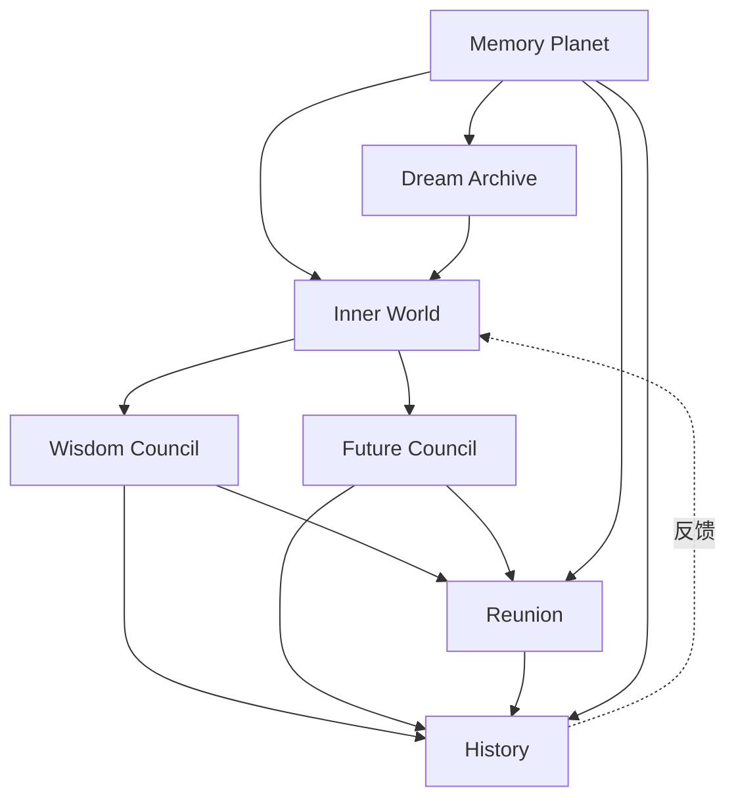
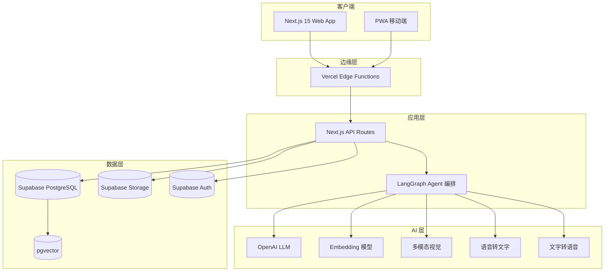
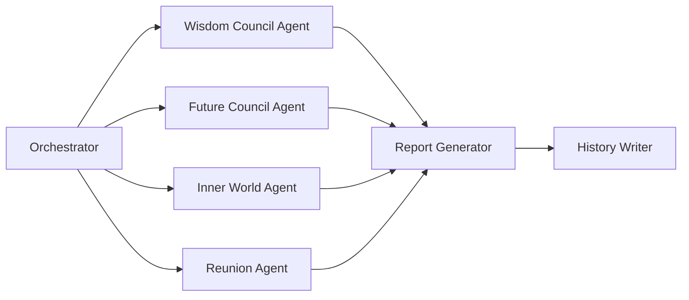

# LifeVerse v5.0 PRD 总纲

> 文档版本：v5.0
> 维护者：产品总监 Alex Chen、市场总监 Rachel Bai、内容策略师 Noah Zheng
> Slogan：Every life deserves its own universe.
> 技术栈：Next.js 15 + TypeScript + Supabase + LangGraph + OpenAI + Vercel
> 上游文档：`docs/world/*.md`

---

## 1. 产品定位

### 1.1 一句话定位

LifeVerse 是一个 **AI 生命操作系统**，把一个人的记忆、情感、梦想、关系与决策，组织成一个可被觉察、可被推演、可被重逢的私人宇宙。

### 1.2 目标用户

| 用户画像 | 占比预估 | 核心诉求 |
| --- | --- | --- |
| 25~35 岁都市白领 | 35% | 职业迷茫、自我探索 |
| 30~45 岁中年人 | 25% | 中年危机、关系修复 |
| 18~25 岁年轻人 | 20% | 梦想规划、自我认同 |
| 45~60 岁准退休人群 | 15% | 人生回望、传承 |
| 心理成长爱好者 | 5% | 深度自我觉察 |

### 1.3 核心价值主张

- **理解自己**：通过 7 大模块看见自己的全貌。
- **理解过去**：把碎片化的过去组织成可回溯的人生地图。
- **理解未来**：在行动之前推演未来的多种可能。

### 1.4 与竞品的根本差异

LifeVerse 不是聊天机器人、不是日记本、不是冥想 App，而是**第一个把"自我"作为操作对象的操作系统**。详见 `competition.md`。

---

## 2. 七大模块概览

| 模块 | 定位 | MVP 是否包含 | 核心交付物 |
| --- | --- | --- | --- |
| Wisdom Council | 决策引擎 | 是 | 命运报告、价值雷达 |
| Future Council | 推演引擎 | 是 | 未来推演报告、后悔分析 |
| Inner World | 情绪引擎 | Phase 2 | 内心天气、内心议会 |
| Memory Planet | 记忆仓库 | Phase 2 | 人生地图、记忆回放 |
| Dream Archive | 梦想仓库 | Phase 3 | 梦想时间轴、儿时自己 |
| Reunion | 关系引擎 | Phase 3 | AI 亲人、私人议会 |
| History | 时间引擎 | 是 | 生命时间线、生命星图 |

### 2.1 模块依赖关系



---

## 3. 技术架构

### 3.1 技术栈选型

| 层 | 技术 | 选型理由 |
| --- | --- | --- |
| 前端 | Next.js 15 + TypeScript | App Router、RSC、生态成熟 |
| 样式 | Tailwind CSS + Framer Motion | 快速构建 + 动画丰富 |
| 后端 | Next.js API Routes + Supabase | 一体化 + BaaS 加速 |
| 数据库 | Supabase (PostgreSQL) | RLS 行级权限、向量检索 |
| AI 编排 | LangGraph | 多 Agent 编排、状态机 |
| LLM | OpenAI GPT-4o / GPT-5 | 多模态、推理能力强 |
| 向量检索 | pgvector (Supabase) | 与业务库统一 |
| 认证 | Supabase Auth + Clerk（可选） | 社交登录、MFA |
| 部署 | Vercel | Edge、Serverless、Preview |
| 存储 | Supabase Storage | 与数据库统一权限 |
| 监控 | Sentry + Vercel Analytics | 错误追踪 + 性能 |

### 3.2 系统架构图



### 3.3 数据模型概览

核心表结构（简化版）：

```sql
-- 用户
users (id, email, name, value_radar, created_at)

-- 记忆
memories (id, user_id, type, title, content, metadata, planet, emotion, importance, privacy, created_at)

-- 梦想
dreams (id, user_id, title, description, stage, status, progress, origin, created_at)

-- 议会
councils (id, user_id, type, topic, members, conflict_value, consensus, report, created_at)

-- AI 亲人
reunion_persons (id, user_id, type, name, profile, language_style, value_radar, boundary, created_at)

-- 时间线事件
history_events (id, user_id, type, ref_id, timestamp, summary, tags)

-- 内心人格状态
inner_states (id, user_id, personality, activity, emotion, timestamp)
```

### 3.4 AI Agent 编排

LangGraph 用于编排多 Agent 场景，典型编排如下：



每个 Agent 拥有独立的 system prompt、记忆边界与工具集，由 Orchestrator 协调调用顺序与数据传递。

---

## 4. 功能需求

### 4.1 MVP（Phase 1）功能清单

| 编号 | 功能 | 模块 | 优先级 |
| --- | --- | --- | --- |
| F-001 | 用户注册与自我画像 | 全局 | P0 |
| F-002 | 智慧议会标准流程 | Wisdom Council | P0 |
| F-003 | 价值雷达生成与漂移追踪 | Wisdom Council | P0 |
| F-004 | 命运报告生成与存储 | Wisdom Council | P0 |
| F-005 | 未来议会标准流程 | Future Council | P0 |
| F-006 | 时间线推演与快照 | Future Council | P0 |
| F-007 | 后悔分析报告 | Future Council | P0 |
| F-008 | History 时间线视图 | History | P0 |
| F-009 | 议会记录回看 | History | P0 |
| F-010 | 扩大议会（WC + FC） | 跨模块 | P1 |

### 4.2 Phase 2 功能清单

| 编号 | 功能 | 模块 | 优先级 |
| --- | --- | --- | --- |
| F-011 | 记忆上传与 AI 分类 | Memory Planet | P0 |
| F-012 | 五星球可视化 | Memory Planet | P0 |
| F-013 | 人生地图生成 | Memory Planet | P0 |
| F-014 | 记忆回放与对话 | Memory Planet | P1 |
| F-015 | 内心人格激活 | Inner World | P0 |
| F-016 | 内心冲突检测 | Inner World | P0 |
| F-017 | 内心天气日历 | Inner World | P1 |
| F-018 | 内心议会 | Inner World | P1 |

### 4.3 Phase 3 功能清单

| 编号 | 功能 | 模块 | 优先级 |
| --- | --- | --- | --- |
| F-019 | AI 亲人生成 | Reunion | P0 |
| F-020 | 私人议会 | Reunion | P0 |
| F-021 | 重逢场景引导 | Reunion | P0 |
| F-022 | 梦想记录与时间轴 | Dream Archive | P0 |
| F-023 | 儿时自己 AI 生成 | Dream Archive | P1 |
| F-024 | 梦想距离报告 | Dream Archive | P1 |

### 4.4 Phase 4 功能清单

| 编号 | 功能 | 模块 | 优先级 |
| --- | --- | --- | --- |
| F-025 | 生命星图 | History | P0 |
| F-026 | 年度生命报告 | 全局 | P0 |
| F-027 | 跨模块智能推荐 | 全局 | P1 |
| F-028 | 多设备同步 | 全局 | P1 |
| F-029 | 开放 API 与插件 | 全局 | P2 |

---

## 5. 非功能需求

### 5.1 性能

| 指标 | 目标值 |
| --- | --- |
| 首屏加载时间（LCP） | < 2.0s |
| 议会响应时间（首 token） | < 1.5s |
| 议会完整生成时间 | < 30s |
| 记忆上传处理时间（单条） | < 5s |
| 人生地图渲染时间 | < 3s |

### 5.2 可用性

| 指标 | 目标值 |
| --- | --- |
| 服务可用性 SLA | 99.5%（MVP）/ 99.9%（Phase 4） |
| 单点故障恢复时间 | < 15min |
| 数据库 RPO | < 5min |
| 数据库 RTO | < 30min |

### 5.3 安全与隐私

| 要求 | 说明 |
| --- | --- |
| 数据加密 | 传输 TLS 1.3，存储 AES-256 |
| 行级权限 | Supabase RLS，用户只能访问自己的数据 |
| AI 数据隔离 | 用户数据不进入公共训练集 |
| 敏感操作 | 二次验证（删除 AI 亲人、导出全部数据） |
| 合规 | GDPR、CCPA、个保法合规 |
| 心理安全 | 检测到自伤倾向时主动提供专业热线 |

### 5.4 可扩展性

- 模块化架构，新模块可独立部署。
- AI Agent 通过 LangGraph 编排，可热插拔。
- 数据库支持水平分表（按 user_id 分片）。
- 多 LLM 后端支持（OpenAI / Anthropic / 本地模型）。

### 5.5 国际化

- MVP 仅支持中文。
- Phase 2 支持英文。
- Phase 3 支持日文、韩文。
- 所有 UI 文案与 AI prompt 模板支持 i18n。

### 5.6 可访问性

- WCAG 2.1 AA 级别。
- 支持屏幕阅读器。
- 支持键盘导航。
- 支持高对比度模式。

---

## 6. 里程碑

| 里程碑 | 时间 | 交付物 |
| --- | --- | --- |
| M1 · MVP 内测 | 2026 Q3 | Wisdom Council + Future Council + History |
| M2 · MVP 公测 | 2026 Q4 | 开放注册，1000 种子用户 |
| M3 · Phase 2 | 2027 Q1 | Memory Planet + Inner World |
| M4 · Phase 3 | 2027 Q3 | Reunion + Dream Archive |
| M5 · Phase 4 | 2028 Q1 | LifeVerse OS 完整版 |

详细路线图见 `roadmap.md`。

---

## 7. 风险与应对

| 风险 | 等级 | 应对 |
| --- | --- | --- |
| AI 生成内容引发心理伤害 | 高 | 伦理边界 + 心理危机干预 + 专业转介 |
| 隐私泄露 | 高 | 端到端加密 + RLS + 第三方审计 |
| LLM 成本失控 | 中 | 缓存 + 降级策略 + 本地小模型 |
| 用户过度依赖 AI 亲人 | 中 | 使用时长提醒 + 真实社交鼓励 |
| 法规变化 | 中 | 法务顾问 + 模块化合规层 |

---

## 8. 成功指标

### 8.1 北极星指标

**周活跃议会用户数（WAU-C）**：每周至少召开 1 次议会的用户数。

### 8.2 核心指标

| 指标 | MVP 目标 | Phase 4 目标 |
| --- | --- | --- |
| 注册用户 | 1,000 | 500,000 |
| 周活 | 400 | 150,000 |
| 议会召开数/周 | 1,200 | 600,000 |
| 命运报告生成数 | 2,000 | 1,000,000 |
| 7 日留存 | 35% | 45% |
| 30 日留存 | 20% | 30% |
| 付费转化 | - | 8% |

---

## 9. 关联文档

- 世界观层：`docs/world/*.md`
- 用户故事：`docs/prd/user_story.md`
- 用户流程：`docs/prd/user_flow.md`
- MVP 范围：`docs/prd/mvp.md`
- 路线图：`docs/prd/roadmap.md`
- 竞品分析：`docs/prd/competition.md`
