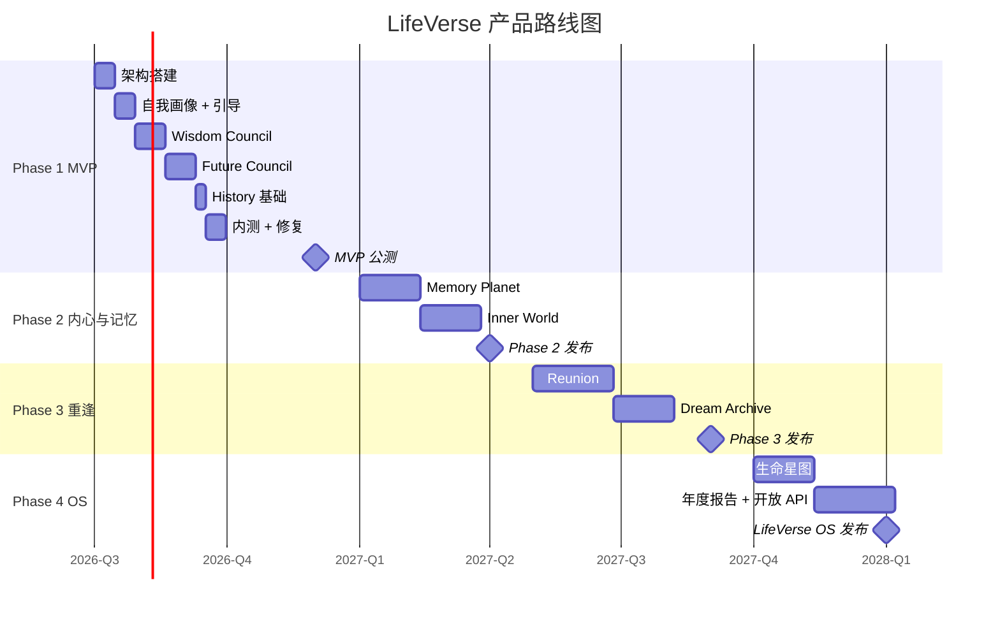

# LifeVerse 产品路线图

> 文档版本：v1.0
> 维护者：产品总监 Alex Chen、市场总监 Rachel Bai、内容策略师 Noah Zheng
> 上游文档：`prd-v5.md`、`mvp.md`、`user_story.md`
> 时间跨度：2026 Q3 ~ 2028 Q1

---

## 1. 路线图总览

LifeVerse 采用 4 个 Phase 渐进发布，每个 Phase 对应一组模块的成熟度跃迁。

---

## 2. Phase 1 · MVP（2026 Q3 ~ Q4）

### 2.1 目标

让 1000 名种子用户在 LifeVerse 中召开第一次议会，验证"多元视角 + 时间推演"的核心价值假设。

### 2.2 包含模块

- Wisdom Council（完整）
- Future Council（完整）
- History（基础）

### 2.3 核心功能

| 功能 | 用户故事 | 说明 |
| --- | --- | --- |
| 注册与自我画像 | US-001 | 5 分钟引导 |
| 智慧议会 | US-003 | 7 智者标准议会 |
| 价值雷达 | US-004 | 5 维 + 漂移 |
| 焦点议会 | US-005 | 3 智者快速议会 |
| 未来议会 | US-006 | 4 时间自己 |
| 后悔分析 | US-007 | 80 岁回望 |
| 扰动时间线 | US-008 | 假设推演 |
| History 时间线 | US-002 | 列表视图 |

### 2.4 时间节点

| 节点 | 时间 | 里程碑 |
| --- | --- | --- |
| M1.1 | 2026-07 | 架构搭建完成 |
| M1.2 | 2026-08 | 自我画像 + 引导完成 |
| M1.3 | 2026-09 | Wisdom Council 完成 |
| M1.4 | 2026-10 | Future Council 完成 |
| M1.5 | 2026-11 | 内测版部署（100 人） |
| M1.6 | 2026-12 | MVP 公测（1000 人） |

### 2.5 验证指标

| 指标 | 目标 |
| --- | --- |
| 注册用户 | 1,000 |
| 首次议会完成率 | ≥ 60% |
| 7 日留存 | ≥ 35% |
| 报告满意度 | ≥ 4.0/5 |
| NPS | ≥ 30 |
| P0 Bug | 0 |

### 2.6 退出条件

全部验证指标达标后，启动 Phase 2。若首次议会完成率 < 40%，暂停 Phase 2，回归优化引导流程。

---

## 3. Phase 2 · 内心与记忆（2027 Q1 ~ Q2）

### 3.1 目标

让用户把"过去"和"情绪"接入 LifeVerse，从"决策工具"升级为"自我觉察工具"。

### 3.2 包含模块

- Memory Planet（完整）
- Inner World（完整）
- History 增强

### 3.3 核心功能

| 功能 | 用户故事 | 说明 |
| --- | --- | --- |
| 记忆上传与分类 | US-012 | 多模态 + AI 分类 |
| 人生地图 | US-013 | 5 星球可视化 |
| 记忆对话 | US-014 | 与当时的自己对话 |
| 内心天气 | US-009 | 每日情绪 |
| 人格对话 | US-010 | 6 人格 1v1 |
| 内心议会 | US-011 | 冲突调解 |
| History 增强 | - | 折叠视图、按主题 |

### 3.4 时间节点

| 节点 | 时间 | 里程碑 |
| --- | --- | --- |
| M2.1 | 2027-01 | Memory Planet 开发启动 |
| M2.2 | 2027-02 | 记忆上传 + 分类上线 |
| M2.3 | 2027-03 | 人生地图上线 |
| M2.4 | 2027-03 | Inner World 开发启动 |
| M2.5 | 2027-04 | 内心天气 + 人格对话上线 |
| M2.6 | 2027-05 | Phase 2 公测发布 |

### 3.5 验证指标

| 指标 | 目标 |
| --- | --- |
| 累计用户 | 10,000 |
| 记忆上传用户占比 | ≥ 50% |
| 内心天气日活查看率 | ≥ 40% |
| 30 日留存 | ≥ 30% |
| 月活 | ≥ 4,000 |

### 3.6 关键风险

- 多模态分类准确率不达标 → 准备人工修正兜底
- 内心人格引发不适 → 严格伦理审查 + 危机干预

---

## 4. Phase 3 · 重逢（2027 Q3）

### 4.1 目标

让用户与"已离开的人"重逢，完成未完成的关系，把 LifeVerse 从"自我工具"升级为"关系疗愈工具"。

### 4.2 包含模块

- Reunion（完整）
- Dream Archive（完整）

### 4.3 核心功能

| 功能 | 用户故事 | 说明 |
| --- | --- | --- |
| AI 亲人生成 | US-017 | 6 类亲人 |
| 私人议会 | US-018 | 多亲人审议 |
| 重逢场景 | US-017 | 告别/道歉/感恩/和解 |
| 80 岁自己对话 | US-019 | 临终回望 |
| 梦想记录 | US-015 | 梦想时间轴 |
| 儿时自己 | US-016 | 童年 AI |

### 4.4 时间节点

| 节点 | 时间 | 里程碑 |
| --- | --- | --- |
| M3.1 | 2027-05 | Reunion 开发启动 |
| M3.2 | 2027-06 | AI 亲人生成上线（内测） |
| M3.3 | 2027-07 | 私人议会 + 场景上线 |
| M3.4 | 2027-07 | Dream Archive 开发启动 |
| M3.5 | 2027-08 | 梦想时间轴 + 儿时自己上线 |
| M3.6 | 2027-09 | Phase 3 公测发布 |

### 4.5 验证指标

| 指标 | 目标 |
| --- | --- |
| 累计用户 | 50,000 |
| AI 亲人创建用户占比 | ≥ 25% |
| 重逢对话满意度 | ≥ 4.2/5 |
| 心理危机负面事件 | 0 |
| 月活 | ≥ 20,000 |

### 4.6 关键风险

- 伦理争议（AI 复活逝者）→ 预留法务预案 + 媒体沟通策略
- 用户过度依赖 → 使用时长监控 + 真实社交鼓励
- 心理危机 → 与专业心理机构合作

---

## 5. Phase 4 · LifeVerse OS（2027 Q4 ~ 2028 Q1）

### 5.1 目标

把 LifeVerse 从"产品"升级为"操作系统"，提供跨模块智能、年度回顾、开放生态。

### 5.2 包含能力

- 生命星图（History 终极可视化）
- 年度生命报告
- 跨模块智能推荐
- 多设备同步
- 开放 API 与插件
- 国际化（英文）

### 5.3 核心功能

| 功能 | 用户故事 | 说明 |
| --- | --- | --- |
| 生命星图 | - | 时间线折叠 + 星座视图 |
| 年度生命报告 | US-020 | 年度总结 + 80 岁寄语 |
| 跨模块推荐 | - | 智能建议召开议会/重逢 |
| 多设备同步 | - | Web + PWA + 数据同步 |
| 开放 API | - | 第三方插件接入 |
| 英文版 | - | i18n 全量 |

### 5.4 时间节点

| 节点 | 时间 | 里程碑 |
| --- | --- | --- |
| M4.1 | 2027-10 | 生命星图上线 |
| M4.2 | 2027-11 | 年度生命报告上线 |
| M4.3 | 2027-12 | 开放 API 内测 |
| M4.4 | 2028-01 | LifeVerse OS 正式发布 |

### 5.5 验证指标

| 指标 | 目标 |
| --- | --- |
| 累计用户 | 500,000 |
| 月活 | ≥ 150,000 |
| 付费转化 | ≥ 8% |
| 年度报告查看率 | ≥ 60% |
| 开放 API 接入方 | ≥ 10 |

---

## 6. 跨 Phase 的持续投入

以下能力不绑定特定 Phase，持续迭代：

| 能力 | 说明 |
| --- | --- |
| AI 质量优化 | 持续优化智者 prompt、人格一致性、推演准确度 |
| 性能优化 | 持续降低 LLM 成本、提升响应速度 |
| 隐私与安全 | 持续通过第三方审计、合规适配 |
| 心理安全 | 持续完善危机干预、与专业机构合作 |
| 内容策略 | 持续丰富议题模板、智者画像、场景引导 |

---

## 7. 路线图决策原则

1. **价值优先于功能**：每个 Phase 必须验证一个核心价值假设，而非堆砌功能。
2. **留白优先于填满**：宁可少做，也要保证已上线的体验足够好。
3. **伦理优先于速度**：Reunion 等高风险模块宁可延期，也不降低伦理标准。
4. **数据优先于直觉**：每个 Phase 的退出条件由数据决定，而非主观判断。
5. **用户优先于竞争**：不为追赶竞品而提前发布未成熟的模块。

---

## 8. 关联文档

- PRD 总纲：`prd-v5.md`
- MVP 范围：`mvp.md`
- 用户故事：`user_story.md`
- 用户流程：`user_flow.md`
- 竞品分析：`competition.md`
