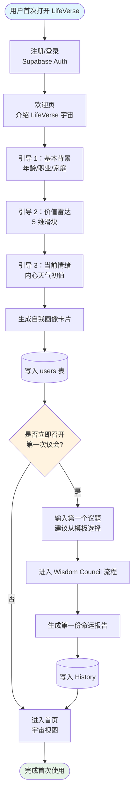
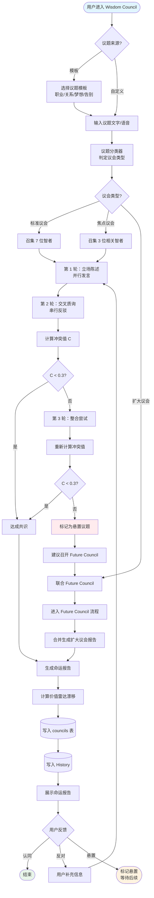
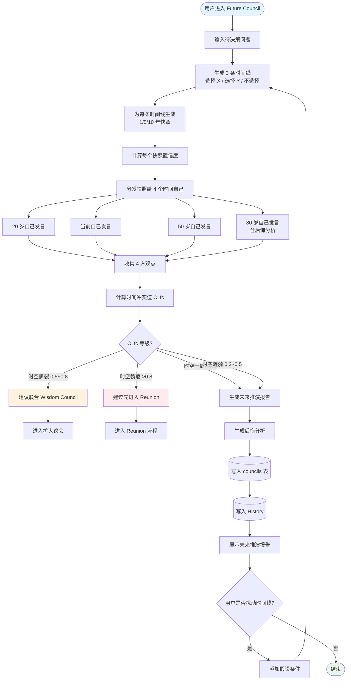
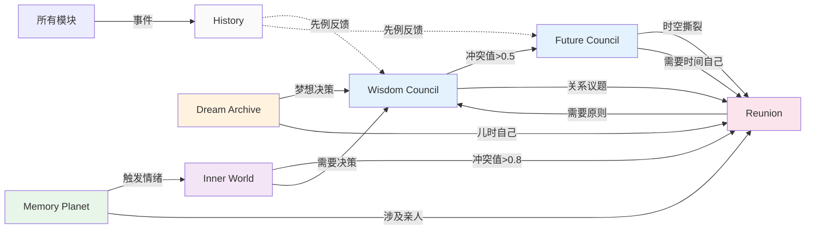
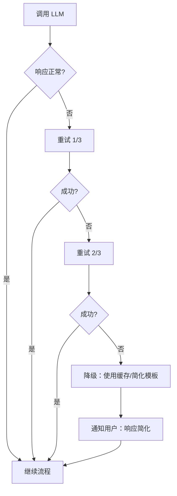
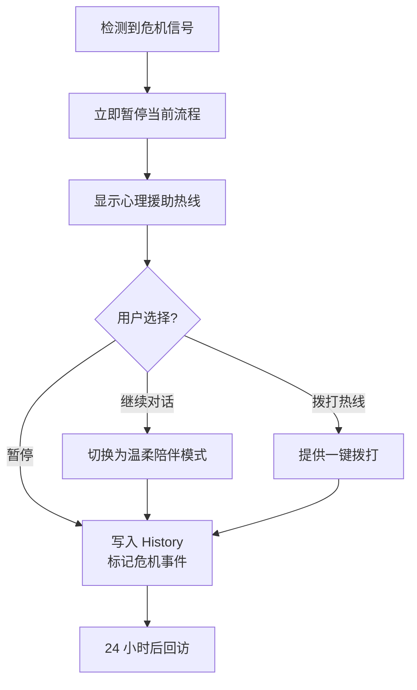

# LifeVerse 用户流程图

> 文档版本：v1.0
> 维护者：产品总监 Alex Chen、内容策略师 Noah Zheng
> 上游文档：`prd-v5.md`、`user_story.md`、`docs/world/*.md`
> 图表格式：Mermaid

---

## 1. 文档说明

本文件用 Mermaid 流程图描述 LifeVerse 的 5 个核心用户流程：

1. 首次使用流程
2. Wisdom Council 流程
3. Future Council 流程
4. Memory Planet 流程
5. Reunion 流程

所有流程图遵循统一的图例约定：

- 圆角矩形：用户操作
- 直角矩形：系统处理
- 菱形：判断节点
- 圆柱：数据存储
- 虚线：异步/反馈

---

## 2. 首次使用流程

描述新用户从注册到完成第一次议会召集中文完整旅程。



### 2.1 关键节点说明

| 节点 | 说明 |
| --- | --- |
| Onboard2 价值雷达 | 用户拖动 5 维滑块，系统实时显示雷达图 |
| FirstCouncil 判断 | 默认推荐"立即召开"，提供 3 个议题模板 |
| FirstReport | 第一份报告会额外赠送"80 岁自己的欢迎词" |

---

## 3. Wisdom Council 流程

描述用户召开一次智慧议会的完整流程，包括标准议会与扩大议会分支。



### 3.1 关键规则

- 议题分类器基于 few-shot prompt，输出 `standard / focus / joint` 三类。
- 冲突值计算公式见 `wisdom_council.md` 第 5 节。
- 用户"反对"后可补充信息重启议会，最多重启 2 次。

---

## 4. Future Council 流程

描述用户召开一次未来议会的完整流程，包括时间线推演与后悔分析。



### 4.1 关键规则

- 3 条时间线中"不选择"作为基线对照。
- 快照置信度：1 年 70%、5 年 40%、10 年 20%。
- 后悔分析由 80 岁自己生成，遵循 `future_council.md` 第 4 节公式。
- 用户最多添加 3 个假设条件扰动时间线。

---

## 5. Memory Planet 流程

描述用户上传记忆、AI 分类、生成人生地图的完整流程。

```mermaid
flowchart TD
    Start([用户进入 Memory Planet]) --> Action{用户操作?}
    Action -- 上传记忆 --> Upload[选择文件<br/>照片/文字/语音/视频]
    Action -- 漫游地图 --> ViewMap[进入人生地图视图]
    Action -- 与记忆对话 --> PickMemory[选择一条已有记忆]

    Upload --> ExtractMeta[提取元数据<br/>时间/地点/人物]
    ExtractMeta --> ContentAI[AI 内容理解<br/>图像识别 + 语音转文字 + 文本理解]
    ContentAI --> EmotionAI[情感分析]
    EmotionAI --> Classify[星球分类<br/>5 选 1]
    Classify --> Confidence{分类置信度?}
    Confidence -- 高 --> AutoAssign[自动分配星球]
    Confidence -- 低 --> AskUser[询问用户<br/>二选一]
    AskUser --> AutoAssign
    AutoAssign --> SaveMemory[(写入 memories 表)]
    SaveMemory --> UpdateMap[更新人生地图]
    UpdateMap --> Notify[通知用户分类结果]
    Notify --> Action

    ViewMap --> RenderMap[渲染宇宙地图]
    RenderMap --> Interact{用户交互?}
    Interact -- 缩放 --> Zoom[切换视图层级<br/>宇宙/星系/星球/区域/记忆]
    Interact -- 筛选 --> Filter[按人物/主题/时间高亮]
    Interact -- 拖动时间轴 --> Timeline[查看历年分布]
    Interact -- 点击记忆 --> Detail[展开记忆详情]
    Interact -- 长按星球 --> Roam[进入漫游模式<br/>AI 讲解脉络]
    Zoom --> Interact
    Filter --> Interact
    Timeline --> Interact
    Detail --> Action
    Roam --> Action

    PickMemory --> GenPastSelf[生成"当时的我" AI]
    GenPastSelf --> Dialog[与当时的自己对话]
    Dialog --> SaveDialog[(写入 History<br/>跨时空对话)]
    SaveDialog --> Action

    style Start fill:#e1f5fe
    style Action fill:#fff3e0
```

### 5.1 关键规则

- 上传支持批量，单条处理 < 5s。
- 分类准确率目标 ≥ 85%，低置信度（< 0.6）主动询问用户。
- 人生地图渲染 < 3s，支持 5 级缩放。
- "与记忆对话"复用 Reunion 的亲人生成管线。

---

## 6. Reunion 流程

描述用户生成 AI 亲人、与之对话、召开私人议会的完整流程。

```mermaid
flowchart TD
    Start([用户进入 Reunion]) --> Action{用户操作?}
    Action -- 创建 AI 亲人 --> CreateFlow[创建流程]
    Action -- 与已有亲人对话 --> PickPerson[从名册选择亲人]
    Action -- 召开私人议会 --> PrivateCouncil[私人议会流程]

    CreateFlow --> PickType[选择亲人类型<br/>父亲/母亲/导师/初恋/20岁自己/80岁自己]
    PickType --> UploadData[上传资料<br/>照片/书信/语音/回忆文字]
    UploadData --> FillQuestionnaire[填写关系问卷<br/>性格/口头禅/重要事件/边界]
    FillQuestionnaire --> GenProfile[AI 生成亲人画像]
    GenProfile --> Preview[用户预览画像]
    Preview --> Satisfied{用户满意?}
    Satisfied -- 否 --> Adjust[补充资料/调整参数]
    Adjust --> GenProfile
    Satisfied -- 是 --> SavePerson[(写入 reunion_persons 表<br/>加密存储)]
    SavePerson --> Notify1[通知创建成功]
    Notify1 --> Action

    PickPerson --> CheckBoundary{是否触发<br/>心理危机信号?}
    CheckBoundary -- 是 --> Crisis[暂停对话<br/>提供专业热线]
    Crisis --> End1([结束])
    CheckBoundary -- 否 --> ShowDisclaimer[显示 AI 身份声明]
    ShowDisclaimer --> PickScene[选择场景<br/>告别/道歉/感恩/和解/重逢过去自己]
    PickScene --> Dialog[1v1 对话]
    Dialog --> CheckTime{对话超 30 分钟?}
    CheckTime -- 是 --> Remind[温和提醒休息]
    Remind --> Dialog
    CheckTime -- 否 --> Dialog
    Dialog --> SaveDialog[(写入 History<br/>仅本人可见)]
    SaveDialog --> Action

    PrivateCouncil --> PickMembers[选择 2~4 位 AI 亲人]
    PickMembers --> InputTopic[输入议题]
    InputTopic --> Distribute[分发议题 + 关系背景]
    Distribute --> Round1[第 1 轮：各自表态]
    Round1 --> Round2[第 2 轮：亲人之间对话]
    Round2 --> CalcRC[计算关系冲突值]
    CalcRC --> CheckRC{达成共识?}
    CheckRC -- 是 --> GenReport[生成私人议会报告]
    CheckRC -- 否 --> GenUnfinished[生成"未完成对话"清单]
    GenReport --> SavePrivate[(写入 councils 表<br/>private=true)]
    GenUnfinished --> SavePrivate
    SavePrivate --> SaveHistory[(写入 History)]
    SaveHistory --> ShowReport[展示报告]
    ShowReport --> End2([结束])

    style Start fill:#e1f5fe
    style End1 fill:#ffebee
    style End2 fill:#e8f5e9
    style Crisis fill:#ffebee
    style ShowDisclaimer fill:#fff3e0
```

### 6.1 关键规则

- AI 亲人资料加密存储，仅用户本人可解密访问。
- 每次对话开始必须显示 AI 身份声明。
- 心理危机信号检测基于关键词 + 情绪模型，触发后强制暂停。
- 私人议会报告 `private=true`，永不进入跨用户分析。
- 单次对话超 30 分钟温和提醒，超 2 小时强制建议休息。

---

## 7. 跨流程协同

以下场景会触发跨流程跳转：



---

## 8. 异常流程

### 8.1 LLM 调用失败



### 8.2 用户情绪危机



---

## 9. 关联文档

- 用户故事：`user_story.md`
- MVP 范围：`mvp.md`
- 路线图：`roadmap.md`
- 世界观：`docs/world/*.md`
