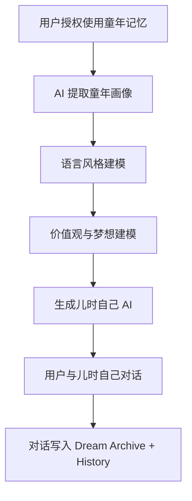
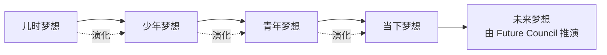

# 梦想档案规则

> 文档版本：v1.0
> 维护者：内容策略师 Noah Zheng、产品总监 Alex Chen
> 上游文档：`world.md`、`lifeverse.md`
> 模块定位：LifeVerse 的"梦想仓库"与"时间轴引擎"

---

## 1. 模块定位

Dream Archive（梦想档案）是 LifeVerse 宇宙中存储与追踪"梦想"的模块。它记录用户从儿时到现在的所有梦想，生成一条"梦想时间轴"，并允许用户与"儿时的自己"对话，看见梦想与现实的距离。

如果说 Memory Planet 记录的是"发生了什么"，Dream Archive 记录的就是"曾想发生什么"。

---

## 2. 梦想记录

### 2.1 梦想的定义

在 LifeVerse 中，"梦想"不等于"目标"。

- **目标**：有明确截止日期与可衡量结果（例如"今年减重 10 斤"）。
- **梦想**：没有明确截止日期，带有情感与想象（例如"写一本影响很多人的书"）。

Dream Archive 只收录"梦想"，目标由其他工具管理。

### 2.2 梦想字段

每条梦想记录包含以下字段：

```yaml
dream_id: dream_2026_0001
title: 写一本关于时间的故事集
description: |
  我想写一本短篇集，每个故事都关于"时间"——
  关于等待、关于错过、关于重逢。
created_at: 2010-08-15  # 梦想诞生的日期（用户回忆填写）
origin: 初中语文老师的鼓励
stage: 儿时梦想
status: 进行中
progress: 0.3
last_updated: 2026-06-20
linked_memories:
  - mem_2010_0008  # 语文老师的那堂课
  - mem_2015_0012  # 第一次投稿被拒
linked_reunion:
  - reunion_2026_0003  # 与儿时自己的对话
emotion: 渴望/畏惧
```

### 2.3 梦想来源

梦想记录有两个来源：

- **主动记录**：用户主动写下当前的梦想。
- **回忆挖掘**：用户在 Memory Planet 中标记某条记忆为"梦想起源"，系统自动生成一条梦想记录。

### 2.4 梦想阶段

每条梦想会被标记为以下阶段之一：

| 阶段 | 含义 | 视觉 |
| --- | --- | --- |
| 儿时梦想 | 12 岁前诞生的梦想 | 幼苗 |
| 少年梦想 | 12~18 岁诞生的梦想 | 新芽 |
| 青年梦想 | 18~30 岁诞生的梦想 | 含苞 |
| 当下梦想 | 30 岁后或当前活跃的梦想 | 绽放 |
| 已完成 | 已经实现的梦想 | 果实 |
| 已放下 | 主动放弃的梦想 | 落叶 |
| 已遗忘 | 长期未更新的梦想，AI 检测后唤醒 | 种子 |

---

## 3. 儿时自己 AI 生成

Dream Archive 最具情感价值的功能是"儿时自己 AI 生成"——基于用户上传的童年记忆，AI 重建一个"儿时的自己"，让用户与之对话。

### 3.1 生成流程



### 3.2 童年画像维度

| 维度 | 数据来源 | 示例 |
| --- | --- | --- |
| 语言风格 | 童年日记、信件、录音 | 用词简单、爱用感叹号 |
| 性格倾向 | 童年记忆的情感分析 | 好奇、害羞、爱幻想 |
| 当时的梦想 | 童年记忆中的"我想成为" | 科学家、画家、宇航员 |
| 重要的人 | 童年记忆中的人物频次 | 妈妈、同桌、语文老师 |
| 重要的事件 | 童年记忆中的高重要度事件 | 转学、获奖、第一次旅行 |

### 3.3 对话场景

用户与儿时自己的对话有三种典型场景：

#### 场景 A：梦想回望

> 用户："你当时为什么想当科学家？"
> 儿时自己："因为我觉得科学家能知道所有秘密！后来呢，你变成科学家了吗？"

#### 场景 B：自我和解

> 用户："对不起，我没有实现你的梦想。"
> 儿时自己："没关系呀。你现在开心吗？开心的话，我就开心。"

#### 场景 C：重新点燃

> 用户："我最近又开始写作了，就是你当时想做的事。"
> 儿时自己："真的吗！太好了！你一定要写下去哦！"

### 3.4 伦理边界

- 儿时自己 AI 会在每次对话开始时声明："我是基于你的童年记忆生成的 AI，不是真实的你。"
- 儿时自己不会"指责"用户没有实现梦想，其性格设定偏向温柔与理解。
- 当用户情绪脆弱时，儿时自己会主动转移话题或建议用户休息。

---

## 4. 梦想时间轴

Dream Archive 把所有梦想组织成一条"梦想时间轴"，让用户看见自己梦想的演化。

### 4.1 时间轴结构



### 4.2 梦想演化关系

梦想之间不是孤立的，存在四种演化关系：

| 关系 | 含义 | 示例 |
| --- | --- | --- |
| 演化 | 一个梦想发展为另一个更成熟的版本 | "当科学家" → "做 AI 研究" |
| 分裂 | 一个梦想分裂为多个 | "做艺术家" → "画画" + "写作" |
| 合并 | 多个梦想合并为一个 | "旅行" + "写作" → "写旅行文学" |
| 沉睡 | 一个梦想长期搁置，但未被放弃 | "学钢琴" 沉睡 10 年后重新激活 |

### 4.3 时间轴可视化

时间轴以"星河"形式呈现：

- 每个梦想是一颗星，亮度由"情感强度"决定。
- 演化关系用光带连接，形成"梦想星座"。
- 已完成的梦想变为"恒星"，永久发光。
- 已放下的梦想变为"流星"，划过即逝，但留下轨迹。
- 已遗忘的梦想是"暗物质"，AI 检测后会温和提示："你 12 岁时曾想学天文，要看看吗？"

---

## 5. 梦想与现实的距离

Dream Archive 会为每条活跃梦想计算"梦想与现实距离"，帮助用户看见自己离梦想有多远。

### 5.1 距离维度

| 维度 | 含义 | 测量方式 |
| --- | --- | --- |
| 能力距离 | 当前能力与梦想所需能力的差距 | 用户自评 + AI 推断 |
| 资源距离 | 当前资源与梦想所需资源的差距 | 用户自评 |
| 时间距离 | 距离梦想实现的预估时间 | AI 推演 |
| 情感距离 | 当前对梦想的渴望程度 | 情绪分析 |
| 行动距离 | 最近 30 天为梦想付出的行动量 | 用户记录 |

### 5.2 距离报告示例

```markdown
# 梦想距离报告 — 写一本关于时间的故事集

## 能力距离
中等。你的文字能力已达出版水平，但叙事结构仍需打磨。

## 资源距离
较小。你有足够的业余时间与一台电脑。

## 时间距离
若每周投入 8 小时，预计 2.5 年完成初稿。

## 情感距离
0.7（强烈渴望）。但恐惧值 0.5（害怕写不好）。

## 行动距离
最近 30 天为梦想投入：3 小时。
建议：每天 30 分钟，先写完第一个故事。

## 儿时自己的话
"你 12 岁就说要写书了。现在 32 岁。还有时间，但别再等了哦。"
```

---

## 6. 梦想议会

当用户在多条梦想之间纠结时，可以召开"梦想议会"——让儿时的自己、当下的自己、80 岁的自己共同审议。

### 6.1 议会成员

- 儿时的自己（来自 Dream Archive）
- 当下的自己
- 80 岁的自己（来自 Future Council）
- 可选：1~2 位智者（来自 Wisdom Council）

### 6.2 议会输出

- 梦想优先级排序
- 梦想整合方案（例如把两个梦想合并）
- 梦想放下建议（例如建议放下已沉睡 15 年且不再渴望的梦想）

---

## 7. 与其他模块的关系

- **上游**：Memory Planet 提供童年记忆，用于生成儿时自己。
- **协同**：与 Future Council 联合召开梦想议会；与 Wisdom Council 联合审议梦想优先级。
- **下游**：梦想演化轨迹写入 History；梦想距离报告触发 Inner World 的人格活跃度。
- **反馈**：用户与儿时自己的对话会校准儿时自己的语言模型。

---

## 8. 设计原则

1. **梦想优先于目标**：Dream Archive 只收录带有情感与想象的梦想，不收录 KPI。
2. **温柔优先于鞭策**：儿时自己不会指责用户"没实现梦想"，而是温柔地提醒。
3. **演化优先于实现**：梦想的价值不在于是否实现，而在于它如何塑造了用户。
4. **唤醒优先于遗忘**：已遗忘的梦想是宝藏，AI 应温和唤醒而非任其沉睡。
