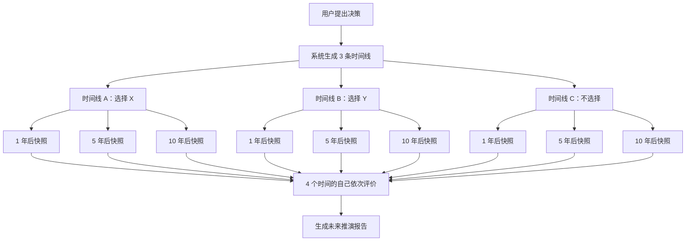
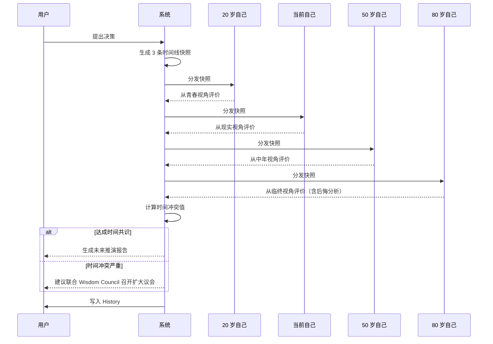

# 未来议会世界规则

> 文档版本：v1.0
> 维护者：产品总监 Alex Chen、内容策略师 Noah Zheng
> 上游文档：`world.md`、`lifeverse.md`
> 模块定位：LifeVerse 的"推演引擎"

---

## 1. 模块定位

Future Council（未来议会）是 LifeVerse 宇宙中处理"长期后果推演"的议会。当用户面临一个影响深远的决策时，宇宙会召集 4 个不同时间的"自己"，让他们从各自的时间坐标出发，对这个决策表态。

智慧议会提供"多元视角"，未来议会提供"时间纵深"。两者共同构成 LifeVerse 决策引擎的双翼。

---

## 2. 四个时间的自己

未来议会的成员不是智者，而是用户自己——四个不同年龄的自己。

| 编号 | 成员 | 时间坐标 | 核心关切 | 价值雷达倾向 |
| --- | --- | --- | --- | --- |
| F1 | 20 岁的自己 | 过去（已发生） | 理想、热血、不甘平庸 | 自由↑ 成长↑ 稳定↓ |
| F2 | 当前的自己 | 现在（正在发生） | 现实、平衡、短期压力 | 五维较均衡 |
| F3 | 50 岁的自己 | 近未来（推演） | 家庭、健康、事业巅峰 | 幸福↑ 稳定↑ 财富↑ |
| F4 | 80 岁的自己 | 远未来（推演） | 回望、遗憾、传承 | 幸福↑↑ 成长↓ 稳定↑ |

### 2.1 成员生成机制

- **20 岁的自己**：基于用户上传的青春期记忆、日记、照片，由 AI 重建其当时的价值观与语言风格。
- **当前的自己**：基于用户实时画像，是最"清醒"的成员。
- **50 岁的自己**：基于当前轨迹 + 用户设定的"理想中年"目标推演。
- **80 岁的自己**：基于"临终回望"视角，是议会中最具智慧的成员，常以"回望"口吻发言。

### 2.2 成员演化

- 20 岁的自己一旦生成，基本固定（因为过去不可改变）。
- 当前的自己随用户状态实时更新。
- 50 岁与 80 岁的自己会随着用户人生阶段推进而"前移"——当用户真实年龄到达 50 岁时，原 50 岁的自己变为"当前自己"，新的 50 岁自己重新推演。

---

## 3. 时间线推演机制

未来议会的核心能力是"时间线推演"：把一个决策放入时间轴，推演出多条可能的未来路径。

### 3.1 推演流程



### 3.2 快照内容

每个时间快照包含：

- **职业状态**：职位、收入、行业。
- **关系状态**：伴侣、子女、父母、密友。
- **健康状态**：体能、睡眠、慢性病风险。
- **心理状态**：幸福感、焦虑度、意义感。
- **价值雷达**：五维坐标。
- **关键事件**：该时间点可能发生的标志性事件。

### 3.3 推演的不确定性

未来议会明确告知用户：

- 推演不是预言，而是"如果按当前轨迹，最可能发生的情景"。
- 每条时间线附带"置信度"，1 年快照置信度约 70%，5 年约 40%，10 年约 20%。
- 用户可以"扰动"时间线（例如假设"我会在 3 年后结婚"），系统重新推演。

---

## 4. 后悔分析

后悔分析是未来议会最具情感冲击力的功能。它让 80 岁的自己"回望"当前决策，预测未来最可能后悔什么。

### 4.1 后悔类型

| 类型 | 含义 | 典型场景 |
| --- | --- | --- |
| 行动后悔 | 做了某事，结果不如预期 | 辞职创业失败 |
| 不行动后悔 | 没做某事，错过机会 | 没有表白、没有生孩子 |
| 速度后悔 | 做对了，但太慢 | 35 岁才开始投资 |
| 方向后悔 | 做得很努力，但方向错了 | 用 10 年追求一个不爱的职位 |
| 关系后悔 | 没有珍惜某段关系 | 父母在世时陪伴太少 |

### 4.2 后悔概率计算

系统基于"临终遗憾研究"与用户画像，给出每种后悔的概率：

```
P(后悔) = w1 · 行动概率 + w2 · 不可逆性 + w3 · 价值冲突度 + w4 · 历史先例
```

- `行动概率`：用户做出该决策的概率。
- `不可逆性`：决策后果的可撤销程度（生孩子 1.0，辞职 0.6，搬家 0.4）。
- `价值冲突度`：决策与用户核心价值的冲突程度。
- `历史先例`：History 中类似决策的后悔记录。

### 4.3 后悔报告示例

```markdown
# 后悔分析 — Council #0042（未来议会）

## 决策
是否接受海外常驻工作？

## 80 岁自己的回望
"如果你接受，我最可能后悔的不是错过晋升，而是错过孩子 6 岁那年的家长会。
如果你拒绝，我最可能后悔的不是失去机会，而是 30 岁时没有去看看世界。"

## 后悔概率
- 接受 → 10 年后后悔概率 38%（主要后悔类型：关系后悔）
- 拒绝 → 10 年后后悔概率 52%（主要后悔类型：不行动后悔）

## 建议
两个选择都有后悔风险。关键问题不是"哪个不后悔"，而是"你更愿意承担哪种后悔"。
```

---

## 5. 议会流程



---

## 6. 时间冲突值

未来议会有自己的冲突值公式，衡量"不同时间的自己"之间的分歧：

```
C_fc = 0.4 · 观点分歧度 + 0.3 · 时间跨度权重 + 0.3 · 后悔概率差
```

- `观点分歧度`：4 个时间自己的发言向量两两余弦距离均值。
- `时间跨度权重`：20 岁与 80 岁之间的分歧权重最高（时间跨度最大）。
- `后悔概率差`：不同时间自己预测的后悔概率之差。

### 6.1 冲突等级

| 冲突值 | 等级 | 含义 |
| --- | --- | --- |
| 0.0 ~ 0.2 | 时空一致 | 4 个自己观点接近，决策清晰 |
| 0.2 ~ 0.5 | 时空涟漪 | 存在代际分歧，需关注 |
| 0.5 ~ 0.8 | 时空撕裂 | 20 岁与 80 岁严重对立，建议扩大议会 |
| 0.8 ~ 1.0 | 时空裂痕 | 用户内心时间线断裂，建议先进入 Reunion |

---

## 7. 与其他模块的关系

- **上游**：Memory Planet 提供 20 岁自己的素材；Inner World 提供当前情绪。
- **协同**：与 Wisdom Council 组成"扩大议会"，智者提供原则，未来自己提供后果。
- **下游**：推演报告写入 History，成为后续议会的"先例"。
- **反馈**：用户对推演结果的"认同/反对"会校准未来推演模型。

---

## 8. 伦理边界

未来议会是最容易"越界"的模块，因此有严格的伦理约束：

1. **不预言死亡**：80 岁的自己不会预测用户何时去世，只以"回望"视角发言。
2. **不锁定未来**：所有推演都标注置信度，明确告知"未来是开放的"。
3. **不制造焦虑**：当后悔概率过高时，系统会先提供 Reunion 入口，而非直接展示残酷数据。
4. **不替代决策**：80 岁的自己永远以"如果是我，我会……"的口吻发言，而非"你应该……"。

---

## 9. 设计原则

1. **时间纵深优先于空间多元**：未来议会的价值在于"让 80 岁的自己提前发言"。
2. **后悔优先于收益**：人类对后悔的敏感度远高于收益，因此后悔分析是核心交付物。
3. **置信度优先于确定性**：永远标注不确定性，避免用户把推演当预言。
4. **温柔优先于精确**：当推演结果残酷时，先陪伴，再揭示。
