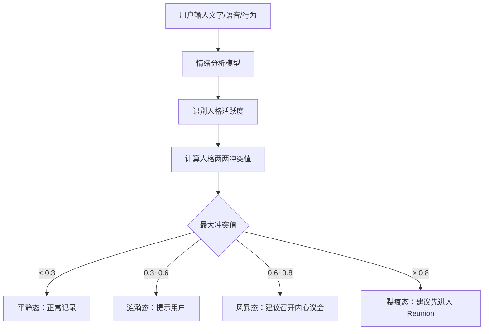
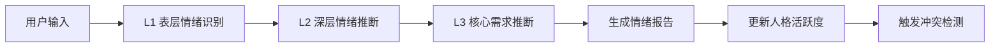
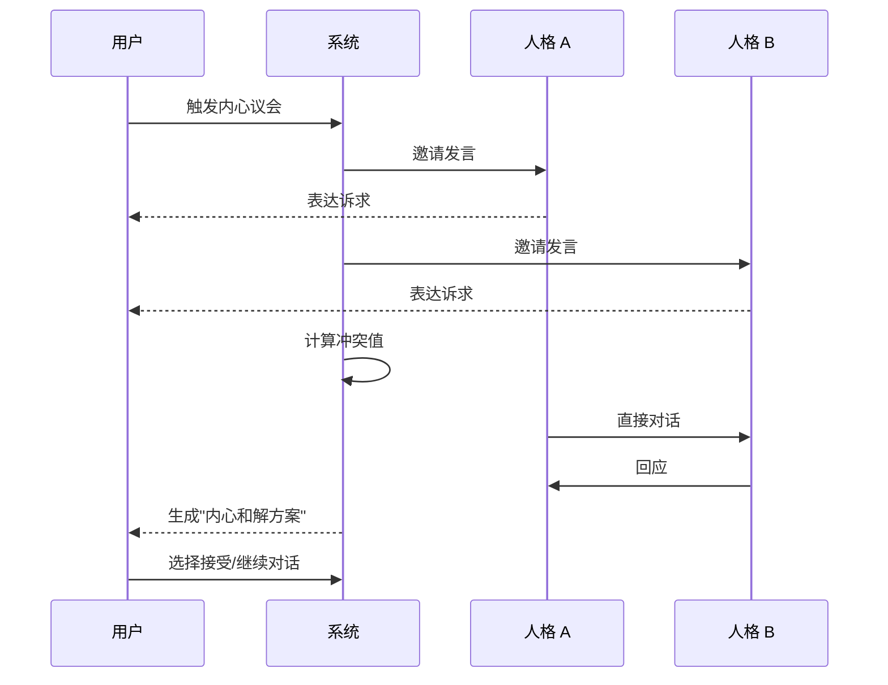

# 内心世界规则

> 文档版本：v1.0
> 维护者：内容策略师 Noah Zheng、产品总监 Alex Chen
> 上游文档：`world.md`、`lifeverse.md`
> 模块定位：LifeVerse 的"情绪引擎"
> 灵感来源：皮克斯动画《头脑特工队》（Inside Out）

---

## 1. 模块定位

Inner World（内心世界）是 LifeVerse 宇宙中处理"情绪与自我关系"的模块。它把用户内心抽象为 6 个可对话的"人格"，让用户能够"看见"自己内心的冲突与渴望。

如果说 Wisdom Council 是"邀请外部智者来议事"，那么 Inner World 就是"邀请内心的自己来开会"。

---

## 2. 设计灵感

Inner World 的设计灵感来自皮克斯《头脑特工队》：把抽象情绪具象化为可对话的角色。但 LifeVerse 做了三个关键升级：

1. **从 5 个情绪扩展为 6 个人格**：不仅包含情绪，还包含"驱动力"（野心、自由）。
2. **从被动观察升级为主动对话**：用户可以直接与某个人格对话，而非只看他们吵架。
3. **从电影叙事升级为决策辅助**：人格之间的冲突会被量化，并触发内心议会。

---

## 3. 六个内心人格

| 编号 | 人格 | 颜色 | 核心诉求 | 典型台词 | 价值雷达倾向 |
| --- | --- | --- | --- | --- | --- |
| I1 | 野心 | 金色 | 成就、地位、被看见 | "你可以做到更多。" | 成长↑ 财富↑ |
| I2 | 理性 | 蓝色 | 逻辑、计划、风险控制 | "让我们看看数据。" | 稳定↑ 成长↑ |
| I3 | 安全感 | 绿色 | 稳定、归属、被保护 | "别冒险，我们好不容易才安稳。" | 稳定↑↑ 幸福↑ |
| I4 | 恐惧 | 紫色 | 风险预警、避免受伤 | "万一失败了呢？" | 稳定↑ 幸福↓ |
| I5 | 爱 | 粉色 | 连接、共情、付出 | "他们需要你。" | 幸福↑↑ |
| I6 | 自由 | 橙色 | 自主、探索、不被定义 | "你的人生不该被别人写好。" | 自由↑↑ 成长↑ |

### 3.1 人格画像示例

#### I1 · 野心

- **外观**：金色西装，目光灼灼，永远站在最前面。
- **语言风格**：激励式、未来导向、常引用成功案例。
- **出现时机**：用户面临晋升、创业、公开表达时。
- **盲区**：容易忽视疲惫与情感需求，推动用户"再坚持一下"。
- **与其他人格的关系**：与安全感高频冲突，与自由中频同盟。

#### I4 · 恐惧

- **外观**：紫色斗篷，半透明，常躲在角落。
- **语言风格**：反问式、灾难化、常以"万一"开头。
- **出现时机**：用户面临风险、不确定性、公开评价时。
- **盲区**：过度预警，可能让用户错过机会。
- **与其他人格的关系**：与野心高频冲突，与安全感中频同盟。
- **特殊设定**：恐惧不是"反派"，它是用户的保护机制。系统会明确告诉用户："恐惧的存在是为了保护你，不是阻止你。"

#### I6 · 自由

- **外观**：橙色风衣，赤脚，永远望向远方。
- **语言风格**：诗意、反叛、常引用旅行与艺术。
- **出现时机**：用户感到被束缚、被定义、被期待压垮时。
- **盲区**：可能美化"逃离"，忽视责任与关系。
- **与其他人格的关系**：与安全感高频冲突，与爱中频冲突（自由 vs 牵挂）。

> 其余 3 个人格的画像在系统内部维护，结构同上。

---

## 4. 内心冲突检测

Inner World 的核心能力是"冲突检测"：实时识别 6 个人格之间的张力，并量化为冲突值。

### 4.1 冲突检测流程



### 4.2 人格活跃度

每个人格在每个时刻都有一个"活跃度"（0~1），由以下信号综合得出：

- **文本信号**：用户输入文字中的情绪词、价值词。
- **语音信号**：语速、音高、停顿（需用户授权）。
- **行为信号**：用户在 App 内的点击、停留、回避。
- **时间信号**：一天中的时段、一周中的某天、特殊日期。
- **历史信号**：用户过去在类似情境下的情绪模式。

### 4.3 人格冲突矩阵

系统维护一个 6×6 的人格冲突矩阵，记录每对人格之间的"基础张力"：

| | 野心 | 理性 | 安全感 | 恐惧 | 爱 | 自由 |
| --- | --- | --- | --- | --- | --- | --- |
| 野心 | - | 0.3 | 0.7 | 0.8 | 0.4 | 0.4 |
| 理性 | 0.3 | - | 0.4 | 0.5 | 0.3 | 0.5 |
| 安全感 | 0.7 | 0.4 | - | 0.3 | 0.2 | 0.8 |
| 恐惧 | 0.8 | 0.5 | 0.3 | - | 0.4 | 0.6 |
| 爱 | 0.4 | 0.3 | 0.2 | 0.4 | - | 0.6 |
| 自由 | 0.4 | 0.5 | 0.8 | 0.6 | 0.6 | - |

实时冲突值 = 基础张力 × 两人格活跃度的乘积。

---

## 5. 情绪分析

Inner World 的情绪分析模型基于心理学框架，输出三层结果。

### 5.1 三层情绪模型

| 层级 | 名称 | 示例 | 用途 |
| --- | --- | --- | --- |
| L1 | 表层情绪 | 开心、愤怒、悲伤 | 即时反馈 |
| L2 | 深层情绪 | 委屈、不甘、释然 | 人格激活 |
| L3 | 核心需求 | 被看见、被接纳、被尊重 | 议会建议 |

### 5.2 情绪分析流程



### 5.3 情绪报告示例

```markdown
# 情绪报告 — 2026-06-21 22:14

## 表层情绪
焦虑（强度 0.7）、疲惫（强度 0.5）

## 深层情绪
不甘（"我已经这么努力了，为什么还是不够好"）
孤独（"没有人真正理解我"）

## 核心需求
被看见、被认可

## 激活的人格
- 野心：0.8（强烈渴望证明自己）
- 恐惧：0.7（害怕被否定）
- 爱：0.3（暂时退场）

## 内心冲突
野心 ↔ 恐惧：0.56（涟漪态）
"你想冲，但你怕。"

## 建议
今晚不召开议会。先休息。
明天若仍有困扰，建议与"爱"对话，或进入 Reunion 寻找一位认可你的人。
```

---

## 6. 内心议会

当冲突值超过 0.6 时，系统会建议召开"内心议会"——让冲突的人格直接对话。

### 6.1 内心议会流程



### 6.2 和解方案类型

- **轮值方案**：让人格 A 主导工作日，人格 B 主导周末。
- **边界方案**：让人格 A 在某个领域有决定权，人格 B 在另一个领域。
- **升维方案**：引入第三个人格（通常是"爱"或"理性"）整合冲突。
- **悬置方案**：暂时无法和解，标记为"内心悬置"，等待外部事件推进。

---

## 7. 内心天气

Inner World 每天生成一份"内心天气"，作为用户的情绪日历。

| 天气 | 含义 | 触发条件 |
| --- | --- | --- |
| 晴 | 情绪稳定，人格和谐 | 平均冲突值 < 0.2 |
| 多云 | 轻微波动，可自我调节 | 平均冲突值 0.2~0.4 |
| 雨 | 持续低落，需要关注 | 爱/安全感活跃度 < 0.3 持续 3 天 |
| 雷暴 | 严重冲突，建议干预 | 最大冲突值 > 0.7 |
| 彩虹 | 冲突后达成和解 | 24 小时内冲突值从 >0.6 降至 <0.3 |

用户可以在 History 中查看自己的"内心天气年历"，看见自己情绪的季节性规律。

---

## 8. 与其他模块的关系

- **上游**：Memory Planet 的记忆会触发人格活跃度变化。
- **下游**：情绪报告与冲突值会传递给 Wisdom Council 与 Future Council，影响议会基调。
- **协同**：当内心冲突无法和解时，系统建议进入 Reunion 寻求亲人视角。
- **反馈**：用户与人格的对话历史会校准人格的语言风格与活跃度模型。

---

## 9. 伦理边界

1. **不诊断心理疾病**：Inner World 不是医疗工具，情绪报告明确声明"仅供参考，不构成医学诊断"。
2. **不放大负面情绪**：当检测到持续负面情绪时，系统优先建议寻求专业帮助，而非深入挖掘。
3. **不利用情绪操纵用户**：人格永远不会用"你不这样做就会后悔"式的威胁语言。
4. **恐惧不是反派**：系统明确告知用户，恐惧是保护机制，不应被消灭。

---

## 10. 设计原则

1. **具象优先于抽象**：把情绪变成可对话的角色，降低自我觉察的门槛。
2. **冲突优先于和谐**：人格之间的张力是产品价值，不应被抹平。
3. **陪伴优先于解决**：Inner World 的首要任务是"让用户感到被理解"，而非"解决问题"。
4. **温柔优先于精确**：当情绪脆弱时，先共情，再分析。
