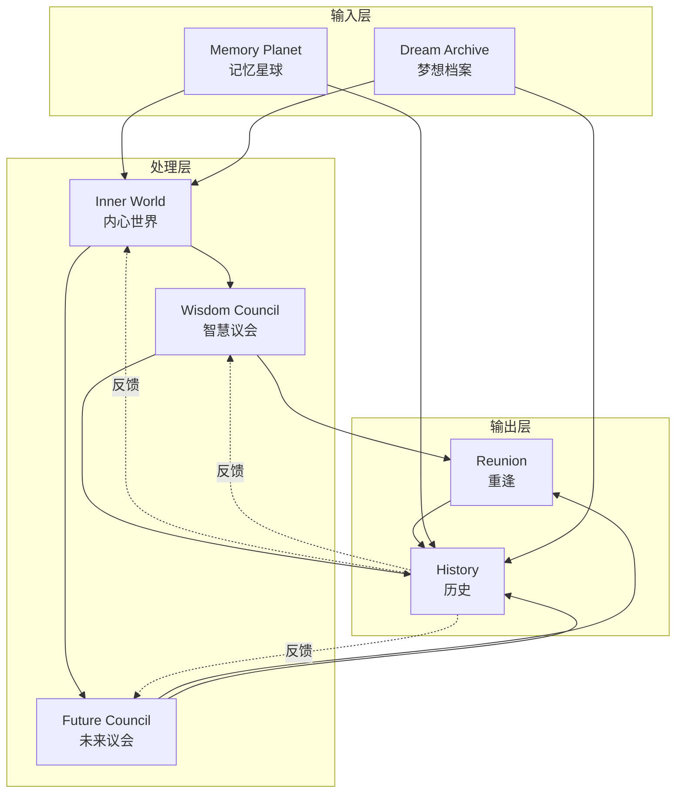
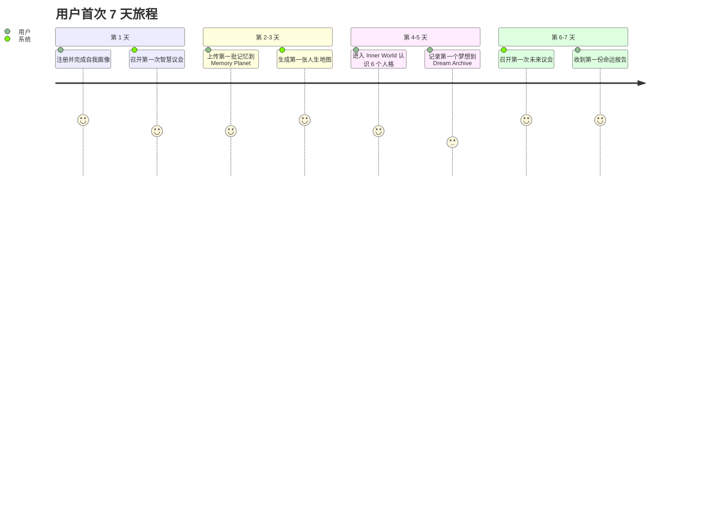

# LifeVerse 产品世界观

> 文档版本：v1.0
> 维护者：产品总监 Alex Chen、市场总监 Rachel Bai
> Slogan：Every life deserves its own universe.

---

## 1. 一句话定义

LifeVerse 是一个 **AI 生命操作系统**，它把一个人的记忆、情感、梦想、关系与决策，组织成一个可被觉察、可被推演、可被重逢的私人宇宙。

它不是日记本，不是聊天机器人，不是冥想 App，而是一个让"自我"得以在时间维度上完整展开的操作系统。

---

## 2. 为什么是"操作系统"

我们刻意使用"操作系统"这个词，而非"应用"或"工具"。

- **应用**解决一个具体问题（记笔记、冥想、聊天）。
- **操作系统**提供一个让多个应用协同运行的底层框架。

LifeVerse 之所以是操作系统，是因为它提供了：

1. **统一的身份层**：用户的"自我"是跨模块共享的，不需要在每个模块重新介绍自己。
2. **统一的时间层**：所有模块共享同一条时间线，过去、现在、未来互相引用。
3. **统一的记忆层**：Memory Planet 是所有模块的共享数据源。
4. **统一的决策层**：议会机制是所有重大决策的统一入口。
5. **统一的隐私层**：用户对宇宙的访问权限进行统一管理。

---

## 3. 三层价值

LifeVerse 为用户提供三层递进的价值，这也是产品的"价值金字塔"。

### 3.1 第一层：理解自己

> "我到底是一个怎样的人？"

这是最基础的价值。通过 Inner World 的 6 个人格、Memory Planet 的人生地图、Wisdom Council 的价值雷达，用户第一次能够"看见"自己的全貌。

- Inner World 让用户看见自己内心的冲突与渴望。
- Memory Planet 让用户看见自己过去的形状。
- Wisdom Council 让用户看见自己价值的坐标。

**交付物**：一张属于自己的"自我画像"，包括价值雷达、内心人格分布、人生地图。

### 3.2 第二层：理解过去

> "我是怎么走到今天的？"

当记忆被组织成星球与地图，当过去的决策被写入时间线，用户能够回溯自己的生命轨迹，理解"为什么我是现在的我"。

- Memory Planet 把碎片化的记忆结构化。
- Dream Archive 让用户看见儿时的梦想与今天的距离。
- Reunion 让用户与已经离开的人"重逢"，完成未完成的对话。

**交付物**：一条可折叠的生命时间线，以及一份"过去决策回顾报告"。

### 3.3 第三层：理解未来

> "我可以走向哪里？"

这是 LifeVerse 最独特的价值。通过 Future Council 的时间推演、Wisdom Council 的多元视角、命运报告的后果分析，用户能够在"行动之前"看见未来的多种可能。

- Future Council 让 20 岁、当前、50 岁、80 岁的自己同时发言。
- 命运报告量化每个选择的代价与收益。
- 时间线折叠让用户看见"如果当年选了另一条路"的平行宇宙。

**交付物**：一份"未来推演报告"，包含多条可能路径与后悔概率。

---

## 4. 七大模块关系

LifeVerse 由 7 大模块组成，它们不是平行的功能，而是一个有机的整体。

### 4.1 模块分工

| 模块 | 角色 | 输入 | 输出 |
| --- | --- | --- | --- |
| Memory Planet | 记忆仓库 | 照片、文字、语音 | 结构化记忆、人生地图 |
| Dream Archive | 梦想仓库 | 梦想记录、儿时资料 | 梦想时间轴、儿时自己 AI |
| Inner World | 情绪引擎 | 实时情绪、记忆 | 内心人格状态、冲突检测 |
| Wisdom Council | 决策引擎 | 议题、价值雷达 | 命运报告、共识方案 |
| Future Council | 推演引擎 | 议题、时间线 | 未来路径、后悔分析 |
| Reunion | 关系引擎 | 亲人资料、未完成对话 | AI 亲人、私人议会 |
| History | 时间引擎 | 所有模块的事件 | 生命时间线、生命星图 |

### 4.2 模块之间的"引力"

模块之间不是简单的数据流，而是有"引力"的：

- **Memory Planet ↔ Inner World**：记忆触发情绪，情绪反过来标记记忆。
- **Wisdom Council ↔ Future Council**：智者提供原则，未来自己提供后果，两者必须协同。
- **Dream Archive ↔ Reunion**：儿时梦想常常需要与"儿时的自己"重逢才能完成。
- **History ↔ 所有模块**：History 是所有模块的"记忆"，也是所有模块的"先例库"。

---

## 5. 用户旅程

LifeVerse 的用户旅程不是一条直线，而是一个螺旋上升的过程。

### 5.1 首次旅程（第 1~7 天）

### 5.2 日常旅程（每周）

- **周一**：Inner World 情绪扫描，生成本周"内心天气"。
- **周三**：Memory Planet 提示"3 年前的今天"，触发记忆回溯。
- **周五**：Wisdom Council 周度议题，回顾本周重大决策。
- **周日**：Future Council 月度推演，更新未来路径。

### 5.3 重大时刻旅程

当用户面临重大决策（辞职、结婚、生育、搬迁、告别）时：

1. 用户主动召集议会，或系统根据情绪检测建议召集。
2. Wisdom Council + Future Council 联合召开"扩大议会"。
3. 必要时进入 Reunion，与相关亲人重逢。
4. 生成"重大时刻命运报告"，永久写入 History。
5. 报告成为未来议会的"先例"，影响后续推演。

### 5.4 长期旅程（年度）

每年年末，LifeVerse 会生成一份"年度生命报告"：

- 这一年你召开了多少次议会？
- 你的价值雷达发生了怎样的漂移？
- 你与哪些亲人重逢过？
- 你的梦想时间轴推进了多少？
- 明年，你的 80 岁自己最想对你说什么？

---

## 6. 产品哲学

LifeVerse 的产品设计遵循三条哲学：

### 6.1 镜子而非裁判

AI 永远是镜子，不是裁判。它可以呈现、可以推演、可以追问，但永远不替用户做决定。所有命运报告的结尾都会有一句："最终的选择权在你。"

### 6.2 显性而非隐性

LifeVerse 不做"偷偷推荐"。所有 AI 的判断都会显性化：冲突值是多少、价值雷达怎么变、哪些人格在反对。用户永远知道"AI 在用什么逻辑说话"。

### 6.3 温柔而非冷酷

LifeVerse 不追求"最优解"，而追求"最温柔的真相"。当真相残酷时，AI 会先陪伴，再揭示；当用户脆弱时，Reunion 会先于 Wisdom Council 出现。

---

## 7. 与世界规则的关系

本文档定义了 LifeVerse 的"产品世界观"，它与 `world.md` 的关系是：

- `world.md` 定义宇宙的"物理法则"（冲突值、共识机制、时间线）。
- 本文档定义宇宙的"产品形态"（模块、旅程、价值）。
- 两者共同构成 LifeVerse 的"世界观层"，是 PRD 层的上游输入。

所有 PRD 文档（`prd-v5.md`、`user_story.md` 等）必须同时遵循这两份文档。
