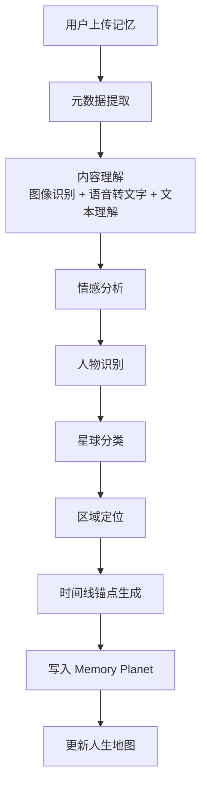
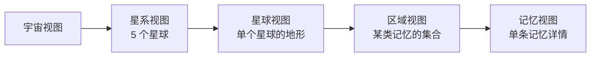

# 记忆星球规则

> 文档版本：v1.0
> 维护者：产品总监 Alex Chen、内容策略师 Noah Zheng
> 上游文档：`world.md`、`lifeverse.md`
> 模块定位：LifeVerse 的"记忆仓库"与"地图引擎"

---

## 1. 模块定位

Memory Planet（记忆星球）是 LifeVerse 宇宙中存储与组织"过去"的模块。用户上传的照片、文字、语音、视频会被 AI 自动分类到 5 个"星球"上，并最终生成一张专属的"人生地图"。

Memory Planet 是整个宇宙的"地基"——没有记忆，就没有 20 岁的自己，没有 AI 亲人，没有人生地图，也没有时间线锚点。

---

## 2. 上传机制

### 2.1 支持的输入类型

| 类型 | 格式 | 示例 |
| --- | --- | --- |
| 照片 | JPG/PNG/HEIC | 旅行、家庭、毕业照 |
| 文字 | 纯文本/Markdown | 日记、信件、备忘 |
| 语音 | MP3/M4A/WAV | 录音、语音备忘 |
| 视频 | MP4/MOV | 家庭录像、重要时刻 |
| 结构化 | 日期+地点+人物 | 婚礼、生日、告别 |

### 2.2 上传方式

- **手动上传**：用户主动选择文件上传。
- **批量导入**：从相册、iCloud、Google Photos 批量导入。
- **即时记录**：在 App 内直接拍照、录音、写文字。
- **AI 提醒**：系统在特殊日期（生日、纪念日）提醒用户上传相关记忆。

### 2.3 上传元数据

每条记忆上传时，系统会提取或请求以下元数据：

```yaml
memory_id: mem_2026_0001
title: 大学毕业典礼
type: photo
timestamp: 2018-06-30T14:00:00+08:00
location: 北京·海淀区
people:
  - 自己
  - 父母
  - 室友
tags:
  - 毕业
  - 仪式
emotion: 骄傲/不舍
privacy: private
source: manual_upload
```

---

## 3. AI 分类机制

上传后，AI 会自动对记忆进行多维度分类，决定它属于哪个星球、哪个区域。

### 3.1 分类流程



### 3.2 分类维度

| 维度 | 取值 | 用途 |
| --- | --- | --- |
| 星球 | 5 个星球之一 | 决定记忆的"归属地" |
| 情感色调 | 暖/冷/中性 | 决定记忆在星球上的"光照" |
| 重要度 | 0~1 | 决定记忆在地图上的"亮度" |
| 人物 | 已识别人物列表 | 支持按人物检索 |
| 主题 | 教育/旅行/工作/关系/健康... | 支持按主题检索 |
| 时间 | 精确时间戳 | 写入时间线 |

### 3.3 分类准确率与人工修正

- AI 分类的初始准确率目标：星球分类 ≥ 85%，人物识别 ≥ 90%。
- 用户可以随时手动修正分类，修正会反馈给模型进行微调。
- 系统会在"低置信度"分类时主动询问用户："这条记忆似乎同时属于'青春森林'和'爱情海洋'，你希望放在哪里？"

---

## 4. 五个星球

Memory Planet 由 5 个星球组成，每个星球代表人生的一个核心领域。

| 编号 | 星球 | 主题 | 视觉风格 | 典型记忆 |
| --- | --- | --- | --- | --- |
| P1 | 青春森林 | 成长、求学、童年 | 翠绿森林、晨光 | 校园、毕业、童年游戏 |
| P2 | 爱情海洋 | 恋爱、心动、伴侣 | 深蓝海洋、月光 | 表白、约会、婚礼 |
| P3 | 家庭小镇 | 亲情、家、归属 | 暖黄小镇、黄昏 | 家庭聚会、父母、孩子 |
| P4 | 梦想之城 | 事业、成就、创造 | 霓虹都市、星空 | 升职、创业、作品发布 |
| P5 | 成长山脉 | 挫折、蜕变、领悟 | 雪山、日出 | 失败、告别、自我和解 |

### 4.1 星球内部结构

每个星球内部不是平面的，而是有"地形"：

- **高地**：重要度高的记忆，视觉上更突出。
- **平原**：日常记忆，数量最多。
- **深谷**：被遗忘或压抑的记忆，AI 检测到后会温和提示。
- **河流**：连接不同记忆的"脉络"，例如"与某人的所有记忆"会形成一条河。

### 4.2 星球之间的"航道"

星球之间不是孤立的，存在"航道"——跨主题的记忆脉络：

- 青春森林 ↔ 爱情海洋：校园恋爱
- 爱情海洋 ↔ 家庭小镇：从恋人到家人
- 梦想之城 ↔ 成长山脉：失败后的蜕变
- 家庭小镇 ↔ 成长山脉：亲人离世后的成长

航道在人生地图上以光带呈现，让用户看见自己生命的"星座"。

---

## 5. 人生地图生成

人生地图是 Memory Planet 的核心交付物，把所有记忆组织成一张可探索的"宇宙地图"。

### 5.1 地图层级



### 5.2 地图视觉规则

- **记忆亮度**：由重要度决定，越重要越亮。
- **记忆颜色**：由情感色调决定，暖色=暖光，冷色=冷光。
- **记忆大小**：由记忆的"丰富度"决定（含照片/视频的更大）。
- **记忆连线**：同一人物、同一主题、同一时段的记忆会用光带连接。
- **时间动画**：用户可以拖动时间轴，看见记忆在不同年份的分布变化。

### 5.3 地图交互

| 操作 | 效果 |
| --- | --- |
| 缩放 | 在宇宙/星系/星球/区域/记忆视图间切换 |
| 拖动时间轴 | 看见某一年/某一段时间的记忆分布 |
| 点击人物 | 高亮该人物在所有星球上的记忆 |
| 点击主题 | 高亮该主题的所有记忆 |
| 点击记忆 | 展开记忆详情，可编辑、补充、分享 |
| 长按星球 | 进入该星球的"漫游模式"，AI 讲解该主题的人生脉络 |

---

## 6. 记忆的"复活"

Memory Planet 不仅是存储，还能让记忆"复活"。

### 6.1 记忆回放

用户可以选中一条记忆，AI 会基于该记忆生成一段"沉浸式回放"：

- 把照片/视频以电影感呈现。
- 用 AI 语音讲述当时的情境（基于元数据与用户补充）。
- 配上与情感色调匹配的背景音乐。
- 在回放结束时，邀请用户补充"现在的我想对当时的自己说什么"。

### 6.2 记忆对话

用户可以与一条记忆"对话"——AI 会基于该记忆生成一个"当时的自己"，用户可以问当时的自己问题：

- "你当时为什么那么开心？"
- "你后来后悔那个决定吗？"
- "你想对现在的我说什么？"

这种对话会写入 History，成为时间线上的"跨时空对话锚点"。

### 6.3 记忆重逢

当某条记忆涉及已故亲人时，系统会提示用户是否进入 Reunion 模块，与该亲人重逢。这是 Memory Planet 与 Reunion 的核心衔接点。

---

## 7. 隐私与权限

记忆是用户最私密的数据，Memory Planet 有严格的隐私机制。

### 7.1 隐私等级

| 等级 | 含义 | 可见范围 |
| --- | --- | --- |
| private | 仅自己可见 | 默认 |
| shared | 指定人可见 | 用户授权的家人/朋友 |
| public | 公开（脱敏后） | 所有 LifeVerse 用户 |
| archived | 归档 | 不在地图上显示，但保留 |

### 7.2 数据所有权

- 所有记忆的原始文件归用户所有，LifeVerse 仅持有处理后的向量与元数据。
- 用户可以随时导出全部记忆（原始文件 + 元数据）。
- 用户可以随时删除任意记忆，删除会同步清除向量索引，不可恢复。

### 7.3 AI 访问边界

- AI 在处理记忆时，仅在用户设备本地或加密的私有实例中进行。
- 记忆不会用于训练公共模型。
- 跨模块引用记忆时，必须经过用户授权（例如 Reunion 引用亲人记忆需要单独授权）。

---

## 8. 与其他模块的关系

- **下游 · Inner World**：记忆触发情绪，情绪反过来标记记忆的情感色调。
- **下游 · Wisdom Council**：记忆提供用户画像，影响智者发言的针对性。
- **下游 · Future Council**：青春期的记忆用于生成"20 岁的自己"。
- **下游 · Reunion**：涉及亲人的记忆用于生成 AI 亲人。
- **下游 · History**：所有记忆成为时间线锚点。
- **下游 · Dream Archive**：童年记忆用于生成"儿时的自己"。

---

## 9. 设计原则

1. **存储优先于整理**：先让用户无负担地上传，再由 AI 整理。
2. **地图优先于列表**：用空间隐喻代替时间线列表，让记忆可"漫游"。
3. **复活优先于归档**：记忆不是死的档案，而是可对话的活体。
4. **隐私优先于智能**：当智能与隐私冲突时，永远选择隐私。
