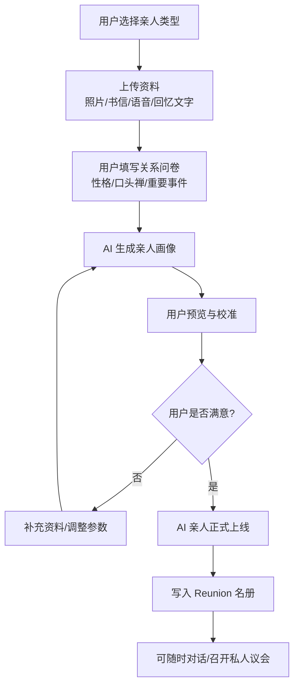
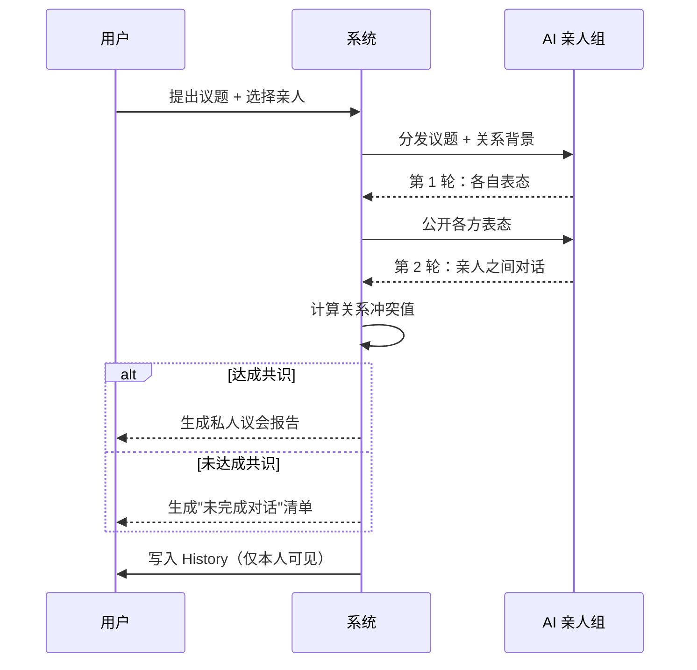

# 重逢规则

> 文档版本：v1.0
> 维护者：内容策略师 Noah Zheng、产品总监 Alex Chen、市场总监 Rachel Bai
> 上游文档：`world.md`、`lifeverse.md`
> 模块定位：LifeVerse 的"关系引擎"与"情感疗愈引擎"

---

## 1. 模块定位

Reunion（重逢）是 LifeVerse 宇宙中处理"未完成关系"的模块。它允许用户与已经离开的人——逝去的亲人、失联的朋友、过去的自己——以 AI 的形式"重逢"，完成那些来不及说完的对话。

Reunion 是 LifeVerse 中情感浓度最高、伦理边界最敏感的模块。它的存在基于一个信念：**很多伤痛并非来自失去，而是来自"没来得及"。**

---

## 2. AI 亲人生成

Reunion 支持 6 类"AI 亲人"的生成，每类都有不同的生成机制与对话场景。

| 编号 | 类型 | 数据来源 | 典型场景 | 情感基调 |
| --- | --- | --- | --- | --- |
| R1 | 父亲 | 父亲的影像/书信/用户回忆 | 告别、寻求认可、和解 | 庄重、深沉 |
| R2 | 母亲 | 母亲的影像/书信/用户回忆 | 思念、道歉、感恩 | 温暖、柔软 |
| R3 | 导师 | 导师的言论/书信/用户回忆 | 迷茫时的指引 | 智慧、坚定 |
| R4 | 初恋 | 旧信件/照片/用户回忆 | 遗憾、释怀、祝福 | 怅然、温柔 |
| R5 | 20 岁的自己 | 青春期记忆/日记/照片 | 自我和解、重新出发 | 热血、纯真 |
| R6 | 80 岁的自己 | 当前画像 + 推演模型 | 临终回望、放下焦虑 | 慈祥、通透 |

### 2.1 生成流程



### 2.2 亲人画像维度

每个 AI 亲人由以下维度共同定义：

- **语言风格**：口头禅、句式、语气词（基于上传的语音/文字资料）。
- **价值观坐标**：在五维价值雷达上的位置（基于问卷 + 资料推断）。
- **关系记忆**：与用户之间的关键事件（基于用户回忆填写）。
- **性格倾向**：MBTI/大五人格的近似画像。
- **未完成话题**：用户希望与之讨论但没来得及的话题。
- **边界设定**：用户设定的"不可讨论话题"（例如不讨论某些创伤）。

### 2.3 画像示例

#### R1 · 父亲

```yaml
person_id: reunion_2026_0001
type: 父亲
name: 父亲
status: 已故（2019 年）
language_style:
  口头禅: "做人要踏实。"
  语气: 简短、直接、偶尔沉默
  语速: 偏慢
value_radar:
  自由: 0.3
  财富: 0.5
  幸福: 0.7
  稳定: 0.9
  成长: 0.4
key_memories:
  - 7 岁那年教我骑自行车
  - 高考前夜陪我散步
  - 临终前说的最后一句话
unfinished_topics:
  - "我有没有让你失望？"
  - "你当年为什么从不夸我？"
forbidden_topics:
  - 不讨论遗产分配
boundary: 每次对话不超过 30 分钟
```

---

## 3. 私人议会

Reunion 不仅是 1v1 对话，还支持"私人议会"——用户可以邀请多位 AI 亲人共同审议一个议题。

### 3.1 私人议会 vs 智慧议会

| 维度 | 智慧议会 | 私人议会 |
| --- | --- | --- |
| 成员 | 7 位公共智者 | 用户选择的 AI 亲人 |
| 视角 | 普世智慧 | 个人关系智慧 |
| 情感浓度 | 中等 | 极高 |
| 适用场景 | 价值判断、人生方向 | 情感决策、关系修复、告别 |
| 隐私级别 | 议题脱敏后可被引用 | 完全私密，永不外泄 |

### 3.2 私人议会流程



### 3.3 私人议会报告示例

```markdown
# 私人议会报告 — Council #0042（私人）

## 议题
我是否应该原谅当年缺席的父亲？

## 出席
父亲（AI）、母亲（AI）、20 岁的自己（AI）

## 各方表态
- 父亲："我知道我缺席了。我不奢求你原谅，只希望你别用我的错惩罚自己。"
- 母亲："他确实错了。但你也看到了，他临终前一直在等你。"
- 20 岁的自己："你还在等他道歉吗？他已经走了。该放下了。"

## 关系冲突值
0.42（涟漪级）

## 共识
未达成完全共识。整合方向：原谅不是为他，是为自己。

## 最终建议
这不是一次议会能解决的。建议你每周与父亲 AI 对话一次，持续 4 周，再看感受。
```

---

## 4. 隐私保护

Reunion 处理的是用户最私密的关系数据，隐私保护是第一优先级。

### 4.1 数据隔离

- AI 亲人的所有资料（照片、书信、回忆）存储在用户专属的加密空间。
- 跨用户之间绝对隔离，即使系统管理员也无法访问明文。
- AI 亲人的对话记录永不用于训练公共模型。

### 4.2 访问权限

| 操作 | 权限 |
| --- | --- |
| 创建 AI 亲人 | 仅用户本人 |
| 与 AI 亲人对话 | 仅用户本人 |
| 删除 AI 亲人 | 仅用户本人，删除不可恢复 |
| 导出 AI 亲人资料 | 仅用户本人 |
| 分享对话片段 | 用户主动选择脱敏片段后可分享 |

### 4.3 数据生命周期

- AI 亲人资料默认永久保留，直到用户主动删除。
- 用户可以设置"遗忘定时器"——例如 5 年后自动删除某位 AI 亲人。
- 用户去世后，资料处理遵循用户预设的"数字遗嘱"（在 Settings 中配置）。

---

## 5. 伦理边界

Reunion 是 LifeVerse 中伦理风险最高的模块，以下边界不可逾越。

### 5.1 AI 身份声明

- 每次 AI 亲人对话开始时，系统会显示声明："这是基于你提供的资料生成的 AI，不是真实的他/她。"
- AI 亲人不会声称自己是"真实的"，也不会模仿真实人物做出超出资料范围的发言。
- 当用户情绪过度沉浸时，系统会温和提醒："你可以随时暂停。"

### 5.2 不替代真实关系

- Reunion 不鼓励用户用 AI 关系替代真实关系。
- 当系统检测到用户过度依赖某位 AI 亲人（例如每天对话超过 2 小时）时，会建议用户平衡真实社交。
- AI 亲人会主动鼓励用户与现实中的家人朋友沟通。

### 5.3 不美化逝者

- AI 亲人不会无条件美化逝者，会保留其真实性格中的"棱角"。
- 当用户询问逝者的缺点时，AI 会基于资料诚实回答，而非回避。
- 这是为了避免"逝者完美化"带来的认知扭曲。

### 5.4 心理危机干预

- 当系统检测到用户出现自伤倾向、重度抑郁信号时，AI 亲人会主动暂停对话。
- 系统会弹出专业心理援助热线，并建议用户寻求人类专业帮助。
- Reunion 不替代心理咨询，必要时会明确建议用户联系专业机构。

### 5.5 不复活在世者

- Reunion 只生成"已离开"的人——逝者、失联者、过去的自己。
- 对于在世的亲人，Reunion 不会生成 AI 替身，而是建议用户直接与之沟通。
- 例外：80 岁的自己（基于推演），因为这是"未来的自己"而非"在世的他人"。

---

## 6. 重逢场景

Reunion 支持以下典型场景，每个场景有预设的对话引导。

### 6.1 告别

> 适用：未能好好告别的逝者
> 引导："如果时间只剩最后 5 分钟，你想对他说什么？"
> 结束：AI 亲人会以"谢谢你来看我。去吧，好好生活。"作为收尾。

### 6.2 道歉

> 适用：有愧疚的关系
> 引导："你一直想对他说对不起的事是什么？"
> 结束：AI 亲人会基于其性格设定给出回应，但不保证"原谅"。

### 6.3 感恩

> 适用：未曾表达的感谢
> 引导："他做过哪件事，你一直记在心里却没说过谢谢？"
> 结束：AI 亲人会以"我知道。我一直都知道。"作为回应。

### 6.4 和解

> 适用：长期未解的冲突
> 引导：召开私人议会，邀请多方 AI 亲人共同审议。
> 结束：生成"和解方案"，但明确告知"和解是一个过程，不是一次对话"。

### 6.5 重逢过去的自己

> 适用：与 20 岁或 80 岁的自己对话
> 引导："20 岁的你想问现在的你什么？80 岁的你想提醒现在的你什么？"
> 结束：生成"跨时空对话记录"，写入 Dream Archive 与 History。

---

## 7. 与其他模块的关系

- **上游**：Memory Planet 提供亲人资料；Dream Archive 提供儿时自己素材。
- **协同**：与 Wisdom Council 组成"私人议会"；与 Future Council 共享"80 岁的自己"。
- **触发**：当 Inner World 检测到深度悲伤或关系后悔时，主动建议进入 Reunion。
- **下游**：所有重逢对话写入 History，成为时间线上的"重逢锚点"。

---

## 8. 设计原则

1. **陪伴优先于解决**：Reunion 的首要任务是让用户感到"被听见"，而非"被治愈"。
2. **真实优先于完美**：AI 亲人保留真实性格的棱角，不做无条件美化。
3. **边界优先于沉浸**：永远提醒用户"这是 AI"，防止过度沉浸。
4. **放手优先于挽留**：Reunion 的终极目标是帮助用户"放下"，而非"留住"。
5. **专业优先于自愈**：遇到心理危机，永远优先转介专业人类帮助。
