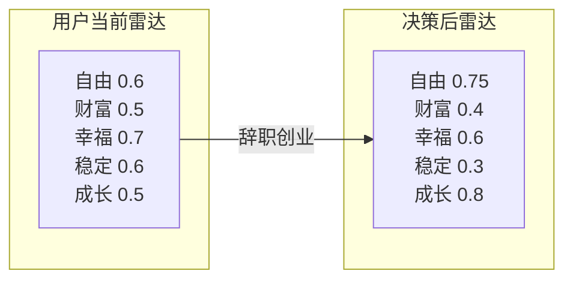
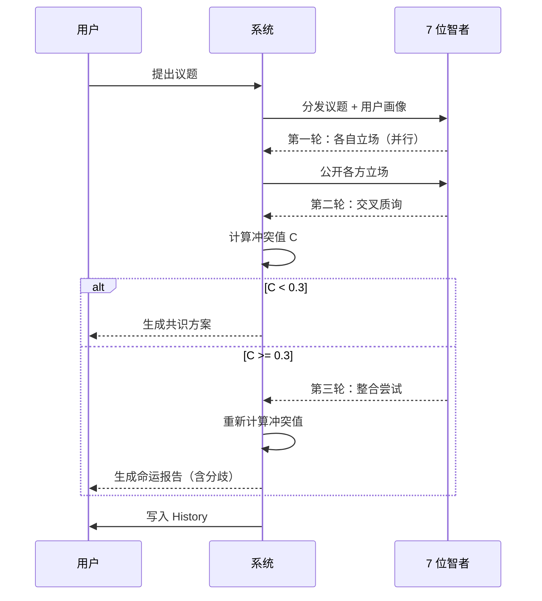

# 智慧议会世界规则

> 文档版本：v1.0
> 维护者：内容策略师 Noah Zheng、产品总监 Alex Chen
> 上游文档：`world.md`、`lifeverse.md`
> 模块定位：LifeVerse 的"决策引擎"

---

## 1. 模块定位

Wisdom Council（智慧议会）是 LifeVerse 宇宙中处理"价值判断与人生方向"的议会。当用户面临一个没有标准答案的问题时，宇宙会召集 7 位智者，让他们从各自的人生哲学出发，给出多元视角。

智慧议会不追求"给出正确答案"，而追求"让用户看见一个问题的 7 种解法"。

---

## 2. 七位智者

智慧议会的 7 位智者来自不同时代、不同文化、不同领域，共同构成一个"多元视角矩阵"。

| 编号 | 智者 | 时代 | 领域 | 核心哲学 | 价值雷达倾向 |
| --- | --- | --- | --- | --- | --- |
| W1 | 埃隆·马斯克 | 当代 | 科技/商业 | 第一性原理，文明延续 | 自由↑ 成长↑ 稳定↓ |
| W2 | 沃伦·巴菲特 | 当代 | 投资 | 长期复利，能力圈 | 财富↑ 稳定↑ 幸福↑ |
| W3 | 史蒂夫·乔布斯 | 当代 | 产品/设计 | 求真，连接点滴，Stay hungry | 成长↑ 自由↑ 幸福↑ |
| W4 | 查理·芒格 | 当代 | 投资/思维 | 多元思维模型，避免愚蠢 | 稳定↑ 成长↑ 财富↑ |
| W5 | 苏格拉底 | 古希腊 | 哲学 | 诘问，认识你自己 | 成长↑ 幸福↑ 财富↓ |
| W6 | 王阳明 | 明代 | 心学 | 知行合一，致良知 | 幸福↑ 成长↑ 稳定↑ |
| W7 | 庄子 | 战国 | 道家 | 逍遥，齐物，无为 | 自由↑↑ 幸福↑ 财富↓ |

### 2.1 智者画像示例

#### W1 · 埃隆·马斯克

- **口头禅**："让我们用第一性原理重新拆解这个问题。"
- **典型发言风格**：直接、激进、偏好颠覆性方案，常引用物理学类比。
- **擅长议题**：职业转型、技术创业、长期赌注、风险承担。
- **盲区**：低估情感成本与关系维护，对"稳定"价值评价偏低。
- **价值雷达坐标**：自由 0.9 / 财富 0.6 / 幸福 0.4 / 稳定 0.2 / 成长 0.9

#### W5 · 苏格拉底

- **口头禅**："你确定你真的知道你所认为你知道的吗？"
- **典型发言风格**：以反问推进，从不直接给答案，喜欢剥洋葱式追问。
- **擅长议题**：自我认知、价值澄清、道德困境。
- **盲区**：对实操细节不感兴趣，可能让用户感到"被审问"。
- **价值雷达坐标**：自由 0.6 / 财富 0.2 / 幸福 0.7 / 稳定 0.3 / 成长 0.9

#### W7 · 庄子

- **口头禅**："无用之用，方为大用。"
- **典型发言风格**：寓言式、诗意、常以自然意象化解焦虑。
- **擅长议题**：放下执念、关系解脱、生死观、与自我和解。
- **盲区**：对现代职场与财务问题给出的建议偏"出世"，可能不接地气。
- **价值雷达坐标**：自由 0.95 / 财富 0.1 / 幸福 0.8 / 稳定 0.2 / 成长 0.6

> 其余 4 位智者的画像在系统内部维护，结构同上。

---

## 3. 价值雷达

价值雷达是智慧议会的"通用语言"。每位智者、每位用户、每个决策，都会被映射到一个五维价值雷达上。

### 3.1 五个维度

| 维度 | 含义 | 高分倾向 |
| --- | --- | --- |
| 自由 | 自主选择权、不受束缚 | 创业者、艺术家、旅行者 |
| 财富 | 物质积累与财务安全 | 投资人、企业家 |
| 幸福 | 主观幸福感与关系质量 | 家庭导向者 |
| 稳定 | 可预测性与风险规避 | 公务员、长期主义者 |
| 成长 | 能力提升与自我超越 | 学习者、探险者 |

### 3.2 雷达图示例



### 3.3 雷达漂移

每次议会结束后，系统会计算"雷达漂移向量"：

- 漂移幅度 = 决策前后雷达坐标的欧氏距离。
- 漂移方向 = 决策推动用户朝哪个价值方向移动。
- 漂移历史 = 用户在 History 中可查看自己历年的雷达漂移轨迹。

当漂移幅度过大（> 0.4）时，系统会提示："这个决定将显著改变你的价值结构，建议同时召开未来议会。"

---

## 4. 辩论机制

智慧议会的辩论不是"轮流发言"，而是有结构的"多轮交锋"。

### 4.1 辩论流程



### 4.2 发言轮次

| 轮次 | 名称 | 内容 | 是否并行 |
| --- | --- | --- | --- |
| 第 1 轮 | 立场陈述 | 每位智者给出初始观点与理由 | 并行 |
| 第 2 轮 | 交叉质询 | 智者之间互相提问与反驳 | 串行 |
| 第 3 轮 | 整合尝试 | 寻找更高维度的整合方案 | 协作 |
| 第 4 轮 | 用户回应 | 用户对各方观点表态 | 单人 |

### 4.3 智者之间的预设关系

智者并非孤立存在，他们之间有预设的"亲疏关系"，影响辩论的激烈程度：

- 马斯克 ↔ 巴菲特：高频冲突（冒险 vs 复利）
- 乔布斯 ↔ 芒格：中频冲突（直觉 vs 模型）
- 苏格拉底 ↔ 王阳明：低频冲突（诘问 vs 致良知，殊途同归）
- 庄子 ↔ 马斯克：高频冲突（无为 vs 第一性原理）
- 庄子 ↔ 苏格拉底：中频冲突（放下 vs 追问）

这些关系会体现在第 2 轮交叉质询中，让辩论更真实。

---

## 5. 冲突值计算

智慧议会的冲突值遵循 `world.md` 中的通用公式，但在本模块中有特化：

```
C_wc = 0.35 · 观点分歧度 + 0.35 · 价值雷达距离 + 0.15 · 智者亲疏权重 + 0.15 · 议题敏感度
```

- `观点分歧度`：7 位智者发言向量的平均两两余弦距离。
- `价值雷达距离`：7 位智者在五维雷达上的平均两两欧氏距离。
- `智者亲疏权重`：根据预设关系调整，关系越对立权重越高。
- `议题敏感度`：由议题分类器给出（职业 0.6 / 关系 0.8 / 生死 1.0）。

### 5.1 冲突等级与系统行为

| 冲突值 | 等级 | 系统行为 |
| --- | --- | --- |
| 0.0 ~ 0.2 | 微光 | 直接生成共识方案 |
| 0.2 ~ 0.5 | 涟漪 | 生成方案 + 标注主要分歧 |
| 0.5 ~ 0.8 | 风暴 | 建议联合 Future Council 召开扩大议会 |
| 0.8 ~ 1.0 | 裂痕 | 建议先进入 Reunion 寻求情感支持 |

---

## 6. 议会类型

智慧议会支持三种子类型：

### 6.1 标准议会

- 7 位智者全部出席。
- 适用于：重大人生决策、价值澄清。
- 时长：约 15~25 分钟（用户阅读 + 互动）。

### 6.2 焦点议会

- 由系统根据议题选择 3 位最相关智者。
- 适用于：具体领域问题（投资、职业、关系）。
- 时长：约 8~12 分钟。

### 6.3 扩大议会

- 智慧议会 + 未来议会联合召开。
- 适用于：冲突值 > 0.5 的悬置议题。
- 时长：约 30~45 分钟。

---

## 7. 命运报告（智慧议会版）

每次智慧议会结束后，生成一份命运报告，结构如下：

```markdown
# 命运报告 — Council #0042（智慧议会）

## 议题
是否辞职创业？

## 出席智者
马斯克、巴菲特、乔布斯、芒格、苏格拉底、王阳明、庄子

## 各方立场
- 马斯克：支持。第一性原理看，你的核心能力在产品，不在大厂流程。
- 巴菲特：反对。你的能力圈不包含销售与现金流管理，创业=走出能力圈。
- 乔布斯：有条件支持。先确认你的"为什么"足够强，否则别开始。
- 芒格：反对。避免愚蠢比追求伟大更重要。
- 苏格拉底：追问。你说的"创业"，是为了自由，还是为了证明？
- 王阳明：中立。知行合一——你若真知，便不会来问议会。
- 庄子：放下。创业与不创业，都是牢笼，关键是你的心是否自由。

## 冲突值
0.71（风暴级）

## 价值雷达漂移
若选择创业：自由 +0.15 / 稳定 -0.30 / 成长 +0.20

## 共识方案
未达成完全共识。整合方案：先以副业验证 6 个月，保留主业现金流。

## 最终建议
这不是一个对错题。先回答苏格拉底的问题：你为什么想创业？
```

---

## 8. 与其他模块的关系

- **上游**：Memory Planet 提供用户画像，Inner World 提供当前情绪状态。
- **下游**：命运报告写入 History，成为未来议会的先例。
- **协同**：与 Future Council 可组成"扩大议会"；与 Reunion 可组成"私人议会"。
- **反馈**：用户对智者发言的"点赞/反对"会微调智者在后续议会中的发言权重。

---

## 9. 设计原则

1. **多元优先于正确**：宁可让用户看到 7 种声音，也不给一个"标准答案"。
2. **冲突优先于和谐**：智者之间的分歧是产品价值，不应被抹平。
3. **追问优先于结论**：苏格拉底式的追问比直接给建议更有长期价值。
4. **可追溯优先于可遗忘**：每一次议会都被永久记录，用户可以随时回看。
