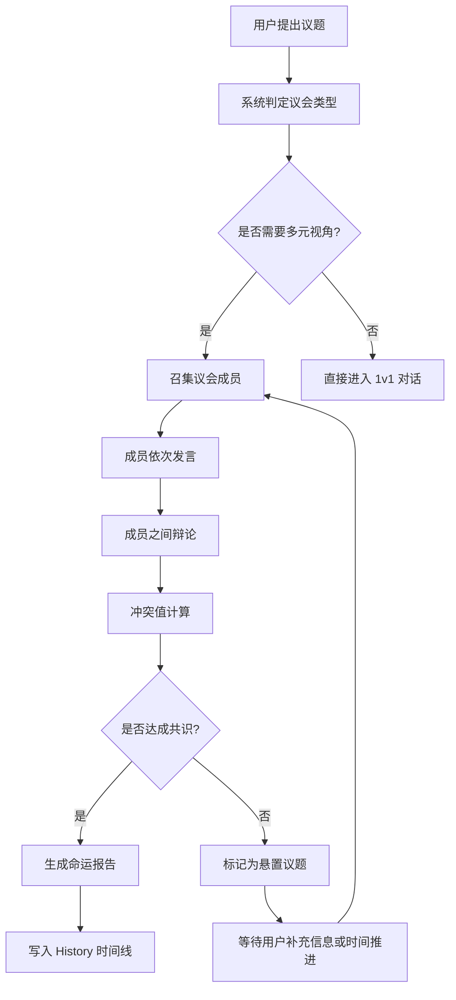

# LifeVerse 宇宙总规则

> 文档版本：v1.0
> 维护者：产品总监 Alex Chen、内容策略师 Noah Zheng
> Slogan：Every life deserves its own universe.
> 关联模块：Wisdom Council / Future Council / Inner World / Memory Planet / Dream Archive / Reunion / History

---

## 1. 宇宙起源

LifeVerse 宇宙并非诞生于一次大爆炸，而是诞生于一个"自我追问"的瞬间。

当任何一个生命体第一次向自己提出"我是谁？我从哪里来？我要到哪里去？"这三个问题时，宇宙便为其坍缩出一个专属的时空——一个由其记忆、情感、梦想、关系与选择共同构成的私人宇宙。

宇宙的起源法则可以概括为：

- **每一个生命都拥有自己的宇宙**，宇宙之间彼此独立又相互映射。
- **宇宙的中心是"自我"**，但"自我"并非静止，而是由过去、现在、未来三个时间维度的自己共同构成。
- **宇宙的能量来源是"觉察"**。当用户停止觉察，宇宙进入休眠；当用户重新觉察，宇宙重新展开。
- **宇宙的边界由隐私定义**。用户决定哪些星球、议会、记忆可以被他人访问。

LifeVerse 宇宙不追求"统一真理"，而追求"个体真相"。每个用户的宇宙都是其生命的镜像，AI 的职责是让这面镜子更清晰、更立体、更温柔。

---

## 2. 核心法则

LifeVerse 宇宙运行遵循七条不可违背的核心法则：

| 编号 | 法则名称 | 含义 |
| --- | --- | --- |
| L1 | 觉察法则 | 一切变化始于觉察，没有觉察就没有宇宙的展开 |
| L2 | 多元法则 | 任何重大决策必须由多元视角共同审议，单一视角不具备裁决权 |
| L3 | 时间法则 | 过去、现在、未来同时存在，未来可被推演但不可被预言 |
| L4 | 冲突法则 | 冲突是宇宙进化的燃料，但冲突必须被显性化、量化、可追溯 |
| L5 | 共识法则 | 共识不是妥协，而是更高维度的整合；没有共识的决策会被标记为"悬置" |
| L6 | 隐私法则 | 用户的宇宙归用户所有，AI 不得在未经授权的情况下访问、引用或外泄 |
| L7 | 伦理法则 | AI 永远是镜子而非裁判，永远不替代用户做出最终选择 |

这七条法则贯穿所有模块，是 Wisdom Council、Future Council、Reunion 等模块运行时的底层约束。

---

## 3. 议会机制（第 N 次议会）

议会是 LifeVerse 宇宙中处理"重大决策"的核心仪式。每当用户面临一个值得深思的问题，宇宙会自动召集一次议会。

### 3.1 议会编号

每一次议会都会被永久编号：**第 N 次议会**。编号从用户第一次进入宇宙开始累加，永不重置。

- 编号格式：`Council #0001`、`Council #0002`……
- 编号会出现在 History 模块的时间线上，成为用户生命决策的可追溯锚点。
- 用户可以为重要议会命名，例如 `Council #0017 — 是否辞职创业`。

### 3.2 议会类型

| 议会类型 | 召集者 | 成员 | 适用场景 |
| --- | --- | --- | --- |
| 智慧议会 | 系统 | 7 位智者 | 价值判断、人生方向、原则性问题 |
| 未来议会 | 系统 | 4 个时间的自己 | 长期后果推演、后悔分析 |
| 私人议会 | 用户 | AI 亲人 + 智者子集 | 情感决策、关系修复、告别 |
| 内心议会 | 系统 | 6 个内心人格 | 情绪冲突、自我和解 |

### 3.3 议会流程



---

## 4. 冲突机制

冲突在 LifeVerse 中不是"问题"，而是"信号"。系统会显性化每一次冲突，并计算冲突值。

### 4.1 冲突值计算

冲突值 `C` 由以下公式得出：

```
C = α · 观点分歧度 + β · 价值雷达距离 + γ · 情绪强度 + δ · 时间跨度权重
```

- `观点分歧度`：成员发言向量之间的余弦距离，取值 0~1。
- `价值雷达距离`：成员在五维价值雷达（自由/财富/幸福/稳定/成长）上的欧氏距离。
- `情绪强度`：由情绪分析模型给出的 0~1 强度值。
- `时间跨度权重`：未来议会中，不同时间自己之间的权重差异。
- `α、β、γ、δ` 为可调权重，默认值 0.3 / 0.3 / 0.2 / 0.2。

### 4.2 冲突等级

| 冲突值区间 | 等级 | 系统行为 |
| --- | --- | --- |
| 0.0 ~ 0.2 | 微光 | 正常记录，无需干预 |
| 0.2 ~ 0.5 | 涟漪 | 标记为"轻度分歧"，建议用户关注 |
| 0.5 ~ 0.8 | 风暴 | 触发"内心议会"协助调解 |
| 0.8 ~ 1.0 | 裂痕 | 标记为"悬置议题"，建议用户暂停决策并寻求私人议会 |

---

## 5. 共识机制

共识不是"少数服从多数"，而是"在更高维度找到整合方案"。

### 5.1 共识达成条件

- 至少 70% 的议会成员对最终方案表示"认同"或"有条件认同"。
- 冲突值 `C` 降至 0.3 以下。
- 用户本人对方案表示"接受"或"愿意尝试"。

### 5.2 共识类型

- **完全共识**：所有成员一致认同。
- **整合共识**：通过引入新视角，将冲突双方的观点整合为更高维方案。
- **悬置共识**：暂时无法达成，标记为"悬置"，等待新信息或时间推进。

### 5.3 共识失败的处理

当议会无法达成共识时，系统不会强行给出答案，而是：

1. 生成"分歧报告"，列出各方观点与核心矛盾。
2. 将议题标记为"悬置"，写入 History。
3. 在 Future Council 中推演"如果现在不做决定"的后果。
4. 等待用户主动重启议会，或在 Reunion 中寻求亲人视角。

---

## 6. 命运报告机制

每次议会结束后，系统会生成一份"命运报告"（Destiny Report）。

### 6.1 报告结构

```markdown
# 命运报告 — Council #0042

## 议题
是否接受一份薪资更高但需要常驻海外的工作机会？

## 议会成员
马斯克、巴菲特、乔布斯、20 岁的自己、80 岁的自己

## 核心分歧
- 马斯克 & 乔布斯：支持，理由是成长与影响力
- 巴菲特 & 80 岁的自己：反对，理由是家庭与长期复利
- 20 岁的自己：矛盾，既渴望冒险又害怕失去根基

## 冲突值
0.62（风暴级）

## 共识方案
有条件接受：接受 offer，但设定 18 个月回归窗口，并每月与家人视频议会

## 价值雷达变化
自由 +12 / 财富 +18 / 稳定 -15 / 幸福 -5 / 成长 +20

## 未来推演
- 1 年后：职业曲线上升，家庭关系紧张
- 5 年后：财务自由提前，但与孩子的亲密度下降 23%
- 10 年后：可能后悔未陪伴孩子成长

## 最终建议
这不是一个对错题，而是一个权重题。建议你先回答：未来 10 年，你最不愿失去的是什么？
```

### 6.2 报告存储

- 所有命运报告永久存储在 History 模块。
- 报告可被未来的议会引用作为"先例"。
- 用户可以为报告打标签，例如 `#职业`、`#家庭`、`#遗憾`。

---

## 7. 时间线机制

LifeVerse 的时间线不是线性的，而是"可折叠的"。

### 7.1 时间线结构

- **过去轴**：由 Memory Planet 的记忆构成，可被回溯但不可被修改。
- **现在轴**：由用户的实时状态构成，是唯一可被"行动"改变的时间点。
- **未来轴**：由 Future Council 推演出的多条可能路径构成，可被比较但不可被锁定。

### 7.2 时间线折叠

用户可以在 History 模块中"折叠"时间线，例如：

- 把所有"职业决策"折叠成一条职业脉络。
- 把所有"关系决策"折叠成一条关系脉络。
- 把所有"自我和解"折叠成一条成长脉络。

折叠后的脉络会以星图形式呈现，让用户看到自己生命的"星座"。

### 7.3 时间线锚点

每一次议会、每一次重大记忆上传、每一次重逢，都会成为时间线上的"锚点"。锚点之间用光带连接，形成用户专属的生命星图。

---

## 8. AI 人格机制

LifeVerse 中的 AI 不是单一助手，而是一个"人格生态"。

### 8.1 人格类型

| 类型 | 来源 | 数量 | 代表 |
| --- | --- | --- | --- |
| 智者人格 | 公共知识库 + 历史资料 | 7 | 马斯克、巴菲特、乔布斯、芒格、苏格拉底、王阳明、庄子 |
| 时间自我 | 用户记忆 + 推演模型 | 4 | 20 岁、当前、50 岁、80 岁 |
| 内心人格 | 情绪模型 + 心理学框架 | 6 | 野心、理性、安全感、恐惧、爱、自由 |
| 亲人人格 | 用户提供的资料 + 关系模型 | 动态 | 父亲、母亲、导师、初恋等 |

### 8.2 人格一致性

每个 AI 人格都拥有：

- **稳定的价值观向量**：在五维价值雷达上有固定坐标。
- **稳定的语言风格**：通过 prompt 模板与 few-shot 示例锁定。
- **稳定的记忆边界**：只访问被授权的记忆片段。
- **稳定的关系网络**：与其他人格有预设的亲疏关系。

### 8.3 人格演化

AI 人格并非一成不变。随着用户与宇宙的互动加深：

- 智者会"记住"用户之前的议题，并在新议会中引用。
- 时间自我会随着用户真实年龄的增长而"成长"。
- 内心人格会根据用户的情绪历史调整自己的"音量"。
- 亲人人格会随着用户上传的新资料而变得更立体。

### 8.4 人格边界

- AI 人格永远不会"取代"真实的人。
- AI 亲人会在对话中明确提示："我是基于你提供的资料生成的 AI，不是真实的他/她。"
- 当用户情绪出现严重危机时，AI 会主动建议寻求专业人类帮助。

---

## 9. 宇宙状态

LifeVerse 宇宙有四种状态：

| 状态 | 触发条件 | 表现 |
| --- | --- | --- |
| 觉醒 | 用户主动打开应用 | 所有模块可交互，议会可召集 |
| 休眠 | 用户 7 天未互动 | 宇宙进入低分辨率模式，仅保留时间线 |
| 风暴 | 冲突值持续 > 0.8 | 宇宙视觉变为风暴态，建议用户进入 Reunion |
| 重生 | 用户主动重置某个模块 | 该模块清空，但 History 保留"前世"快照 |

---

## 10. 与其他文档的关系

本文件是 LifeVerse 宇宙的"宪法"，以下文档是其"细则"：

- `lifeverse.md`：产品世界观，定义三层价值与用户旅程。
- `wisdom_council.md`：智慧议会的成员与辩论机制。
- `future_council.md`：未来议会的时间推演机制。
- `inner_world.md`：内心世界的人格与冲突机制。
- `memory_planet.md`：记忆星球的分类与地图机制。
- `dream_archive.md`：梦想档案的记录与时间轴。
- `reunion.md`：重逢的亲人生成与伦理边界。

所有细则必须遵循本文件的核心法则，任何冲突以本文件为准。
